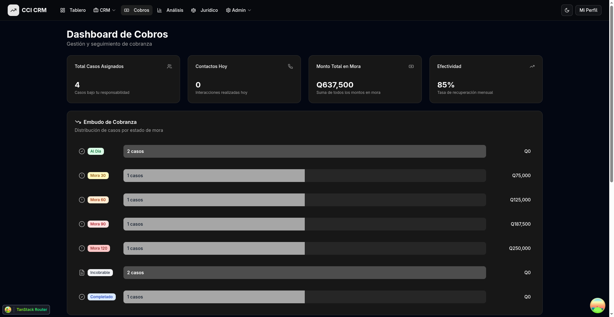
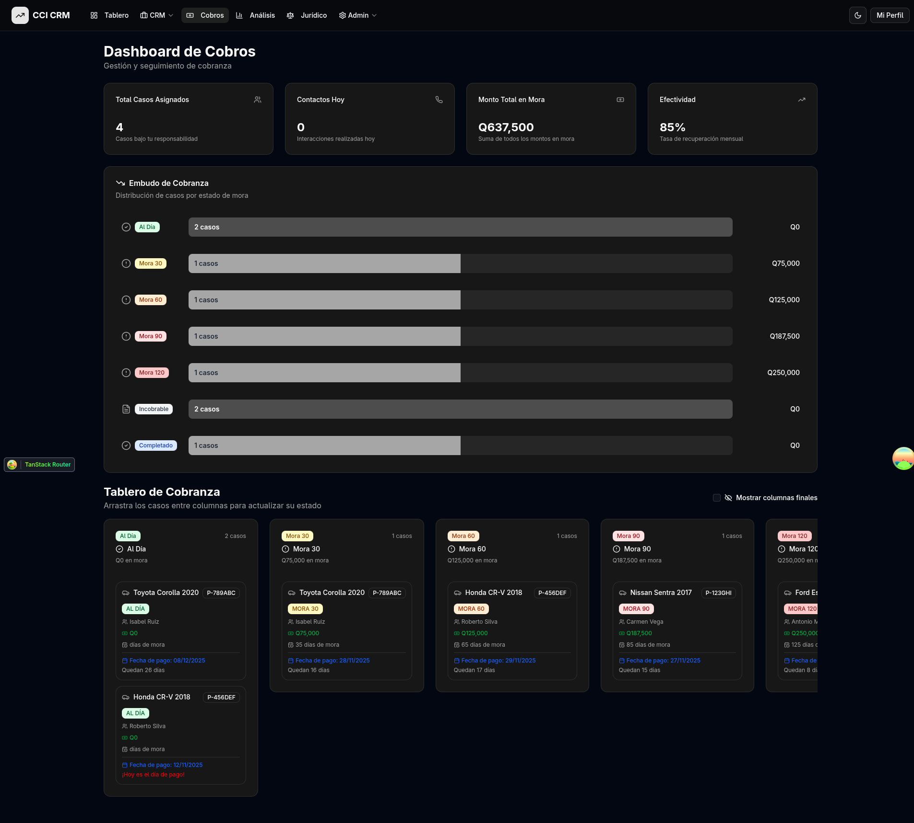
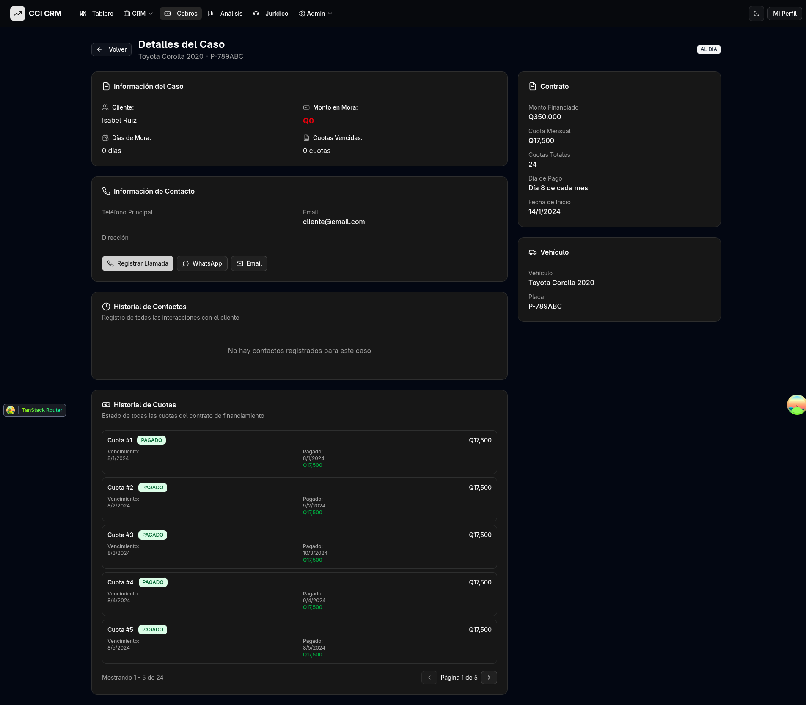
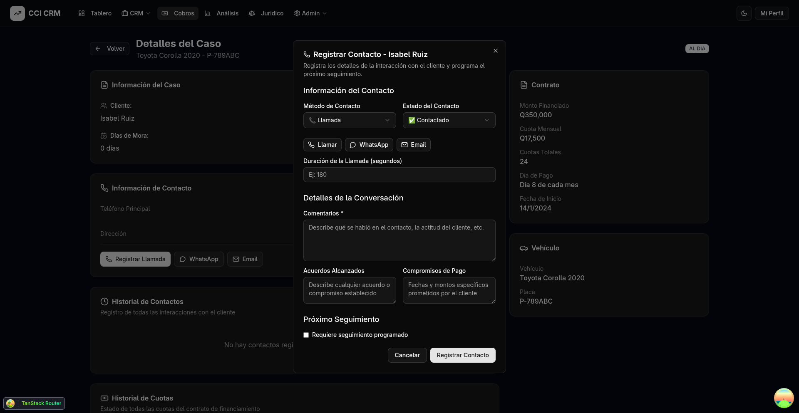

# Manual de Usuario - Sistema de Cobros

**Club Cash In CRM**
Versión 1.0 - Noviembre 2025

---

## Tabla de Contenidos

1. [Introducción](#introducción)
2. [Roles y Permisos](#roles-y-permisos)
3. [Acceso al Sistema](#acceso-al-sistema)
4. [Dashboard de Cobros](#dashboard-de-cobros)
5. [Para Cobradores](#para-cobradores)
   - [Navegación en el Tablero Kanban](#navegación-en-el-tablero-kanban)
   - [Ver Detalles de un Caso](#ver-detalles-de-un-caso)
   - [Registrar Contactos con Clientes](#registrar-contactos-con-clientes)
   - [Gestionar Convenios de Pago](#gestionar-convenios-de-pago)
6. [Para Jefes y Supervisores](#para-jefes-y-supervisores)
   - [Asignar Responsables de Cobros](#asignar-responsables-de-cobros)
   - [Sincronización con Cartera-Back](#sincronización-con-cartera-back)
   - [Ver Reportes Globales](#ver-reportes-globales)
7. [Glosario de Estados y Términos](#glosario-de-estados-y-términos)

---

## Introducción

El **Sistema de Cobros** del CCI CRM es una herramienta diseñada para facilitar la gestión y seguimiento de la cobranza de contratos de financiamiento. Permite a los cobradores y supervisores:

- Visualizar casos de mora en un tablero Kanban intuitivo
- Registrar todas las interacciones con clientes
- Dar seguimiento a compromisos de pago
- Generar convenios de pago personalizados
- Monitorear el estado de las cuotas

Este manual está diseñado para ser una guía práctica y sencilla para el uso diario del sistema.

---

## Roles y Permisos

El sistema de cobros cuenta con dos niveles de acceso:

### 👤 Cobrador

**Permisos:**
- Ver casos asignados a su persona
- Registrar contactos con clientes
- Crear y gestionar convenios de pago
- Ver historial de contactos y cuotas
- Programar seguimientos
- Registrar pagos

**Restricciones:**
- Solo puede ver y gestionar los casos que le fueron asignados
- No puede asignar casos a otros cobradores
- No puede ejecutar sincronizaciones del sistema
- No tiene acceso a reportes globales de inversionistas

### 👨‍💼 Jefe / Supervisor

**Permisos:**
- Todos los permisos de cobrador PLUS:
- Ver **todos** los casos del departamento
- Asignar y reasignar responsables de cobros
- Ejecutar sincronizaciones con cartera-back
- Ver lista completa de usuarios del área
- Acceder a reportes de inversionistas
- Ver estadísticas agregadas del equipo

---

## Acceso al Sistema

1. Ingrese a la URL del CCI CRM
2. Inicie sesión con sus credenciales
3. En el menú principal, haga clic en **"Cobros"**

---

## Dashboard de Cobros

Al acceder a la sección de cobros, verá el dashboard principal que incluye:

### Estadísticas Principales

En la parte superior encontrará 4 indicadores clave:

1. **Total Casos Asignados**: Número de casos bajo su responsabilidad
2. **Contactos Hoy**: Cantidad de interacciones realizadas en el día actual
3. **Monto Total en Mora**: Suma de todos los montos pendientes de pago
4. **Efectividad**: Tasa de recuperación mensual (meta: 85%)

### Embudo de Cobranza

Muestra la distribución de casos por estado de mora con:
- Número de casos en cada etapa
- Monto total en mora por categoría
- Barras proporcionales para visualización rápida

### Tablero Kanban

Vista principal de trabajo con columnas organizadas por estado de mora (ver sección siguiente).

---

## Para Cobradores

Esta sección describe las funciones principales para usuarios con rol de **Cobrador**.

### Navegación en el Tablero Kanban

El tablero Kanban organiza los casos en columnas según su estado de mora:

#### Columnas del Tablero

1. **Al Día** (Verde) - Sin mora
2. **Mora 30** (Amarillo) - 1 a 30 días de atraso
3. **Mora 60** (Naranja) - 31 a 60 días de atraso
4. **Mora 90** (Rojo) - 61 a 90 días de atraso
5. **Mora 120** (Rojo Oscuro) - 91 a 120 días de atraso
6. **Incobrable** (Gris) - Casos en proceso de recuperación
7. **Completado** (Azul) - Contratos liquidados

#### Información en cada Tarjeta

Cada tarjeta de caso muestra:
- Marca, modelo y año del vehículo
- Número de placa
- Nombre del cliente
- Monto en mora (Q)
- Días de mora máximo
- Próxima fecha de pago
- Días restantes hasta el pago

#### Acciones Rápidas

- **Hacer clic** en una tarjeta para ver detalles completos
- **Arrastrar** tarjetas entre columnas para actualizar estado (requiere confirmación)
- **Checkbox** "Mostrar columnas finales" para ver/ocultar Incobrable y Completado

---

### Ver Detalles de un Caso

Al hacer clic en cualquier caso, accederá a la vista de detalles completos:

#### Secciones de la Vista de Detalles

**1. Información del Caso**
- Nombre del cliente
- Monto total en mora
- Días de mora actuales
- Número de cuotas vencidas

**2. Información de Contacto**
- Teléfono principal y alternativo
- Email del cliente
- Dirección física
- Botones de acción rápida: Llamar, WhatsApp, Email

**3. Historial de Contactos**
- Lista de todas las interacciones previas
- Filtros por método y estado
- Detalles de cada contacto (fecha, método, resultado, comentarios)
- Paginación (5 contactos por página)

**4. Historial de Cuotas**
- Estado de todas las cuotas del contrato
- Fechas de vencimiento y pago
- Montos y saldos
- Indicadores visuales de estado (Pagado, Vencido, Pendiente)

**5. Información del Contrato**
- Monto financiado total
- Cuota mensual
- Número total de cuotas
- Día de pago
- Fecha de inicio del contrato

**6. Datos del Vehículo**
- Marca, modelo y año
- Número de placa

---

### Registrar Contactos con Clientes

Esta es una de las funciones más importantes del sistema. Cada interacción con el cliente debe quedar documentada.

#### Cómo Registrar un Contacto

1. **Abrir el Formulario**
   - Desde la vista de detalles del caso
   - Haga clic en uno de los botones: "Registrar Llamada", "WhatsApp" o "Email"

2. **Información del Contacto**

   **Método de Contacto:**
   - 📞 Llamada
   - 💬 WhatsApp
   - 📧 Email
   - 🏠 Visita a Domicilio
   - 📄 Carta Notarial

   **Estado del Contacto:**
   - ✅ Contactado - Se logró comunicación efectiva
   - ❌ No Contesta - Cliente no respondió
   - 📱 Número Equivocado - Teléfono incorrecto
   - 🤝 Promesa de Pago - Cliente se comprometió a pagar
   - 📝 Acuerdo Parcial - Se negoció un pago parcial
   - 🚫 Rechaza Pagar - Cliente se niega a pagar

3. **Acciones Rápidas**
   - **Llamar**: Inicia llamada directa (registra duración automáticamente)
   - **WhatsApp**: Abre chat de WhatsApp
   - **Email**: Abre cliente de correo

4. **Duración de la Llamada**
   - Si seleccionó "Llamada", ingrese los segundos de duración
   - Ejemplo: 180 segundos = 3 minutos

5. **Detalles de la Conversación**

   **Comentarios (Obligatorio):**
   Describa brevemente:
   - Qué se habló con el cliente
   - Actitud del cliente (receptivo, molesto, colaborador)
   - Razón del atraso si la mencionó
   - Cualquier información relevante

   **Acuerdos Alcanzados (Opcional):**
   - Describa cualquier compromiso establecido
   - Ejemplo: "Cliente acepta pagar Q5,000 el día 15"

   **Compromisos de Pago (Opcional):**
   - Fechas y montos específicos prometidos
   - Ejemplo: "Q2,500 el 10/11/2025 y Q2,500 el 20/11/2025"

6. **Próximo Seguimiento**
   - Marque la casilla si requiere programar un seguimiento
   - Ingrese la fecha y hora del próximo contacto
   - Añada notas sobre qué hacer en el seguimiento

7. **Guardar**
   - Haga clic en "Registrar Contacto"
   - El contacto aparecerá en el historial inmediatamente

#### Mejores Prácticas

- ✅ Registre **TODOS** los contactos, incluso los no exitosos
- ✅ Sea específico en los comentarios
- ✅ Actualice el estado del caso después de cada contacto importante
- ✅ Programe seguimientos para no perder continuidad
- ✅ Si el cliente hace una promesa de pago, créela en "Compromisos de Pago"

---

### Gestionar Convenios de Pago

Los convenios de pago son acuerdos especiales que se establecen con clientes que no pueden cumplir con el plan de pagos original.

#### Cuándo Crear un Convenio

- Cliente con múltiples cuotas vencidas que negocia un plan de pagos
- Situación especial que requiere reestructuración temporal
- Acuerdo de pago parcial o diferido

#### Cómo Crear un Convenio

1. En la vista de detalles del caso, localice la sección "Convenios de Pago"
2. Haga clic en "Crear Nuevo Convenio"
3. Complete el formulario:

   **Información Básica:**
   - Fecha de inicio del convenio
   - Fecha de finalización
   - Monto total a cubrir

   **Términos del Convenio:**
   - Número de cuotas del convenio
   - Monto de cada cuota
   - Día de pago de cada cuota

   **Observaciones:**
   - Condiciones especiales
   - Razón del convenio
   - Acuerdos adicionales

4. Haga clic en "Crear Convenio"

#### Seguimiento de Convenios

- Los convenios activos aparecen en la vista de detalles
- Puede ver el estado de cumplimiento
- Si el cliente incumple, puede cancelar el convenio
- Al completar todas las cuotas, el convenio se marca como "Cumplido"

---

## Para Jefes y Supervisores

Esta sección describe funciones adicionales disponibles solo para **Administradores y Jefes de Cobros**.

### Asignar Responsables de Cobros

Los supervisores pueden asignar o reasignar casos a diferentes cobradores.

#### Cómo Asignar un Caso

1. Abra la vista de detalles del caso
2. En la parte superior, localice "Responsable de Cobros"
3. Haga clic en el selector desplegable
4. Seleccione el cobrador al que desea asignar el caso
5. El cambio se guarda automáticamente
6. El cobrador recibirá una notificación de la asignación

#### Criterios de Asignación

Considere:
- Carga de trabajo actual del cobrador
- Experiencia con casos similares
- Ubicación geográfica (para visitas a domicilio)
- Historial de efectividad

---

### Sincronización con Cartera-Back

El sistema se sincroniza automáticamente con el sistema contable externo (cartera-back) para mantener los datos actualizados.

#### Sincronización Automática

- Se ejecuta cada 24 horas
- Importa nuevos casos de mora
- Actualiza estados de cuotas
- Registra pagos realizados

#### Sincronización Manual (Solo Administradores)

1. Haga clic en el menú "Admin" en la barra superior
2. Seleccione "Sincronización de Cobros"
3. Haga clic en "Ejecutar Sincronización Ahora"
4. Espere a que se complete el proceso
5. Revise el reporte de sincronización para ver:
   - Casos nuevos importados
   - Casos actualizados
   - Errores si los hubo

#### Historial de Sincronizaciones

- Vea todas las sincronizaciones ejecutadas
- Fecha y hora de cada sincronización
- Resultados y estadísticas
- Logs de errores para diagnóstico

---

### Ver Reportes Globales

Los supervisores tienen acceso a reportes consolidados del área de cobros.

#### Reportes Disponibles

**1. Reporte de Cartera**
- Antigüedad de saldos
- Distribución por estado de mora
- Evolución mensual de la mora
- Tasa de recuperación

**2. Reporte de Inversionistas**
- Distribución de créditos por inversionista
- Montos en mora por inversionista
- Estado de recuperación

**3. Reporte de Desempeño del Equipo**
- Contactos por cobrador
- Tasa de efectividad por cobrador
- Casos resueltos vs pendientes
- Tiempo promedio de resolución

#### Acceso a Reportes

1. Menú "Admin" → "Reportes de Cobros"
2. Seleccione el tipo de reporte
3. Configure filtros (rango de fechas, cobradores, estados)
4. Haga clic en "Generar Reporte"
5. Exporte a Excel si lo necesita

---

## Glosario de Estados y Términos

### Estados de Mora

| Estado | Días de Atraso | Color | Descripción |
|--------|----------------|-------|-------------|
| Al Día | 0 días | Verde | Sin cuotas vencidas |
| Mora 30 | 1-30 días | Amarillo | Atraso leve, seguimiento preventivo |
| Mora 60 | 31-60 días | Naranja | Atraso moderado, contacto frecuente |
| Mora 90 | 61-90 días | Rojo | Atraso grave, acciones urgentes |
| Mora 120 | 91-120 días | Rojo Oscuro | Atraso crítico, convenio o recuperación |
| Mora 120+ | Más de 120 días | Rojo Oscuro | Muy crítico, alto riesgo |
| Incobrable | N/A | Gris | En proceso de recuperación de vehículo |
| Completado | N/A | Azul | Contrato liquidado completamente |

### Métodos de Contacto

| Método | Icono | Cuándo Usar |
|--------|-------|-------------|
| Llamada | 📞 | Primera opción, contacto directo |
| WhatsApp | 💬 | Cliente prefiere mensajes, recordatorios |
| Email | 📧 | Envío de documentos, comunicación formal |
| Visita a Domicilio | 🏠 | Casos graves, cliente no responde |
| Carta Notarial | 📄 | Proceso legal iniciado |

### Estados de Contacto

| Estado | Icono | Significado | Siguiente Acción |
|--------|-------|-------------|------------------|
| Contactado | ✅ | Comunicación exitosa | Registrar acuerdos y programar seguimiento |
| No Contesta | ❌ | Cliente no responde | Intentar en diferente horario o método |
| Número Equivocado | 📱 | Teléfono incorrecto | Buscar número alterno |
| Promesa de Pago | 🤝 | Cliente se comprometió | Crear compromiso y hacer seguimiento en fecha prometida |
| Acuerdo Parcial | 📝 | Negociación de pago parcial | Crear convenio si aplica |
| Rechaza Pagar | 🚫 | Cliente se niega | Escalar a supervisor, iniciar proceso legal |

### Tipos de Recuperación (Casos Incobrables)

| Tipo | Descripción |
|------|-------------|
| Entrega Voluntaria | Cliente entrega el vehículo por acuerdo |
| Tomado | Vehículo recuperado en campo |
| Orden de Secuestro | Recuperación por vía judicial |

### Términos del Sistema

- **Caso**: Un contrato de financiamiento que requiere seguimiento de cobros
- **Cuota**: Pago mensual establecido en el contrato
- **Convenio**: Acuerdo de pago especial fuera del plan original
- **Compromiso**: Promesa específica de pago con fecha y monto
- **Sincronización**: Actualización de datos con sistema contable externo
- **Embudo**: Visualización de distribución de casos por estado

---

## Soporte y Ayuda

Si tiene dudas o encuentra problemas con el sistema:

1. Consulte este manual primero
2. Contacte a su supervisor inmediato
3. Reporte problemas técnicos al departamento de IT

**¡Importante!** Registre todos sus contactos en el sistema. La información que usted captura es fundamental para el seguimiento efectivo de la cobranza y para generar reportes precisos.

---

**Última actualización:** Noviembre 2025
**Versión del manual:** 1.0
**Sistema:** CCI CRM - Módulo de Cobros
