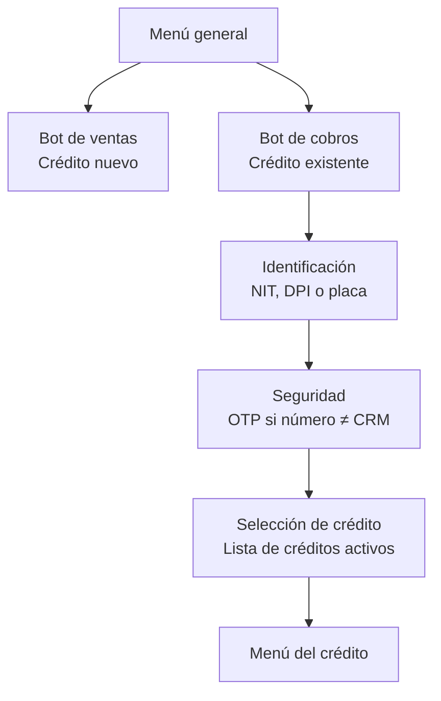
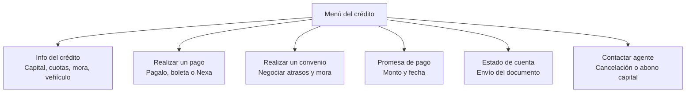
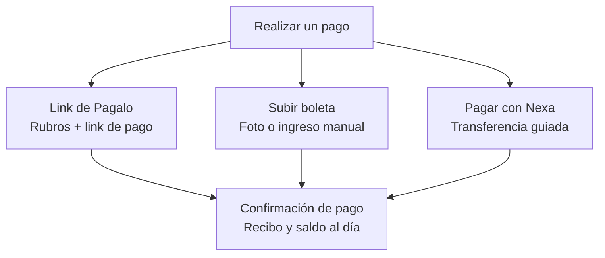
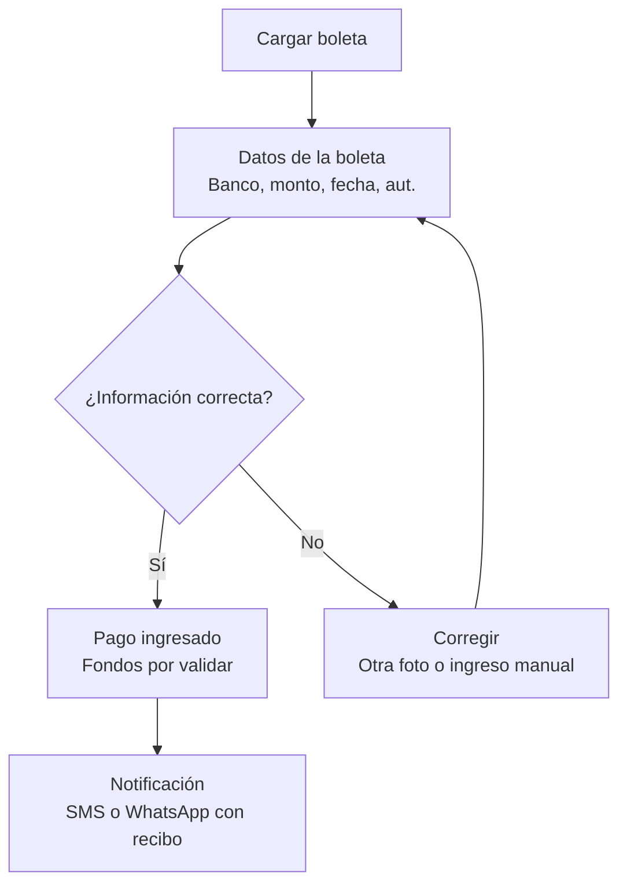
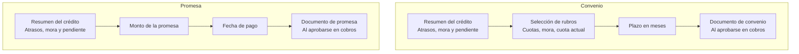

# Árbol de decisiones del bot — referencia funcional

**Estado:** Aprobado como propuesta de flujo (documento de gerencia v1.0, agosto 2026)
**Fuente:** [`fuente/flujo-bot-whatsapp.pdf`](./fuente/flujo-bot-whatsapp.pdf)
**Ticket:** [CC2-48 · CB-115](https://clubcashin.atlassian.net/browse/CC2-48)

Este archivo transcribe el árbol completo tal como lo aprobó gerencia. Es la referencia
funcional del feature: **el detalle técnico de cada paso vive en su propio documento**.
Cambiar algo de acá implica validarlo con Cobros, no es una decisión de IT.

---

## 01 · Flujo general de entrada → **Paso 1**

El menú general separa a los clientes según su situación: quien busca un crédito nuevo
pasa al bot de ventas; quien ya tiene un crédito entra al bot de cobros. Ahí el cliente
se identifica con su **NIT, DPI o placa** y acepta términos y condiciones. Si el número
desde el que escribe no coincide con el registrado en el CRM, se activa la **validación
por OTP** (y, de forma opcional, la validación de vida). Con la identidad confirmada, el
cliente elige uno de sus **créditos activos**.

> Detalle técnico y contratos: [`01-identificacion-y-acceso.md`](./01-identificacion-y-acceso.md)

---

## 02 · Menú del crédito → Paso 2

Al seleccionar un crédito, el cliente accede a **seis gestiones**. La información del
crédito muestra capital activo, cuotas atrasadas, cuota actual (por ejemplo 3/60), mora
si aplica, fecha próxima de pago y datos del vehículo. Las gestiones de **cancelación de
crédito, convenios especiales o abonos a capital se transfieren a un agente humano**.

Siempre existe la opción de **regresar al menú anterior**.

---

## 03 · Métodos de pago → Paso 3

El menú de pago es **dinámico**: la opción de subir boleta se habilita según el perfil
del cliente. Con el link de **Pagalo**, el cliente selecciona qué rubros incluir (cuotas
atrasadas, mora, cuota actual o convenio) y recibe el link; **si no confirma su pago, el
caso se transborda a un agente**. Con **Nexa** recibe los datos de su cuenta y un mini
tutorial de transferencia. En todos los casos, al acreditarse el pago se envía un
comprobante indicando cómo quedó el capital, la mora y la cuota, y si hubo abono a una
cuota siguiente.

---

## 04 · Validación de boleta → Paso 4

Al cargar la foto de la boleta, el sistema extrae **banco, monto, fecha, número de
autorización y cuenta destino**, y se los presenta al cliente para confirmar. Si algo no
es correcto, puede subir otra foto o ingresar los datos manualmente (banco desde una
lista, número de autorización como campo opcional). El pago queda ingresado con la
aclaración de que **los fondos deben validarse**; el cliente será notificado tanto si el
pago se acredita como si se rechaza.

---

## 05 · Convenio y promesa de pago → Paso 5

Ambas gestiones inician con un **mensaje aclaratorio** de qué son y qué incluyen (cuotas
atrasadas, mora y cualquier situación legal), seguido de un resumen del crédito. En el
**convenio**, el cliente selecciona los rubros a incluir y define en cuántos meses lo
pagará; en la **promesa**, indica el monto y la fecha en la que realizará el pago. Cuando
la gestión se aprueba del lado de cobros —o el cliente la completa— se envía un documento
con el resumen correspondiente.

En ambos casos el cliente puede regresar al menú anterior.

---

## 06 · Reglas transversales

| Regla | Definición del documento |
| --- | --- |
| **Excedentes de pago** | En boleta o Nexa, los excedentes **mayores a Q25** se aplican automáticamente a la siguiente cuota; los **menores a Q25** se registran como otros ingresos. |
| **Notificaciones de resultado** | Todo pago genera notificación por SMS o WhatsApp: si se acredita, incluye recibo y cómo quedó capital, mora y cuota; **si se rechaza, se informa igualmente** al cliente. |
| **Escalamiento a agente** | Cancelación de crédito, abonos a capital, convenios especiales o **falta de respuesta tras un link de pago** se transbordan a un agente humano. |
| **Seguridad de acceso** | Si el número del cliente no coincide con el registrado en el CRM, se exige **validación por OTP**, con **validación de vida como paso opcional adicional**. |

---

## Notas de lectura para IT

Cosas que el documento funcional **no** resuelve y que hay que definir del lado técnico
(cada una tiene su entrada en [`DECISIONES.md`](./DECISIONES.md)):

- Qué cuenta como "crédito activo" para listarlo.
- Qué pasa si quien escribe **no es el titular** (OTP no lo resuelve: el código llega al
  titular, no a quien está chateando).
- Cómo se comporta el bot con un cliente que tiene **varios créditos** vs. uno solo.
- Dónde vive el estado de la conversación: en SimpleTech, en el CRM, o repartido.
- Qué datos se pueden exponer **antes** de verificar identidad (idealmente ninguno).
