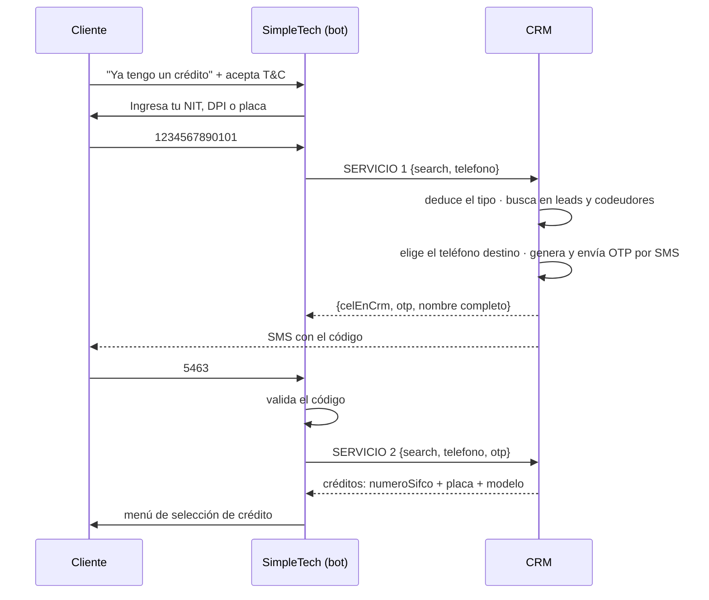

# Paso 1 · Identificación y acceso

**Estado:** 🟢 **Definido (2026-08-13)** — listo para implementar · aún **no implementado**
**Tickets:** [CC2-39 · CB-103](https://clubcashin.atlassian.net/browse/CC2-39) (principal),
[CC2-48 · CB-115](https://clubcashin.atlassian.net/browse/CC2-48) (árbol)
**Apps involucradas:** `apps/crm` únicamente — **este paso no consulta cartera-back**
**Prerrequisitos de lectura:** [`ARQUITECTURA.md`](./ARQUITECTURA.md)

---

## 1. Alcance

Desde que el cliente elige "ya tengo un crédito" hasta que ve la lista de sus créditos para
elegir uno.

**Son dos servicios, los dos en el CRM:**

| # | Servicio | Qué hace |
| --- | --- | --- |
| 1 | **Buscar cliente y enviar OTP** | Recibe `search` (NIT, DPI o placa) + teléfono. Deduce qué es, busca al cliente, dice si el teléfono es de él, **siempre manda OTP por SMS** y devuelve el nombre. |
| 2 | **Listar créditos** | Con el OTP validado, devuelve las oportunidades ganadas del cliente con la info del vehículo. |

**Decisión importante:** en este paso **todo se resuelve dentro del CRM**. No se consulta
cartera-back. La consulta a cartera empieza cuando el cliente **selecciona** un crédito
(Paso 2). Por eso el listado del servicio 2 **no** trae saldos, mora ni estado del crédito:
solo lo necesario para elegir.

**No entra en este paso:** el menú del crédito y los saldos (Paso 2), pagos, boletas,
convenios y promesas (Pasos 3–5), y el ruteo ventas/cobros dentro de SimpleTech.

---

## 2. Recorrido



### Reglas del servicio 1

1. **`search` viene sin tipo.** El CRM deduce si es DPI, NIT o placa antes de buscar.
2. **El DPI puede ser del titular o de un codeudor.** Se busca en `leads.dpi` **y** en
   `co_debtors.dpi`.
3. **A dónde va el OTP:**
   - Si el DPI resultó ser de un **codeudor** → al teléfono que tenemos **del codeudor**
     (`co_debtors.phone`).
   - Si es del **titular** → a su **teléfono principal**. Ojo: hay leads con **varios
     teléfonos en el mismo campo**, separados por `,` o `/`; el principal es el primero.
4. **El OTP se envía siempre**, coincida o no el teléfono desde el que escribe. Lo que
   cambia es el destino, no si se manda.
5. **El OTP va por SMS.** Ya existe: `otpController` (`controllers/otp.ts`) usando
   `@repo/sms` (BroadcasterMobile), código de 4 dígitos, 5 minutos de vigencia.
6. `celEnCrm` dice si el número desde el que escribe es uno de los que tenemos registrados
   del cliente. Es información para el bot y para auditoría, **no** cambia si se manda OTP.

---

## 3. Contratos

Base: `POST /api/bot/v1/cobros/...` · `Authorization: Bearer <BOT_COBROS_TOKEN>` ·
formato de respuesta y códigos de error en [`ARQUITECTURA.md`](./ARQUITECTURA.md).

### 3.1 Servicio 1 · Buscar cliente y enviar OTP

```jsonc
// request
{
  "search": "1234567890101",   // NIT, DPI o placa — sin decir cuál
  "telefono": "50255551234"    // número desde el que escribe el cliente
}
```

```jsonc
// respuesta · cliente encontrado
{
  "success": true,
  "data": {
    "encontrado": true,
    "celEnCrm": true,                       // ¿el número del chat es uno de los suyos?
    "otp": "5463",                          // siempre se genera y se envía por SMS
    "cliente": {
      "nombreCompleto": "Daniel Rodríguez López",
      "tipo": "titular"                     // "titular" | "codeudor"
    },
    "tipoBusqueda": "dpi",                  // lo que dedujo el CRM: "dpi" | "nit" | "placa"
    "otpEnviadoA": "****1234"               // enmascarado, para que el bot lo diga en el chat
  }
}
```

```jsonc
// respuesta · no encontrado
{
  "success": true,
  "data": { "encontrado": false }
}
```

**Detección del tipo de `search`** — orden de evaluación propuesto:

Regla acordada: **la placa tiene letras, el NIT no.**

| Orden | Tipo | Cómo se reconoce | Dónde se busca |
| --- | --- | --- | --- |
| 1 | **DPI** | **13 dígitos** numéricos. Ya existe `validarDpi` (`utils/cui-validation.ts`) para validar el CUI. | `leads.dpi` con el helper `eqDpi` (hay DPI guardados con y sin formato) **y** `co_debtors.dpi` |
| 2 | **Placa** | Contiene **letras** (ej. `P123ABC`), con o sin guion | `vehicles.license_plate` → `opportunities.vehicle_id` |
| 3 | **NIT** | **Solo dígitos** y no son 13 | `leads.nit` |

Antes de clasificar se normaliza: se quitan guiones, espacios y se pasa a mayúsculas.

> ⚠️ **Única excepción a revisar:** el NIT guatemalteco puede llevar **`K` como dígito
> verificador** (`1234567-K`). Con la regla de arriba, ese NIT se clasificaría como placa.
> Si hay NIT así en la base, la regla necesita una salvedad: una sola `K` al final ⇒ NIT.

---

### 3.2 Servicio 2 · Listar créditos

```jsonc
// request
{
  "search": "1234567890101",
  "telefono": "50255551234",
  "otp": "5463"                 // el código que ingresó el cliente
}
```

```jsonc
// respuesta
{
  "success": true,
  "data": {
    "cliente": { "nombreCompleto": "Daniel Rodríguez López", "tipo": "titular" },
    "creditos": [
      {
        "numeroSifco": "01010214117590",
        "etiqueta": "Toyota Yaris 2019 · P123ABC",   // lo que el bot muestra en el menú
        "vehiculo": {
          "placa": "P123ABC",
          "marca": "Toyota",
          "modelo": "Yaris",
          "anio": 2019
        }
      },
      {
        "numeroSifco": "01010214118821",
        "etiqueta": "Daniel Rodríguez López",        // sin vehículo: se usa el nombre
        "vehiculo": null
      }
    ]
  }
}
```

**De dónde salen los créditos:** de las oportunidades del cliente en el CRM con
`status IN ('won', 'migrate')`.

- Si es **titular** → `opportunities.lead_id = lead.id`
- Si es **codeudor** → las oportunidades donde aparece como codeudor
  (`co_debtors.opportunity_id`)
- Vehículo: `opportunities.vehicle_id` → `vehicles` (placa, marca, modelo, año)
- Número de crédito: `opportunities.numero_sifco`

> **Por qué también `migrate`:** los créditos cargados por la migración masiva quedaron con
> `status = 'migrate'`, no con `won`. Filtrar solo por `won` dejaría fuera a los clientes
> viejos, que son el grueso de la cartera en cobros.

**Sin info del vehículo.** Puede pasar y no es un error: en esos casos el crédito se lista
igual, usando el **nombre completo del cliente** como etiqueta. El campo `etiqueta` lo arma
el CRM para que el bot no tenga que decidir nada.

**Validación del OTP.** SimpleTech puede validar el código de su lado, pero **el servicio 2
debe recibirlo y validarlo igual** contra la tabla `otps`: es una consulta que ya existe,
marca el código como usado y evita que baste el token de la API para listar los créditos de
cualquier persona. Ver [D-16](./DECISIONES.md#d-16--el-otp-viaja-en-la-respuesta).

---

## 4. Datos y piezas que ya existen

| Necesidad | Qué hay hoy |
| --- | --- |
| Generar y enviar OTP por SMS | `otpController.sendOTP` — 4 dígitos, 5 min, `@repo/sms`, tag `otp-verification` |
| Validar OTP | `otpController.validateOTP` — **no reusar el endpoint** `/info/validate-otp`: dispara una consulta a Infornet (buró) que en cobros es costo puro. Ver [D-07](./DECISIONES.md#d-07--otp-de-cobros-reuso-o-endpoints-nuevos) |
| Buscar por DPI tolerando formatos | `eqDpi` (`lib/dpi-lookup.ts`) |
| Validar DPI | `validarDpi` (`utils/cui-validation.ts`) |
| Autenticar al bot | Patrón de `validatePortalToken` (`controllers/portal-lead.ts`), con secreto propio |
| Codeudores | Tabla `co_debtors` (`opportunity_id`, `full_name`, `dpi`, `phone`) |

### Ajuste necesario en la tabla `otps`

Hoy `otps` tiene `lead_id` **NOT NULL** y `dpi` NOT NULL: está pensada solo para leads.
Para el OTP de un **codeudor** hay dos caminos:

- **A)** Agregar `co_debtor_id` nullable y relajar `lead_id`.
- **B)** Guardar el `lead_id` de la oportunidad y el `dpi` del codeudor.

A es más limpio y deja auditoría real de a quién se le mandó el código. Requiere migración
—que corre el usuario, como siempre en este repo—.

### Sin tabla de sesiones (por ahora)

La propuesta original tenía una tabla `bot_cobros_sesiones` con token opaco. **Se descarta
para esta primera versión:** los dos servicios son sin estado y el bot reenvía `search` +
`telefono` en cada llamada. Ver
[D-04](./DECISIONES.md#d-04--dónde-vive-el-estado-de-identidad). Si más adelante hacen falta
sesiones (pagos, boletas), se agrega ahí.

---

## 5. Seguridad

| Control | Definición |
| --- | --- |
| Autenticación | Bearer con secreto propio del bot. Los dos servicios exponen datos de clientes: **ninguno puede quedar público**, a diferencia de los `/info/*` del bot de ventas. |
| OTP | Siempre se envía. 4 dígitos, 5 min, un solo uso, al contacto **registrado** (nunca al número del chat si ese número no está registrado). |
| Intentos | Tope de búsquedas por teléfono y por `search` en una ventana de tiempo, y tope de intentos de OTP. Números a afinar con Cobros. |
| Enumeración | Ante `search` no encontrado, respuesta genérica: nunca "ese DPI no existe" vs. "existe pero…". |
| Logs | El **OTP no se registra en logs** (hoy `otpController` lo imprime en consola: hay que quitarlo para este flujo). DPI y NIT hasheados, teléfonos enmascarados. |
| Nombre completo | Se devuelve antes de validar el OTP porque el bot saluda con él. Es una fuga menor pero real: quien acierte un DPI obtiene un nombre. Aceptado. |

---

## 6. Casos borde

| Caso | Comportamiento |
| --- | --- |
| **Lead con varios teléfonos** en un campo (`,` o `/`) | Se toma el **primero** como principal. Definir si se normaliza el dato en la base o solo al leerlo. |
| Teléfono con o sin `502`, con guiones o espacios | Normalizar antes de comparar y antes de mandar el SMS. |
| DPI que existe **como lead y como codeudor** (personas que son ambas cosas) | Definir prioridad. Propuesta: titular gana; si no tiene oportunidades propias, se usa la de codeudor. |
| DPI de codeudor en **varias** oportunidades | Se listan todas esas oportunidades. |
| Codeudor **sin teléfono** (`co_debtors.phone` es nullable) | No hay a dónde mandar el OTP → salida a agente y se registra para que Cobros complete el dato. |
| Cliente **sin teléfono** en el CRM | Igual: agente. |
| Oportunidad ganada **sin `numero_sifco`** | **No ocurre**: una oportunidad ganada o migrada siempre tiene número SIFCO. Si aparece una, es un dato roto: se omite del listado y se registra para revisar. |
| Oportunidad **sin info del vehículo** | Sí ocurre. Se lista igual con el **nombre completo del cliente** como etiqueta. |
| DPI duplicado en varios leads | Criterio determinista (el que tenga oportunidades ganadas) y alerta al equipo. Hay precedente de duplicados por formato de DPI. |
| Búsqueda por placa de un vehículo con más de una oportunidad | Se listan las que apliquen. |
| Cliente sin ninguna oportunidad ganada | `creditos: []` → mensaje claro y salida a agente. |
| El SMS no se entrega | Definir reintento y cuántos, y salida a agente. |

---

## 7. Criterios de aceptación

1. Con un `search` válido, el servicio 1 deduce solo si es DPI, NIT o placa y encuentra al
   cliente.
2. Un DPI de **codeudor** encuentra al cliente y el OTP se manda al teléfono **del
   codeudor**.
3. Un DPI de **titular** manda el OTP a su teléfono **principal**, aun cuando el campo tenga
   varios números separados por `,` o `/`.
4. El OTP se envía **siempre**, coincida o no el teléfono del chat, y llega **por SMS**.
5. `celEnCrm` refleja correctamente si el número del chat está registrado.
6. La respuesta trae el **nombre completo** del cliente.
7. Con un `search` que no existe, la respuesta es genérica y no revela nada.
8. El servicio 2 devuelve las oportunidades **ganadas y migradas** con `numero_sifco`, placa
   y modelo, **sin consultar cartera-back**.
9. Un crédito sin info de vehículo se lista igual, con el nombre completo del cliente.
10. El servicio 2 rechaza la petición si el OTP no es válido o ya se usó.

---

## 8. Decisiones que siguen abiertas

| # | Pregunta |
| --- | --- |
| [D-10](./DECISIONES.md#d-10--ambiente-de-pruebas-para-simpletech) | Ambiente de pruebas para SimpleTech |
| [D-12](./DECISIONES.md#d-12--términos-y-condiciones) | Texto y versionado de los T&C (se aceptan al enviar el `search`) |
| — | Si existen NIT con `K` como dígito verificador en la base (romperían la regla de detección) |
| — | Si se listan créditos ya liquidados (no se puede saber sin consultar cartera) |

Ninguna bloquea la implementación de los dos servicios.

---

## 9. Tareas

| # | Tarea | Dependencias |
| --- | --- | --- |
| 1 | Middleware de autenticación del bot (`BOT_COBROS_TOKEN`) + rate limiting | — |
| 2 | Detector de tipo de `search` (DPI / NIT / placa) con normalización | D-09 |
| 3 | Búsqueda unificada: `leads` + `co_debtors` + `vehicles` → cliente y tipo | 2 |
| 4 | Resolución del teléfono destino (principal del lead, o del codeudor) y comparación con el del chat | 3 |
| 5 | Migración de `otps` para soportar codeudor | — |
| 6 | Servicio 1: buscar + enviar OTP por SMS (reuso de `otpController`, sin Infornet) | 3, 4, 5 |
| 7 | Servicio 2: validar OTP + listar oportunidades ganadas con vehículo | 6, D-17 |
| 8 | Colección Postman y entrega del contrato a SimpleTech | 6, 7 |
| 9 | Pruebas de los casos borde de la §6 | 6, 7 |
