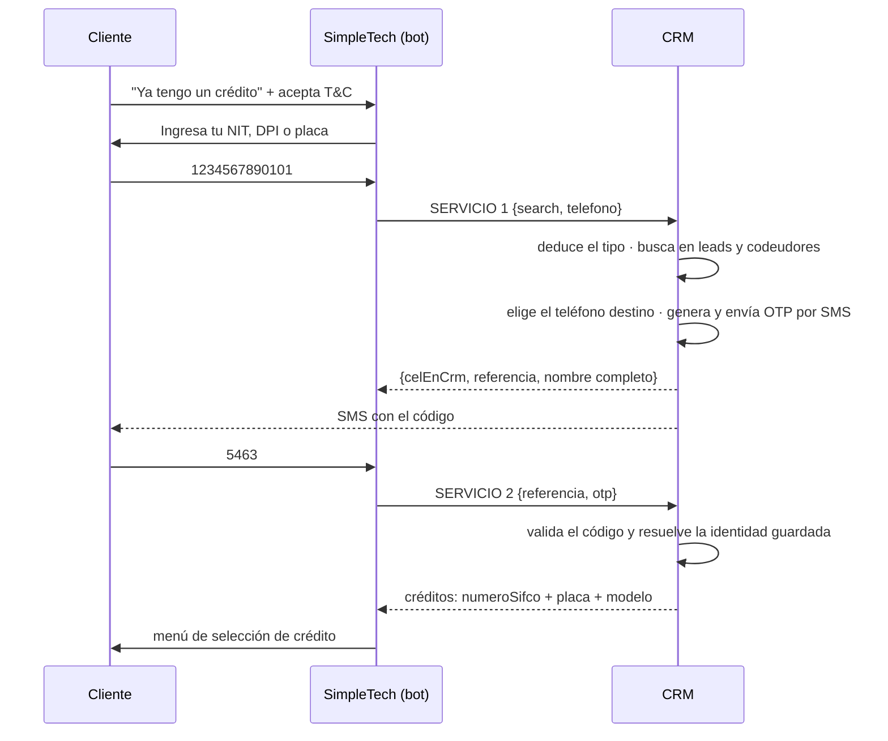

# Paso 1 · Identificación y acceso

**Estado:** 🔵 **Los dos servicios implementados (2026-08-14)** — falta correr la migración
0034 y probar el envío real del SMS en dev
**Tickets:** [CC2-39 · CB-103](https://clubcashin.atlassian.net/browse/CC2-39) (principal),
[CC2-48 · CB-115](https://clubcashin.atlassian.net/browse/CC2-48) (árbol)
**Apps involucradas:** `apps/crm` únicamente — **este paso no consulta cartera-back**
**Prerrequisitos de lectura:** [`ARQUITECTURA.md`](./ARQUITECTURA.md)

---

## 1. Alcance

Desde que el cliente elige "ya tengo un crédito" hasta que ve la lista de sus créditos para
elegir uno.

**Son dos servicios, los dos en el CRM:**

| # | Servicio | Qué hace |
| --- | --- | --- |
| 1 | **Buscar cliente y enviar OTP** | Recibe `search` (NIT, DPI o placa) + teléfono. Deduce qué es, busca al cliente, dice si el teléfono es de él, **siempre manda OTP por SMS** y devuelve el nombre. |
| 2 | **Validar código y listar créditos** | Recibe la referencia y el código. Lo valida y, si es correcto, devuelve las oportunidades ganadas del cliente con la info del vehículo. Las dos cosas en una llamada. |

**Decisión importante:** en este paso **todo se resuelve dentro del CRM**. No se consulta
cartera-back. La consulta a cartera empieza cuando el cliente **selecciona** un crédito
(Paso 2). Por eso el listado del servicio 2 **no** trae saldos, mora ni estado del crédito:
solo lo necesario para elegir.

**No entra en este paso:** el menú del crédito y los saldos (Paso 2), pagos, boletas,
convenios y promesas (Pasos 3–5), y el ruteo ventas/cobros dentro de SimpleTech.

---

## 2. Recorrido



### Reglas del servicio 1

1. **`search` viene sin tipo.** El CRM deduce si es DPI, NIT o placa antes de buscar.
2. **Dónde vive cada identificador:** el DPI en `leads.dpi` **y en `co_debtors.dpi`**; el NIT
   en `leads.nit` **y en `opportunities.nit`**; la placa en `vehicles.license_plate`.
   Si el DPI resulta ser de un **codeudor**, el OTP va al teléfono **del codeudor**
   ([D-20](./DECISIONES.md#d-20--el-dpi-se-busca-también-en-codeudores)).
3. **El OTP se envía siempre**, coincida o no el teléfono desde el que escribe. Lo que
   cambia es el destino, no si se manda.
4. **A dónde va el OTP:** al **primer número móvil** del cliente, no al primero de la lista.
   Ver [D-19](./DECISIONES.md#d-19--a-qué-teléfono-se-manda-el-otp) — un SMS a un teléfono
   fijo no llega nunca.
5. **Sin teléfono utilizable no hay flujo.** Si el cliente no tiene ningún móvil registrado
   (~12% de la cartera), se responde con un error claro y se le dice que contacte a soporte.
6. **El OTP va por SMS.** Ya existe: `otpController` (`controllers/otp.ts`) usando
   `@repo/sms` (BroadcasterMobile), código de 4 dígitos, 5 minutos de vigencia.
7. **El código no se devuelve.** Se valida en el servicio 2
   ([D-16](./DECISIONES.md#d-16--quién-valida-el-otp)), para poder distinguir un código
   **vencido** de uno incorrecto. En su lugar se devuelve una **referencia** opaca que el bot
   guarda y manda de vuelta.
8. `celEnCrm` dice si el número desde el que escribe es uno de los que tenemos registrados
   del cliente. Es información para el bot y para auditoría, **no** cambia si se manda OTP.

---

## 3. Contratos

Base: `POST /api/bot/cobros/...` · `Authorization: Bearer <BOT_COBROS_API_KEY>`
([D-18](./DECISIONES.md#d-18--autenticación-del-bot-api-key)).

### 3.1 Servicio 1 · Buscar cliente y enviar OTP

`POST /api/bot/cobros/buscar-cliente`

```jsonc
// request
{
  "search": "1234567890101",   // NIT, DPI o placa — sin decir cuál
  "telefono": "50255551234"    // número desde el que escribe el cliente
}
```

```jsonc
// respuesta · cliente encontrado, OTP enviado
{
  "success": true,
  "data": {
    "encontrado": true,
    "celEnCrm": true,                       // ¿el número del chat es uno de los suyos?
    "otpEnviado": true,
    "otpSimulado": false,                   // true SOLO en dev: no salió SMS (§3.3)
    "referencia": "c2287206-…",             // el bot la guarda para el servicio 2
    "otpEnviadoA": "****6376",              // enmascarado, para decirlo en el chat
    "otpExpiraEnSegundos": 300,
    "cliente": { "nombreCompleto": "Daniel Rodríguez López" },
    "tipoBusqueda": "dpi"                   // lo que dedujo el CRM: "dpi" | "nit" | "placa"
  }
}
```

```jsonc
// respuesta · no encontrado
{
  "success": true,
  "data": { "encontrado": false }
}
```

```jsonc
// respuesta · pidió otro código demasiado pronto
{
  "success": false,
  "error": {
    "codigo": "DEMASIADOS_ENVIOS",
    "mensaje": "Ya te enviamos un código hace poco. Espera un momento antes de pedir otro."
  },
  "data": { "reintentarEnSegundos": 42 }
}
```

Límites de envío: **60 segundos** entre códigos y **5 por hora** por persona. Cada código
nuevo **invalida los anteriores**, para que pedir otro no regale 3 intentos más.

```jsonc
// respuesta · encontrado pero sin teléfono al cual mandar el código
{
  "success": false,
  "error": {
    "codigo": "SIN_TELEFONO_REGISTRADO",
    "mensaje": "No tenemos un número de celular registrado para enviarte el código. Por favor contacta a soporte."
  }
}
```

**Detección del tipo de `search`.** Regla acordada: **la placa tiene letras, el NIT no.**

| Orden | Tipo | Cómo se reconoce | Dónde se busca |
| --- | --- | --- | --- |
| 1 | **DPI** | **13 dígitos** numéricos. Se valida el CUI con `validarDpi` (`utils/cui-validation.ts`). | `leads.dpi` con el helper `eqDpi` (hay DPI guardados con y sin formato) **y** `co_debtors.dpi` |
| 2 | **Placa** | Contiene **letras** (ej. `P185KKW`), con o sin guion | `vehicles.license_plate` → `opportunities.vehicle_id` |
| 3 | **NIT** | **Solo dígitos** y no son 13 | `leads.nit` **y** `opportunities.nit` |

Antes de clasificar se normaliza: se quitan guiones, espacios y se pasa a mayúsculas.

> ⚠️ **Excepción a revisar:** el NIT guatemalteco puede llevar **`K` como dígito verificador**
> (`1234567-K`). Con la regla de arriba caería como placa. Si aparecen NIT así, se agrega la
> salvedad: una sola `K` al final ⇒ NIT.

**Sanitización de la placa.** La placa guatemalteca se escribe `P-185KKW`, pero el cliente
puede mandar `P185KKW`, `p 185 kkw` o incluso `185KKW` sin la letra de tipo. Y del lado de la
base está igual de irregular: de 1,369 vehículos con placa, 1,155 tienen guion, **98 tienen
espacios**, 8 están en minúsculas y **19 no empiezan con letra**.

Por eso se compara **normalizando los dos lados**: solo letras y dígitos, en mayúsculas.

| Lo que escribe el cliente | Normalizado | Contra qué hace match |
| --- | --- | --- |
| `P-185KKW`, `p 185 kkw`, `P185KKW` | `P185KKW` | Igualdad exacta |
| `185KKW` (sin la letra de tipo) | `185KKW` | La placa guardada **termina en** ese valor |
| `P-185KKW` cuando la guardada es `185KKW` | `P185KKW` | Se compara sin la letra inicial |

La tolerancia va en **las dos direcciones**: puede faltar la letra de tipo del lado del
cliente o del lado de la base (hay 19 vehículos guardados así).

Si la búsqueda sin letra inicial calza con **más de un** vehículo, se le pide al cliente la
placa completa en vez de adivinar.

### 3.2 Servicio 2 · Validar el código y listar los créditos

`POST /api/bot/cobros/creditos`

**Hace las dos cosas en una sola llamada:** valida el código y, si es correcto, devuelve los
créditos. Si no lo es, responde el error y no lista nada.

```jsonc
// request
{
  "referencia": "c2287206-…",   // la que devolvió el servicio 1
  "otp": "5463"                 // el código que escribió el cliente
}
```

```jsonc
// respuesta · código correcto
{
  "success": true,
  "data": {
    "creditos": [
      {
        "numeroSifco": "01010214113290",
        "etiqueta": "MAZDA CX-5 GRAND TOURING AWD 2016 · P-247JYT",  // para el menú
        "vehiculo": {
          "placa": "P-247JYT",
          "marca": "MAZDA",
          "modelo": "CX-5 GRAND TOURING AWD",
          "anio": 2016
        }
      }
    ]
  }
}
```

```jsonc
// respuesta · código incorrecto
{
  "success": false,
  "error": { "codigo": "OTP_INVALIDO", "mensaje": "El código no es correcto." },
  "data": { "intentosRestantes": 2 }
}
```

Otros errores posibles: `OTP_VENCIDO`, `OTP_YA_USADO` (un código sirve una sola vez),
`DEMASIADOS_INTENTOS` (llega en el **tercer** fallo, no en el cuarto) y
`REFERENCIA_INVALIDA`.

**Validación y listado van en una sola transacción**, con la fila del OTP bloqueada
(`FOR UPDATE`): peticiones simultáneas no pueden pisarse el contador de intentos, y si el
listado falla el código **no queda consumido**, así el cliente reintenta sin pedir otro SMS.

**Por qué va la `referencia` y no el `search`.** Con solo el código de 4 dígitos, alguien con
la API key podría probar `0000`…`9999` hasta caer en el código vivo de cualquier cliente, y
como no habría a quién atribuirle el intento, el tope de 3 no lo frenaría. La referencia ata
el código a **una** persona. Y como en la fila del OTP ya quedó guardado a qué lead o
codeudor pertenece, **no hace falta volver a buscar** por DPI, NIT o placa.

**De dónde salen los créditos:** de las oportunidades del cliente en el CRM con
`status IN ('won', 'migrate')`.

- Como **titular** → `opportunities.lead_id`, o cualquier lead con el mismo DPI
- Como **codeudor** → oportunidades donde su DPI aparece en `co_debtors`
- Vehículo: `opportunities.vehicle_id` → `vehicles` (placa, marca, modelo, año)
- Número de crédito: `opportunities.numero_sifco`

**Un cliente ve todos los créditos donde aparece**, sea como titular o como codeudor.

> **Por qué también `migrate`:** los créditos cargados por la migración masiva quedaron con
> `status = 'migrate'`, no con `won`. Filtrar solo por `won` dejaría fuera a los clientes
> viejos, que son el grueso de la cartera en cobros.

**Dos formatos de `numero_sifco`, los dos válidos:** el número de SIFCO
(`01010214113290`) y `CRM-<uuid>` para los créditos post-migración, que nacen al cerrar la
oportunidad en el CRM y quedan en cartera con ese mismo número
(`services/close-opportunity.ts`). Hoy son 1,106 y 427 respectivamente.

**Créditos liquidados:** se listan igual. En el CRM la oportunidad sigue ganada aunque el
crédito esté pagado, y este paso no consulta cartera, así que no hay forma de distinguirlos
(D-17).

**Sin info del vehículo.** Puede pasar y no es un error: en esos casos el crédito se lista
igual, usando el **nombre completo del cliente** como etiqueta. El campo `etiqueta` lo arma
el CRM para que el bot no tenga que decidir nada.

**Validación del OTP.** SimpleTech puede validar el código de su lado, pero **el servicio 2
debe recibirlo y validarlo igual** contra la tabla `otps`: es una consulta que ya existe,
marca el código como usado y evita que baste el token de la API para listar los créditos de
cualquier persona. Ver [D-16](./DECISIONES.md#d-16--el-otp-viaja-en-la-respuesta).

### 3.3 Solo dev · Consultar el código sin recibir el SMS

`POST /api/bot/cobros/pruebas/otp`

> ⏳ **Temporal.** El proveedor de SMS solo acepta peticiones desde **IPs en su whitelist** y
> la de esta instancia no está, así que el envío muere en timeout y el flujo se queda trabado
> en el servicio 1. Este endpoint lo destraba: devuelve el código para poder seguir, como si
> el SMS hubiera llegado. Se elimina cuando la IP esté habilitada.
> Ver [D-21](./DECISIONES.md#d-21--modo-simulado-mientras-el-sms-no-sale).

```jsonc
// petición — la referencia es la que devolvió el servicio 1
{ "referencia": "c2287206-…" }
```

```jsonc
// respuesta
{
  "success": true,
  "data": {
    "otp": "6126",
    "usado": false,             // ¿ya se canjeó en el servicio 2?
    "intentosFallidos": 0,      // de 3
    "expiraEnSegundos": 299
  }
}
```

Va detrás de **la misma API key** que los otros dos, y además:

| Situación | Respuesta |
| --- | --- |
| La instancia no tiene `BOT_COBROS_OTP_SIMULADO=true` (producción) | **404** `NO_ENCONTRADO` |
| La referencia es de un **cliente real** | **403** `NO_ES_CLIENTE_DE_PRUEBA` |
| La referencia no existe o no es un uuid | **404** `REFERENCIA_INVALIDA` |

Solo funciona con los clientes ficticios sembrados para el equipo
([pruebas-equipo-it.md](./pruebas-equipo-it.md)) porque la base de dev es una **copia de
producción**: sin ese filtro, con la API key se podría pedir el DPI de un cliente real y
leer su código.

Mientras la env esté prendida, el servicio 1 devuelve `otpSimulado: true` y **no sale ningún
SMS** — tampoco para clientes reales. El resto del flujo (vencimiento, 3 intentos, límites
de reenvío, un solo uso) se comporta exactamente igual que en producción.

---

## 4. Datos y piezas que ya existen

| Necesidad | Qué hay hoy |
| --- | --- |
| Generar y enviar OTP por SMS | `otpController.sendOTP` — 4 dígitos, 5 min, `@repo/sms`, tag `otp-verification` |
| Validar OTP | `otpController.validateOTP` — **no reusar el endpoint** `/info/validate-otp`: dispara una consulta a Infornet (buró) que en cobros es costo puro. Ver [D-07](./DECISIONES.md#d-07--otp-de-cobros-reuso-o-endpoints-nuevos) |
| Buscar por DPI tolerando formatos | `eqDpi` (`lib/dpi-lookup.ts`) |
| Validar DPI | `validarDpi` (`utils/cui-validation.ts`) |
| Autenticar al bot | Patrón de `validatePortalToken` (`controllers/portal-lead.ts`), con secreto propio |
| Codeudores | Tabla `co_debtors` (`opportunity_id`, `full_name`, `dpi`, `phone`) |

### Ajuste necesario en la tabla `otps`

`otps` estaba pensada solo para leads de ventas. Hicieron falta dos ajustes, los dos en
`apps/crm/apps/server/src/db/migrations/` y **los corre el usuario**:

| Migración | Qué hace | Por qué |
| --- | --- | --- |
| `0033_bot_cobros_otp_codeudor.sql` ✅ aplicada | Agrega `co_debtor_id` y hace `lead_id` nullable | El código también se le manda a codeudores |
| `0034_bot_cobros_otp_sin_dpi.sql` ⏳ pendiente | Hace `dpi` nullable | **274 de 1,522 clientes con crédito (18%) no tienen DPI en el CRM.** Si se identifican por placa o NIT, con `dpi NOT NULL` no se les puede generar el código y quedan fuera del bot |
| `0035_bot_cobros_otp_origen.sql` ⏳ pendiente | Agrega `origen` ('ventas' / 'cobros') | La tabla se comparte con el bot de ventas, cuyo `/info/send-otp` es público: sin distinguir el origen se podía entrar al bot de cobros con un código pedido desde ahí |

### Perfil de los datos reales (consultado el 2026-08-14)

Medido sobre los clientes con oportunidad `won` o `migrate`, que son la población del bot:

| Dato | Número |
| --- | --- |
| Clientes con crédito | 1,760 |
| …con al menos un teléfono utilizable | 1,554 |
| …**sin ningún teléfono utilizable** → van a soporte | ~206 (12%) |
| …con varios teléfonos en el mismo campo | 570 (32%) |
| …con al menos un móvil (3, 4 o 5) | 1,551 |
| …con solo fijos | 3 |
| Sin DPI en el lead | 332 (19%) |
| Sin NIT en el lead | 332 — por eso también se busca en `opportunities.nit` |
| Vehículos con placa | 1,369 · 1,155 con guion · 98 con espacios · 8 en minúsculas · 19 sin letra inicial |

Dos conclusiones que cambiaron el diseño: **el teléfono destino tiene que ser un móvil**
(§ [D-19](./DECISIONES.md#d-19--a-qué-teléfono-se-manda-el-otp)) y **la placa hay que
normalizarla de los dos lados**, no solo la que escribe el cliente.

### Sin tabla de sesiones (por ahora)

La propuesta original tenía una tabla `bot_cobros_sesiones` con token opaco. **Se descarta
para esta primera versión:** los dos servicios son sin estado y el bot reenvía `search` +
`telefono` en cada llamada. Ver
[D-04](./DECISIONES.md#d-04--dónde-vive-el-estado-de-identidad). Si más adelante hacen falta
sesiones (pagos, boletas), se agrega ahí.

---

## 5. Seguridad

| Control | Definición |
| --- | --- |
| Autenticación | Bearer con secreto propio del bot. Los dos servicios exponen datos de clientes: **ninguno puede quedar público**, a diferencia de los `/info/*` del bot de ventas. |
| OTP | Siempre se envía. 4 dígitos, 5 min, un solo uso, al contacto **registrado** (nunca al número del chat si ese número no está registrado). |
| Intentos | Tope de búsquedas por teléfono y por `search` en una ventana de tiempo, y tope de intentos de OTP. Números a afinar con Cobros. |
| Enumeración | Ante `search` no encontrado, respuesta genérica: nunca "ese DPI no existe" vs. "existe pero…". |
| Logs | El **OTP no se registra en logs** (hoy `otpController` lo imprime en consola: hay que quitarlo para este flujo). DPI y NIT hasheados, teléfonos enmascarados. |
| Nombre completo | Se devuelve antes de validar el OTP porque el bot saluda con él. Es una fuga menor pero real: quien acierte un DPI obtiene un nombre. Aceptado. |

---

## 6. Casos borde

| Caso | Comportamiento |
| --- | --- |
| **Lead con varios teléfonos** en un campo (`,` o `/`) — 570 de 1,760 clientes | Se parte por `,` y `/` y se toma el **primer móvil**, no el primero de la lista ([D-19](./DECISIONES.md#d-19--a-qué-teléfono-se-manda-el-otp)). |
| **Primer teléfono es un fijo** (empieza en 2, 6 o 7) | Se salta: el SMS no llegaría. Solo 3 clientes de 1,760 tienen únicamente fijos. |
| Teléfono con o sin `502`, con guiones o espacios | Se normaliza a 8 dígitos para comparar, y a `502XXXXXXXX` para mandar el SMS. |
| **Basura en el campo teléfono** | Hay 3 registros con 16 dígitos (parecen tarjetas), uno con `0` y uno de 7 dígitos. Se descartan por longitud. |
| DPI que existe **como lead y como codeudor** (personas que son ambas cosas) | Definir prioridad. Propuesta: titular gana; si no tiene oportunidades propias, se usa la de codeudor. |
| DPI de codeudor en **varias** oportunidades | Se listan todas esas oportunidades. |
| Codeudor **sin teléfono** (`co_debtors.phone` es nullable) | No hay a dónde mandar el OTP → salida a agente y se registra para que Cobros complete el dato. |
| Cliente **sin teléfono** en el CRM | Igual: agente. |
| Oportunidad ganada **sin `numero_sifco`** | **No ocurre**: una oportunidad ganada o migrada siempre tiene número SIFCO. Si aparece una, es un dato roto: se omite del listado y se registra para revisar. |
| Oportunidad **sin info del vehículo** | Sí ocurre. Se lista igual con el **nombre completo del cliente** como etiqueta. |
| DPI (o NIT) duplicado en varios leads | Se toma el del **crédito más reciente**, con el id como desempate, para que la respuesta no cambie entre consultas. El duplicado se registra en el log con los ids —no con el identificador— para que alguien lo unifique. |
| Búsqueda por placa de un vehículo con más de una oportunidad | Se listan las que apliquen. |
| Cliente sin ninguna oportunidad ganada | `creditos: []` → mensaje claro y salida a agente. |
| El SMS no se entrega | Definir reintento y cuántos, y salida a agente. |

---

## 7. Criterios de aceptación

1. Con un `search` válido, el servicio 1 deduce solo si es DPI, NIT o placa y encuentra al
   cliente.
2. Un DPI de **codeudor** encuentra al cliente y el OTP se manda al teléfono **del
   codeudor**.
3. Un DPI de **titular** manda el OTP a su teléfono **principal**, aun cuando el campo tenga
   varios números separados por `,` o `/`.
4. El OTP se envía **siempre**, coincida o no el teléfono del chat, y llega **por SMS**.
5. `celEnCrm` refleja correctamente si el número del chat está registrado.
6. La respuesta trae el **nombre completo** del cliente.
7. Con un `search` que no existe, la respuesta es genérica y no revela nada.
8. El servicio 2 devuelve las oportunidades **ganadas y migradas** con `numero_sifco`, placa
   y modelo, **sin consultar cartera-back**.
9. Un crédito sin info de vehículo se lista igual, con el nombre completo del cliente.
10. El servicio 2 rechaza la petición si el OTP no es válido o ya se usó.

---

## 8. Decisiones que siguen abiertas

| # | Pregunta |
| --- | --- |
| [D-10](./DECISIONES.md#d-10--ambiente-de-pruebas-para-simpletech) | Ambiente de pruebas para SimpleTech |
| [D-12](./DECISIONES.md#d-12--términos-y-condiciones) | Texto y versionado de los T&C (se aceptan al enviar el `search`) |
| — | Si existen NIT con `K` como dígito verificador en la base (romperían la regla de detección) |
| — | Si se listan créditos ya liquidados (no se puede saber sin consultar cartera) |

Ninguna bloquea la implementación de los dos servicios.

---

## 9. Estado de implementación

| # | Tarea | Estado |
| --- | --- | --- |
| 1 | Middleware de autenticación del bot (`BOT_COBROS_API_KEY`) | ✅ `lib/bot-cobros/auth.ts` |
| 2 | Detector de tipo de `search` + normalización de placa y teléfono | ✅ `lib/bot-cobros/identificadores.ts` (26 pruebas) |
| 3 | Búsqueda unificada: `leads` + `co_debtors` + `opportunities` + `vehicles` | ✅ `lib/bot-cobros/buscar-cliente.ts` |
| 4 | Resolución del teléfono destino y comparación con el del chat | ✅ `elegirTelefonoParaOtp` / `telefonoEstaRegistrado` |
| 5 | Migración `0033` (codeudor en `otps`) | ✅ aplicada en dev |
| 6 | Migración `0034` (`dpi` nullable) | ⏳ **la corre el usuario** |
| 7 | Servicio 1: buscar + enviar OTP por SMS | ✅ `controllers/bot-cobros.ts` |
| 8 | Servicio 2: validar código + listar créditos | ✅ `controllers/bot-cobros.ts` |
| 9 | Colección Postman y entrega del contrato a SimpleTech | ⚪ Pendiente |
| 10 | Rate limiting | ⚪ Pendiente |
| 11 | Modo simulado + consulta del código (D-21) | ✅ `lib/bot-cobros/otp.ts` (8 pruebas) |

### Dónde quedó cada cosa

```
apps/crm/apps/server/src/
├── controllers/bot-cobros.ts              ← los dos endpoints
├── lib/bot-cobros/
│   ├── auth.ts                            ← API key (D-18)
│   ├── identificadores.ts                 ← detección y normalización
│   ├── identificadores.test.ts            ← 26 pruebas con los formatos reales
│   ├── buscar-cliente.ts                  ← búsqueda por DPI / NIT / placa
│   ├── otp.ts                             ← MÓDULO AISLADO: envío y validación
│   └── otp.test.ts                        ← candados del modo simulado (D-21)
├── db/schema/otp.ts                       ← + co_debtor_id, lead_id nullable
├── db/migrations/0033_bot_cobros_otp_codeudor.sql
└── index.ts                               ← montaje de las rutas
```

### Cómo quitar el OTP si se decide cambiarlo

Se pidió que fuera fácil de extraer. Todo lo del OTP vive en `lib/bot-cobros/otp.ts`; para
sacarlo se borra ese archivo y se quitan sus dos llamadas en `controllers/bot-cobros.ts`
(`enviarOtp` en el servicio 1, `validarOtp` en el servicio 2). La búsqueda del cliente y el
listado de créditos no lo tocan y siguen funcionando igual.

### Lo que se decidió durante la implementación

- **No se reusó `otpController`** (`controllers/otp.ts`), aunque D-07 decía reusarlo: tiene
  un **bypass hardcodeado con el código `1234`** que valida siempre, exige que exista un lead
  con ese DPI —el bot también le manda el código a codeudores— y escribe el código en la
  consola. Se reusan la tabla `otps` y `@repo/sms`, que es lo que importaba.
- **Los envíos respetan `TEST_MESSAGE`.** Como la base de dev es una copia de producción con
  teléfonos reales, con esa variable en `true` el SMS se redirige a un número interno
  (`lib/messaging-test-mode.ts`).
- **El DPI se guarda normalizado** en `otps`, para que validar el código no dependa del
  formato con el que quedó guardado en el CRM.
- **Una palabra suelta no se busca como placa.** Se exige forma de placa (5 a 9 caracteres
  con al menos un dígito), para no salir a consultar la base con cada "hola" del cliente.
- **Solo se encuentra a quien tiene crédito** (oportunidad `won` o `migrate`): así no se le
  manda un SMS ni se le revela el nombre a un lead de ventas.

### Pruebas hechas contra la base de dev (2026-08-14)

| Caso | Resultado |
| --- | --- |
| DPI guardado con espacios (`2266 84938 0101`) y escrito sin ellos | Encuentra al mismo titular |
| DPI de un codeudor | Encuentra al codeudor y resuelve su teléfono |
| NIT que está en el lead | Encuentra al titular |
| NIT que solo está en la oportunidad | Encuentra al titular |
| Placa `P-247JYT`, `P247JYT`, `p 247 jyt`, `247JYT` | Las cuatro llegan al mismo cliente |
| DPI inexistente | `encontrado: false` |
| `"hola"` | `BUSQUEDA_INVALIDA`, sin consultar la base |
| Sin API key / con llave incorrecta | 401 `NO_AUTORIZADO` |
| Servicio 2 con código incorrecto | 401 `OTP_INVALIDO` + `intentosRestantes: 2` |
| Servicio 2 con referencia inventada | 401 `REFERENCIA_INVALIDA` |
| Servicio 2 con código correcto | Devuelve los créditos con su etiqueta armada |
| Reusar el mismo código | 401 `OTP_YA_USADO` |

**Modo simulado (D-21), probado el 2026-08-14:**

| Caso | Resultado |
| --- | --- |
| Flujo completo con un cliente de prueba (servicio 1 → consultar código → servicio 2) | ✅ en **2 s**; antes moría a los 60 s con `OTP_NO_ENVIADO` |
| Pedir el código de un **cliente real** de la copia de prod | 403 `NO_ES_CLIENTE_DE_PRUEBA` |
| Pedir el código en una instancia **sin la env** (como producción) | 404 `NO_ENCONTRADO` |
| Pedir el código sin API key | 401 `NO_AUTORIZADO` |
| Referencia que no es uuid | 404 `REFERENCIA_INVALIDA` |
| Consultar un código ya canjeado | Responde con `usado: true` |
| La misma búsqueda 5 veces seguidas | Siempre el mismo cliente (elección determinista) |
| Tercer código equivocado | 429 `DEMASIADOS_INTENTOS` (no al cuarto) |
| 10 validaciones **en paralelo** con código malo | Solo 2 cuentan como intento; el contador queda en 3, no en 1 |
| Falla el listado después de validar | El código **no** queda usado y el reintento funciona |
| Cliente con dos créditos | Lista los dos |
| Codeudor | Lista el crédito donde es codeudor |

**El envío real del SMS no se pudo probar:** desde la red local no se alcanza a
`api.broadcastermobile.com` (timeout). Queda para cuando se levante en dev.
