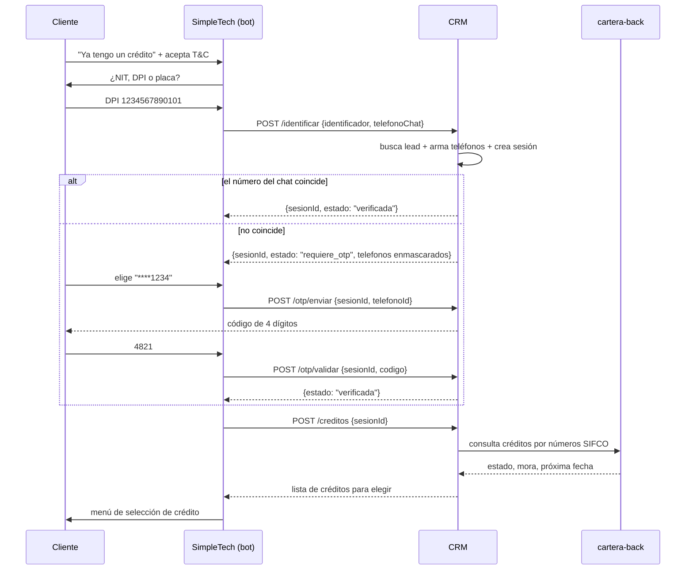

# Paso 1 · Identificación y acceso

**Estado:** 🟡 Propuesta en definición · **No implementado**
**Tickets:** [CC2-39 · CB-103](https://clubcashin.atlassian.net/browse/CC2-39) (principal),
[CC2-48 · CB-115](https://clubcashin.atlassian.net/browse/CC2-48) (árbol)
**Apps involucradas:** `apps/crm` (principal), `apps/cartera-back` (lectura de créditos)
**Prerrequisitos de lectura:** [`ARQUITECTURA.md`](./ARQUITECTURA.md)

---

## 1. Alcance

Desde que el cliente elige "ya tengo un crédito" hasta que queda con **un crédito
seleccionado y su identidad verificada**. Es el cimiento de todo el bot: ningún paso
posterior puede exponer un dato sin que este haya terminado bien.

**Entra en este paso**

- Identificación del cliente por **NIT, DPI o placa**.
- Aceptación de términos y condiciones.
- Verificación de que quien escribe es el titular (comparación contra los teléfonos del
  CRM y, si no coincide, segundo factor).
- Listado de los créditos del cliente y selección de uno.
- Reglas antifraude: intentos máximos, bloqueos, enmascarado de datos.

**No entra en este paso**

- El contenido del menú del crédito y el detalle de saldos (Paso 2).
- Cualquier forma de pago, boleta, convenio o promesa (Pasos 3–5).
- El ruteo entre bot de ventas y bot de cobros dentro de SimpleTech: eso se configura del
  lado del bot (CB-115), acá solo se asume que el cliente ya cayó en la rama de cobros.

---

## 2. Recorrido funcional

1. El cliente entra al bot de cobros y acepta términos y condiciones.
2. El bot pide un identificador y le ofrece tres formas: **NIT, DPI o placa**.
3. El bot llama al CRM con el identificador **y el número desde el que escribe**.
4. El CRM busca al cliente:
   - **No lo encuentra** → respuesta genérica, el cliente puede reintentar (con tope) o
     pasar a un agente.
   - **Lo encuentra** → crea una sesión y compara el número del chat contra los teléfonos
     registrados del cliente.
5. Segundo factor:
   - **El número coincide** → la sesión queda `verificada` de una vez.
   - **No coincide** → la sesión queda `requiere_otp`; el bot ofrece los teléfonos
     registrados **enmascarados**, el cliente elige uno y recibe el código ahí.
6. Con la sesión verificada, el bot pide la lista de créditos:
   - Búsqueda por **placa** → normalmente un solo crédito, se puede autoseleccionar.
   - Búsqueda por **NIT o DPI** → puede haber varios; se muestran para elegir.
   - **Sin créditos activos** → mensaje y salida hacia agente.
7. El cliente elige un crédito → **fin del Paso 1**, entra el menú del crédito (Paso 2).



---

## 3. Contratos propuestos

Base: `POST /api/bot/v1/cobros/...` · `Authorization: Bearer <BOT_COBROS_TOKEN>` ·
formato de respuesta y códigos de error en [`ARQUITECTURA.md`](./ARQUITECTURA.md).

> ⚠️ Contratos **en revisión**. No se implementan hasta cerrarlos con SimpleTech y
> resolver las decisiones bloqueantes de la §8.

### 3.1 `POST /identificar`

Busca al cliente y abre la sesión.

```jsonc
// request
{
  "canal": "whatsapp",
  "telefonoChat": "50255551234",     // número desde el que escribe, formato 502XXXXXXXX
  "tipoIdentificador": "dpi",        // "dpi" | "nit" | "placa"
  "identificador": "1234567890101",
  "aceptaTerminos": true             // se registra con fecha y versión de los T&C
}
```

```jsonc
// respuesta · cliente encontrado y número coincide
{
  "success": true,
  "data": {
    "sesionId": "bcs_7f3a…",
    "estado": "verificada",
    "cliente": { "nombreCorto": "Daniel R." },   // nunca el nombre completo ni el DPI
    "expiraEnSegundos": 900
  }
}
```

```jsonc
// respuesta · cliente encontrado, número NO coincide
{
  "success": true,
  "data": {
    "sesionId": "bcs_7f3a…",
    "estado": "requiere_otp",
    "cliente": { "nombreCorto": "Daniel R." },
    "telefonos": [
      { "id": "tel_1", "mascara": "****1234" },
      { "id": "tel_2", "mascara": "****9087" }
    ],
    "expiraEnSegundos": 900
  }
}
```

```jsonc
// respuesta · no encontrado (200, no 404 — ver D-05)
{
  "success": true,
  "data": { "estado": "no_encontrado", "intentosRestantes": 2 }
}
```

Notas:

- **La comparación del teléfono la hace el CRM**, no SimpleTech: así los números completos
  del cliente nunca salen de nuestros servidores. Ver [D-02](./DECISIONES.md).
- `telefonos[].id` es un identificador **de la sesión**, no de la base: no sirve fuera de
  ella y no permite reconstruir el número.
- El campo `cliente` se devuelve incluso antes de verificar porque el bot necesita
  saludar; por eso es solo nombre + inicial, nunca dato sensible.

### 3.2 `POST /otp/enviar`

```jsonc
// request
{ "sesionId": "bcs_7f3a…", "telefonoId": "tel_1" }
```

```jsonc
// respuesta
{
  "success": true,
  "data": {
    "estado": "requiere_otp",
    "enviadoA": "****1234",
    "expiraEnSegundos": 300,
    "reenvioDisponibleEnSegundos": 60,
    "reenviosRestantes": 2
  }
}
```

### 3.3 `POST /otp/validar`

```jsonc
// request
{ "sesionId": "bcs_7f3a…", "codigo": "4821" }
```

```jsonc
// respuesta OK
{ "success": true, "data": { "estado": "verificada", "expiraEnSegundos": 900 } }
```

```jsonc
// respuesta código incorrecto
{
  "success": false,
  "error": { "codigo": "OTP_INVALIDO", "mensaje": "El código no es correcto." },
  "data": { "intentosRestantes": 2 }
}
```

> **Importante:** no reutilizar `/info/validate-otp` tal cual. Ese endpoint, al validar
> bien el código, **dispara una consulta a Infornet** (buró) porque fue hecho para el
> flujo de ventas. En cobros eso sería un costo por cada cliente que entra al bot, sin
> ninguna utilidad. Se reusa `otpController` (generación, TTL, intentos), **sin** el
> efecto secundario. Ver [D-07](./DECISIONES.md).

### 3.4 `POST /creditos`

```jsonc
// request
{ "sesionId": "bcs_7f3a…" }
```

```jsonc
// respuesta
{
  "success": true,
  "data": {
    "creditos": [
      {
        "creditoId": "crd_a1",                  // referencia opaca, válida en la sesión
        "numeroSifco": "01010214117590",
        "alias": "Toyota Yaris 2019 · P123ABC", // lo que se muestra en el menú
        "placa": "P123ABC",
        "estado": "activo",
        "tieneMora": true
      }
    ],
    "seleccionAutomatica": false   // true cuando se identificó por placa y hay 1 crédito
  }
}
```

Notas:

- Devuelve **lo mínimo para elegir**. Capital, cuotas, mora y fechas son del Paso 2, ya con
  el crédito seleccionado: menos datos en tránsito y menos consultas a cartera por cliente
  que solo está navegando.
- `creditoId` opaco: el bot no maneja números SIFCO en su estado conversacional.
- Requiere sesión `verificada`; si no, `SESION_NO_VERIFICADA`.

---

## 4. Modelo de datos propuesto (CRM)

Dos tablas nuevas. Migración a cargo del usuario, como siempre en este repo.

### `bot_cobros_sesiones`

| Campo | Tipo | Notas |
| --- | --- | --- |
| `id` | uuid PK | |
| `token` | text unique | El `sesionId` opaco que ve el bot. |
| `canal` | enum | `whatsapp` (deja lugar a otros canales). |
| `telefono_chat` | text | Número desde el que escribe. Ata la sesión a ese número. |
| `lead_id` | uuid FK → `leads.id` | Nullable hasta que se identifica. |
| `tipo_identificador` | enum | `dpi` \| `nit` \| `placa`. |
| `identificador_hash` | text | Hash, no el dato en claro. |
| `estado` | enum | `iniciada` \| `requiere_otp` \| `verificada` \| `bloqueada` \| `expirada`. |
| `intentos_otp` | integer | |
| `reenvios_otp` | integer | |
| `verificada_at` | timestamp | |
| `expira_at` | timestamp | |
| `terminos_aceptados_at` | timestamp | Con versión de los T&C. |
| `created_at` / `updated_at` | timestamp | |

### `bot_cobros_eventos`

Auditoría y, más adelante, la fuente de la pantalla de CB-110
([CC2-46](https://clubcashin.atlassian.net/browse/CC2-46)): "ver en el CRM todas las
interacciones del bot".

| Campo | Tipo | Notas |
| --- | --- | --- |
| `id` | uuid PK | |
| `sesion_id` | uuid FK | |
| `lead_id` | uuid FK | Nullable. |
| `tipo` | enum | `identificacion_ok`, `identificacion_fallida`, `otp_enviado`, `otp_ok`, `otp_fallido`, `bloqueo`, `creditos_listados`, `credito_seleccionado`, `escalado_agente`. |
| `payload` | jsonb | Sin PII en claro. |
| `created_at` | timestamp | |

> Se diseñan pensando en que los pasos siguientes (pagos, boletas, convenios) escriben en
> la **misma** tabla de eventos. No crear una tabla de log por paso.

---

## 5. Seguridad y antifraude

CB-103 pide explícitamente "reglas antifraude, intentos máximos y mensajes de error".
Propuesta inicial — los números se afinan con Cobros:

| Control | Propuesta |
| --- | --- |
| Intentos de identificación | 5 por `telefonoChat` por hora; 3 por identificador por hora. |
| Enumeración de clientes | Respuesta genérica ante no encontrado. Nunca "ese DPI no existe" vs "ese DPI existe pero…". |
| OTP | 4 dígitos (reusa lo existente), TTL 5 min, 3 intentos, reenvío con cooldown de 60 s, máx. 3 reenvíos. |
| Bloqueo | Al agotar intentos: sesión `bloqueada` 30 min y oferta de agente humano. |
| Sesión | TTL 15 min; atada al `telefonoChat`; token opaco; se invalida al cambiar de número. |
| Datos expuestos sin verificar | Solo nombre corto y máscaras de teléfono. Ni DPI, ni saldos, ni cantidad de créditos. |
| Datos expuestos ya verificado | Solo lo del contrato. Nada de DPI completo o dirección en el chat. |
| Logs | DPI/NIT hasheados, teléfonos enmascarados. |
| Validación de vida | Opcional según el PDF. Existe `livenessController` en el CRM; se evalúa como refuerzo para casos de alto riesgo, no para el flujo normal ([D-03](./DECISIONES.md)). |

**Límite honesto de este diseño:** el OTP prueba que *alguien con acceso al teléfono
registrado* aprobó la consulta, no que quien escribe sea el titular. Un familiar con el
teléfono del titular pasa igual. Para gestiones sensibles (convenios, cancelación), el
árbol ya manda a un agente humano, y ahí sigue la validación de siempre.

---

## 6. Casos borde a resolver

| Caso | Comportamiento esperado |
| --- | --- |
| DPI existe en **más de un lead** (duplicados históricos) | Definir criterio determinista (lead con crédito activo más reciente) y **alertar** al equipo. Hay precedente: se corrigieron duplicados por formato de DPI. |
| Cliente con **varios créditos** | Se listan todos los activos; el bot muestra menú de selección. |
| Cliente con **cero créditos activos** | Mensaje claro + oferta de agente. No decirle "no existís". |
| Búsqueda por **placa de otro cliente** | El teléfono del chat no coincide → OTP al titular. Si no lo pasa, no ve nada. |
| Placa con formato distinto (`P123ABC` / `P-123ABC` / minúsculas) | Normalizar antes de buscar ([D-09](./DECISIONES.md)). |
| NIT con guion o con `CF` | Normalizar; `CF` no identifica a nadie: se rechaza. |
| Oportunidad **sin `numero_sifco`** (migraciones viejas) | No se puede listar como crédito; se escala a agente. |
| **Crédito renumerado** en SIFCO | El número que conoce cartera puede no ser el histórico. Se lista el vigente. |
| Cliente **sin teléfono** en el CRM | No hay a dónde mandar OTP → agente humano, y queda registrado para que Cobros complete el dato. |
| Cliente al día, **sin caso de cobros** | Sus teléfonos salen solo de `leads.phone`. Es lo normal en B0, no un error. |
| cartera-back caído | `SERVICIO_NO_DISPONIBLE` + agente. Nunca error técnico al cliente. |
| El cliente escribe desde un número nuevo y **quiere actualizarlo** | Fuera de alcance del Paso 1: no se actualizan teléfonos desde el bot. Se registra el evento para que Cobros lo revise. |

---

## 7. Criterios de aceptación

1. Con NIT, DPI o placa válidos y escribiendo **desde un número registrado**, el cliente
   llega a la lista de sus créditos activos sin pasar por OTP.
2. Escribiendo **desde un número no registrado**, no ve ningún dato del crédito hasta
   validar un OTP enviado a un teléfono registrado, mostrado siempre enmascarado.
3. Con un identificador que no corresponde a ningún cliente, recibe un mensaje genérico y
   tiene intentos limitados; el sistema no revela si el dato existe.
4. Agotados los intentos, la sesión se bloquea por el tiempo definido y se le ofrece un
   agente.
5. Identificado por placa y con un solo crédito, el flujo puede saltarse el menú de
   selección.
6. Sin créditos activos, recibe un mensaje claro y salida a agente.
7. Todo intento —exitoso o fallido— queda auditado, sin PII en claro.
8. Ninguna respuesta del CRM incluye número de teléfono completo, DPI completo ni saldos
   antes de la verificación.

---

## 8. Decisiones pendientes que bloquean la implementación

| # | Pregunta | Quién decide |
| --- | --- | --- |
| [D-02](./DECISIONES.md) | ¿La comparación del teléfono la hace el CRM o SimpleTech? | IT (con SimpleTech) |
| [D-03](./DECISIONES.md) | Segundo factor definitivo: ¿solo OTP? ¿validación de vida en qué casos? | Cobros + IT |
| [D-07](./DECISIONES.md) | OTP de cobros: ¿reuso sin Infornet o endpoints nuevos? | IT |
| [D-08](./DECISIONES.md) | ¿Qué estados de cartera cuentan como "crédito activo" listable? | Cobros + Cartera |
| [D-11](./DECISIONES.md) | ¿Qué hacemos cuando quien escribe no es el titular? | Cobros + Legal |
| [D-12](./DECISIONES.md) | T&C: texto, versionado y dónde se registra la aceptación | Legal |

---

## 9. Tareas propuestas

Para desglosar [CC2-39](https://clubcashin.atlassian.net/browse/CC2-39) (estimado en 13
días, es la historia más grande del sprint). Estimaciones a validar.

| # | Tarea | App | Dependencias |
| --- | --- | --- | --- |
| 1 | Cerrar contrato de API con SimpleTech (§3) y publicar colección Postman | — | D-02 |
| 2 | Esquema `bot_cobros_sesiones` + `bot_cobros_eventos` y migración | CRM | D-06 |
| 3 | Middleware de autenticación del bot (`BOT_COBROS_TOKEN`) + rate limiting | CRM | — |
| 4 | Búsqueda unificada por DPI / NIT / placa con normalización | CRM | D-09 |
| 5 | Endpoint `identificar` + comparación de teléfonos + creación de sesión | CRM | 2, 3, 4 |
| 6 | OTP de cobros (reuso de `otpController` sin Infornet) + intentos y bloqueos | CRM | D-07 |
| 7 | Endpoint `creditos` (resolución SIFCO + consulta a cartera) | CRM + cartera | D-08 |
| 8 | Auditoría de eventos y enmascarado de PII | CRM | 2 |
| 9 | Ambiente de pruebas para SimpleTech + datos de prueba | Infra | D-10 |
| 10 | Pruebas de los casos borde de la §6 | CRM | 5, 6, 7 |
