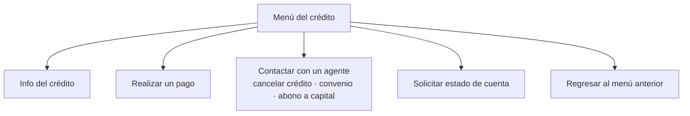
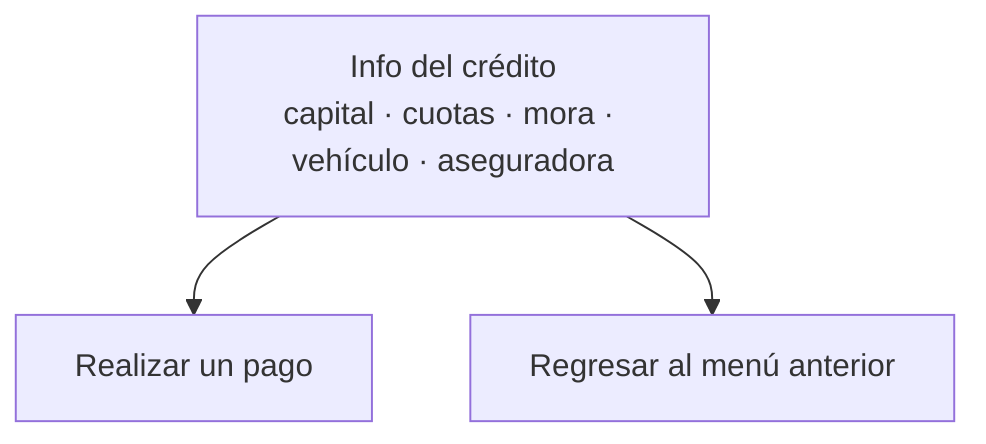

# Paso 2 · Menú del crédito

**Estado:** 🔵 **"Info del crédito" implementada (2026-08-18)** — el resto sigue en definición
**Tickets:** [CC2-40 · CB-104](https://clubcashin.atlassian.net/browse/CC2-40)
**Prerrequisito:** [Paso 1](./01-identificacion-y-acceso.md) (sin identidad verificada no se
muestra nada de esto)

---

## 1. Opciones del menú

Según el documento detallado, al seleccionar un crédito el cliente ve:



| Gestión | Estado |
| --- | --- |
| Info del crédito | 🔵 **Implementada** (ver §2) |
| Realizar un pago | 🟡 En definición → [Paso 3](./03-metodos-de-pago.md) |
| Contactar con un agente | ⚪ Pendiente (ver §3) |
| Solicitar estado de cuenta | ⚪ Pendiente (ver §4) |
| Regresar al menú anterior | Siempre disponible |

### Convenio y promesa no son botones del menú

El árbol de gerencia mostraba seis gestiones, con **convenio** y **promesa de pago** como
opciones propias. El documento detallado **no las pone en el menú**: manda cancelación,
convenio y abono a capital por **"Contactar con un agente"**.

Eso resuelve la duda que quedó abierta al bloquear el flujo
([D-15](./DECISIONES.md#d-15--convenio-y-promesa-de-pago-bloqueados)): **el menú no lleva
esos botones y esas gestiones pasan por un humano.** El autoservicio de convenio y promesa
queda documentado aparte en [`05-convenio-y-promesa.md`](./05-convenio-y-promesa.md) para
cuando gerencia lo apruebe.

---

## 2. Info del crédito

### Qué muestra

| Dato | Fuente |
| --- | --- |
| Capital activo | cartera-back |
| Cuotas atrasadas | cartera-back |
| Cuota actual — con la info de la cuota y el número, ej. `3/60` | cartera-back |
| Monto de la mora, **si tiene** | cartera-back |
| Fecha próxima de pago | cartera-back |
| Info del vehículo | CRM (`vehicles`) |
| **Aseguradora** — agregado en reunión 2026-08-13 | cartera-back (`creditos.aseguradora_id`) |

### Salidas del nodo — cambio vs. el árbol de gerencia

En el árbol original "Info del crédito" era un nodo terminal. **Se acordó que después de
mostrar la información, el bot ofrece dos salidas:**



Razón: el cliente que consulta su saldo es el que más cerca está de pagar; no tiene sentido
obligarlo a volver al menú para hacerlo.

### Se agregó el convenio

No estaba en el árbol original. Si el crédito tiene un convenio activo, el bot muestra su
cuota, cuánto falta y en qué pago va: es lo primero que pregunta un cliente en convenio.

### El contrato

`POST /api/bot/cobros/credito/info` — documentado y ejecutable en el
[Swagger](./01-identificacion-y-acceso.md#33-la-documentación-viva-swagger).

```jsonc
// request — la referencia es la MISMA del paso 1
{ "referencia": "3b530493-…", "numeroSifco": "01010214124000" }
```

```jsonc
// respuesta
{
  "success": true,
  "data": {
    "credito": {
      "numeroSifco": "01010214124000",
      "etiqueta": "Toyota Corolla 2015 · P-319JJL",
      "estado": "MOROSO",
      "capitalActivo": "53439.10",
      "cuotaMensual": "2464.63",
      "cuotasAtrasadas": 1,
      "cuotaActual": { "numero": 1, "de": 48, "fechaVencimiento": "2026-02-28", "vencida": true },
      "proximaFechaPago": "2026-08-30",
      "mora": { "monto": "598.52", "cuotasAtrasadas": 1 },
      "moraPorConfirmar": false,
      "convenio": null,
      "vehiculo": { "placa": "P-319JJL", "marca": "Toyota", "modelo": "Corolla", "anio": 2015 }
    }
  }
}
```

### De dónde sale cada dato

| Dato | Fuente | Nota |
| --- | --- | --- |
| Capital activo | cartera | `creditos.capital` — **el mismo número que muestra la pantalla de cobros del CRM** (ver abajo) |
| Cuotas atrasadas | cartera | Vencidas, sin pagar y **sin un pago esperando validación** |
| Cuota actual `3/60` | cartera | La más vieja sin pagar |
| Mora | cartera | `null` si no tiene, **o si su monto no es confiable ahora** (ver abajo). Un convenio activo la congela |
| Próxima fecha de pago | cartera | La próxima que **todavía no vence** |
| Convenio | cartera | `null` si no tiene |
| Vehículo | CRM (`vehicles`) | `null` si no tiene: **se responde igual** |

### `cuotaActual` y `proximaFechaPago` no son lo mismo

Con atraso, la cuota que el cliente **debe** venció hace meses, mientras que la próxima que
le toca aún no llega. En el ejemplo de arriba: debe la cuota 1 —vencida el 28 de febrero— y
su próxima fecha es el 30 de agosto.

Mezclarlos daría un mensaje absurdo ("tu próxima fecha de pago fue en febrero"), así que van
en campos distintos y `cuotaActual` trae `vencida` para que el bot sepa cuál mostrar.

### Qué es el "capital activo" que ve el cliente

Es **`creditos.capital`**: el mismo dato que la pantalla de cobros del CRM rotula "Capital
Activo" (lo llena `montoFinanciado` en `routers/cobros.ts`). Decisión de Daniel el 2026-08-18:
que el bot y la pantalla digan lo mismo. Si un asesor abre el caso y ve Q190,846.74 mientras
el cliente recibe otra cifra por WhatsApp, el que queda mal parado es el asesor.

**El nombre engaña en los dos lados:** ese número es el monto del crédito, no el saldo
pendiente de capital. Cartera devuelve además `capital_activo` —`capital − SUM(abono_capital)`,
la definición que usa `assignCapital`—, que para el crédito `01010214108330` da Q188,942.11
contra los Q190,846.74 que se muestran.

Queda pendiente decidir con Cobros cuál de los dos corresponde mostrarle al cliente. Cambiarlo
es una línea en `menu-credito.ts`: el dato ya viaja en la respuesta.

### La mora tiene una ventana en la que no se puede citar

`moras_credito` es una **foto** que solo refresca el job `procesarMoras` a las **23:59 GT**.
Entre que el cliente paga —o CONTA valida su boleta— y esa corrida, la fila sigue guardando
las cuotas y el recargo viejos.

Sin cuidado, el bot podía responder **`cuotasAtrasadas: 0` junto a una mora de Q598**: *"ya no
debés cuotas, pero pagá el recargo por atrasarte"*. En el sandbox eso pasa en **2 créditos
ahora mismo**, por Q1,932.94 que se les cobrarían de más.

Por eso el monto **solo se cita cuando la foto coincide** con las cuotas atrasadas que se
están reportando en esa misma respuesta. Si no coinciden, `mora` va en `null` y se levanta
**`moraPorConfirmar: true`** — no se calla el tema, se manda al cliente con su asesor antes que
darle una cifra equivocada. Es el mismo criterio que ya aplica `cuotasProximas`.

Tampoco se cita en los estados que no devengan mora: `EN_CONVENIO`, `INCOBRABLE`, `CANCELADO`,
`PENDIENTE_CANCELACION` y `CAIDO`.

### 🔒 Quién puede ver qué

**La API key identifica a SimpleTech, no al cliente final:** con ella sola se podría pedir el
saldo de cualquier crédito. Por eso este servicio exige la **misma `referencia` del paso 1** y
comprueba cuatro cosas ([D-24](./DECISIONES.md#d-24--el-menú-hereda-la-identidad-del-paso-1)):

1. que la referencia exista y sea de un OTP de cobros,
2. que el cliente **haya canjeado** su código (o sea, pasó el servicio 2),
3. que no hayan pasado **30 minutos** desde ese canje,
4. que el crédito consultado **sea de esa persona**.

Pedir el crédito de un tercero responde `404 CREDITO_NO_ENCONTRADO` — el mismo error que si no
existiera, para que no se pueda averiguar qué créditos hay probando números.

### Por qué no se reusa `/credito` de cartera tal cual

Ese endpoint devuelve el calendario completo: **14 consultas y ~56 KB medidos** para un
crédito de 84 cuotas, con el desglose de cada pago, **el asesor asignado, el royalti, las
membresías y las observaciones internas**. Nada de eso puede salir hacia un integrador
externo, y el bot necesita siete datos.

Se agregó `GET /credito/resumen` en cartera: **421 bytes y ~4x más rápido**, con las mismas
reglas de negocio calculadas donde viven. Se hizo endpoint aparte y no un parámetro porque
`getCreditoByNumero` tiene 473 líneas y lo usa la pantalla que cobranza ocupa a diario.

> El capital activo **tiene** que calcularlo cartera: 441 pagos pagados no tienen `cuota_id`
> (414 con abono a capital), así que sumarlos desde el calendario los dejaría fuera. En el
> sandbox eso desviaba **24 créditos, uno por Q309,485** — le diríamos al cliente que debe de
> más.

### Pendientes

- **La aseguradora quedó fuera de esta entrega** (decisión de Daniel: hoy no es
  indispensable). El endpoint **ya la devuelve** —nombre y `no_poliza`, que sí existe y está
  llena en 1,110 de 1,809 créditos—, solo falta decidir si se muestra y cómo. Lo que **no**
  existe es vigencia, cobertura ni teléfono de asistencia.
- Formato del mensaje: es WhatsApp; definir si todo entra en un mensaje o se parte.

---

## 3. Contactar con un agente

Es la salida para **cancelación de crédito, convenio de pago y abono a capital**.

> ❓ **Pendientes:** cómo se transborda (¿el mismo hilo pasa a un asesor?, ¿se crea un caso o
> un seguimiento en el CRM?), a quién se le asigna, qué pasa fuera de horario, y qué se le
> dice al cliente mientras espera.

---

## 4. Solicitar estado de cuenta

> ❓ **Pendiente:** qué documento se envía exactamente, quién lo genera (¿ya existe en
> cartera?), en qué formato y si se manda por el chat o por correo.

---

## 5. Notas transversales del paso

- Toda pantalla conserva la opción de **regresar al menú anterior**.
- Ninguna gestión de este menú se sirve sin sesión verificada del [Paso 1](./01-identificacion-y-acceso.md).
