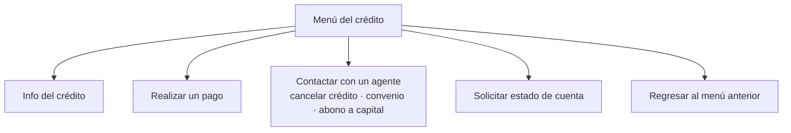
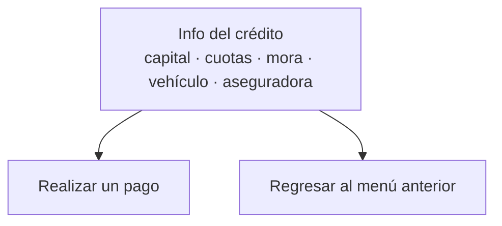

# Paso 2 · Menú del crédito

**Estado:** 🟡 En definición — notas de reunión (2026-08-13) + documento detallado
**Tickets:** [CC2-40 · CB-104](https://clubcashin.atlassian.net/browse/CC2-40)
**Prerrequisito:** [Paso 1](./01-identificacion-y-acceso.md) (sin identidad verificada no se
muestra nada de esto)

---

## 1. Opciones del menú

Según el documento detallado, al seleccionar un crédito el cliente ve:

| Gestión | Estado |
| --- | --- |
| Info del crédito | 🟡 En definición (ver §2) |
| Realizar un pago | 🟡 En definición → [Paso 3](./03-metodos-de-pago.md) |
| Contactar con un agente | ⚪ Pendiente (ver §3) |
| Solicitar estado de cuenta | ⚪ Pendiente (ver §4) |
| Regresar al menú anterior | Siempre disponible |

### Convenio y promesa no son botones del menú

El árbol de gerencia mostraba seis gestiones, con **convenio** y **promesa de pago** como
opciones propias. El documento detallado **no las pone en el menú**: manda cancelación,
convenio y abono a capital por **"Contactar con un agente"**.

Eso resuelve la duda que quedó abierta al bloquear el flujo
([D-15](./DECISIONES.md#d-15--convenio-y-promesa-de-pago-bloqueados)): **el menú no lleva
esos botones y esas gestiones pasan por un humano.** El autoservicio de convenio y promesa
queda documentado aparte en [`05-convenio-y-promesa.md`](./05-convenio-y-promesa.md) para
cuando gerencia lo apruebe.

---

## 2. Info del crédito

### Qué muestra

| Dato | Fuente |
| --- | --- |
| Capital activo | cartera-back |
| Cuotas atrasadas | cartera-back |
| Cuota actual — con la info de la cuota y el número, ej. `3/60` | cartera-back |
| Monto de la mora, **si tiene** | cartera-back |
| Fecha próxima de pago | cartera-back |
| Info del vehículo | CRM (`vehicles`) |
| **Aseguradora** — agregado en reunión 2026-08-13 | cartera-back (`creditos.aseguradora_id`) |

### Salidas del nodo — cambio vs. el árbol de gerencia

En el árbol original "Info del crédito" era un nodo terminal. **Se acordó que después de
mostrar la información, el bot ofrece dos salidas:**

Razón: el cliente que consulta su saldo es el que más cerca está de pagar; no tiene sentido
obligarlo a volver al menú para hacerlo.

### Pendientes

- **Qué datos de la aseguradora exactamente.** Hoy cartera-back solo guarda el **nombre**
  (catálogo `aseguradoras`, enlazado por `creditos.aseguradora_id`, expuesto como
  `aseguradora` en `getAllCredits`). Si se necesita **número de póliza, vigencia, cobertura o
  teléfono de asistencia**, ese dato **no existe** y hay que definir de dónde sale antes de
  prometerlo en el bot.
- Qué se muestra si el crédito no tiene aseguradora asignada (`aseguradora_id` nulo).
- Formato del mensaje: es WhatsApp; definir si todo entra en un mensaje o se parte.

---

## 3. Contactar con un agente

Es la salida para **cancelación de crédito, convenio de pago y abono a capital**.

> ❓ **Pendientes:** cómo se transborda (¿el mismo hilo pasa a un asesor?, ¿se crea un caso o
> un seguimiento en el CRM?), a quién se le asigna, qué pasa fuera de horario, y qué se le
> dice al cliente mientras espera.

---

## 4. Solicitar estado de cuenta

> ❓ **Pendiente:** qué documento se envía exactamente, quién lo genera (¿ya existe en
> cartera?), en qué formato y si se manda por el chat o por correo.

---

## 5. Notas transversales del paso

- Toda pantalla conserva la opción de **regresar al menú anterior**.
- Ninguna gestión de este menú se sirve sin sesión verificada del [Paso 1](./01-identificacion-y-acceso.md).
