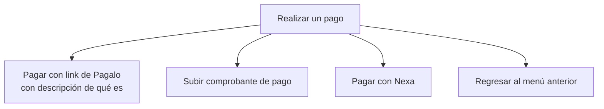
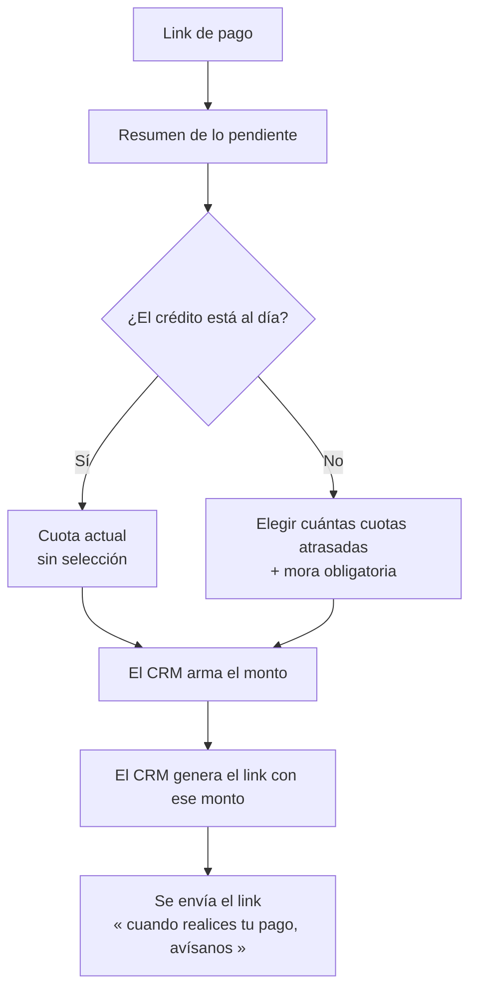
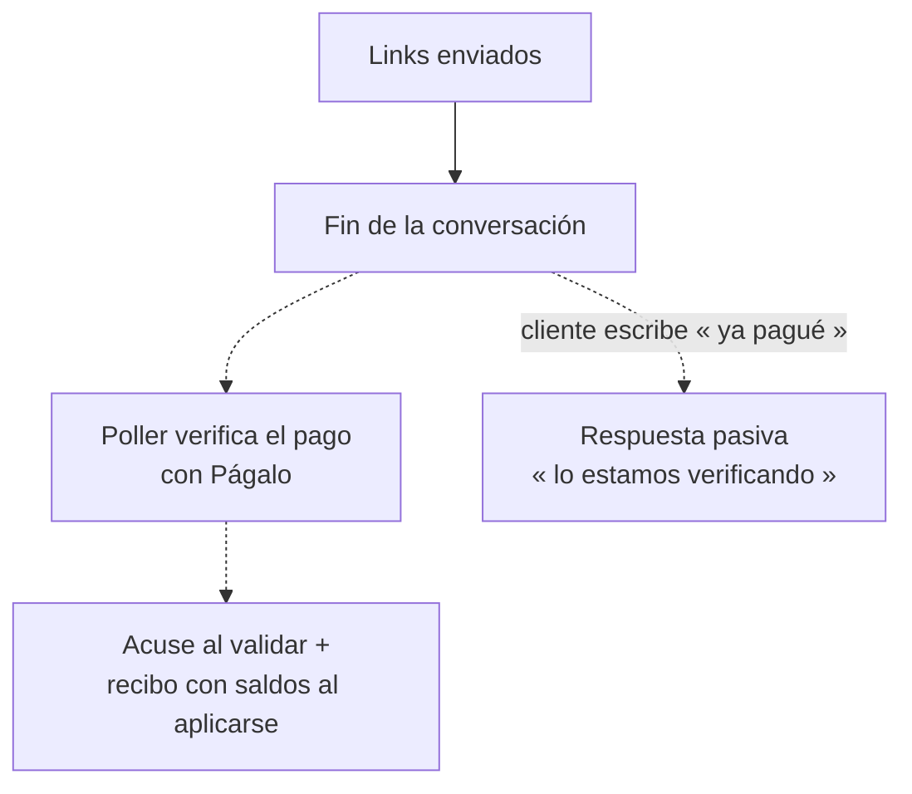

# Paso 3 · Realizar un pago

**Estado:** 🟡 En definición — el link de Págalo ya tiene **contrato propuesto** en
[`07-pago-con-link.md`](./07-pago-con-link.md) (2026-08-24); Nexa sigue en notas de reunión
**Tickets:** [CC2-41 · CB-105](https://clubcashin.atlassian.net/browse/CC2-41) (link de pago),
[CC2-42 · CB-106](https://clubcashin.atlassian.net/browse/CC2-42) (transferencia),
[CC2-43 · CB-107](https://clubcashin.atlassian.net/browse/CC2-43) (comprobante)
**Prerrequisito:** [Paso 2](./02-menu-del-credito.md) — se entra con un crédito ya seleccionado

---

## 1. Menú de pago

> ¿Cómo te gustaría realizar tu pago?

**Subir comprobante lo ve cualquier cliente.** El documento de gerencia decía que la opción
se mostrara solo a algunos perfiles; se descartó
([D-30](./DECISIONES.md#d-30--subir-boleta-lo-puede-hacer-cualquier-cliente)). Quien llegó al
menú ya probó su identidad, y la boleta entra igual a la cola de contabilidad que si la
mandara por correo.

---

## 2. Pagar con link de Pagalo

> 📄 **Contrato detallado en [`07-pago-con-link.md`](./07-pago-con-link.md)** (2026-08-24):
> investigación de la API de Págalo, los dos servicios del bot, el circuito de verificación
> y aplicación (compartido con CB-028, el flujo del asesor), y las decisiones D-45…D-50.
> Esta sección queda como resumen del paso.

### 2.1 Resumen previo

Antes de elegir, al cliente se le muestra el resumen de lo que tiene pendiente:

- Cuotas atrasadas
- Mora
- Cuota actual
- Convenio (si tiene) — 🔴 ver [D-15](./DECISIONES.md#d-15--convenio-y-promesa-de-pago-bloqueados)

### 2.2 Qué elige el cliente

**Regla base (reunión 2026-08-13):** el bot **solo muestra opciones de cuántas cuotas**. No
calcula, no arma montos, no conoce la mora. El monto y el link **los arma el CRM**.

| Situación del crédito | Qué se le ofrece |
| --- | --- |
| **Al día** | Solo la **cuota actual**. No hay selección: es la única opción. |
| **Con atraso** | Elige **cuántas cuotas atrasadas** quiere pagar. La **mora se suma siempre**, obligatoria y **sin opción de excluirla**. |
| **Con convenio vigente** | El documento detallado dice que se incluye **la cuota del convenio como tal**. Bloqueado hasta que gerencia apruebe el flujo de convenios. |

La selección se implementa con un **select de SimpleTech**. Con lo elegido se arma el monto,
y con ese monto **nosotros generamos el link de pago internamente**.

### 2.3 Cambio vs. el árbol de gerencia

El PDF de gerencia decía que el cliente selecciona **rubros**: cuotas atrasadas, mora, cuota
actual o convenio. **La mora ya no es un rubro elegible**: va siempre incluida cuando hay
atraso. El documento detallado lo dice igual: *"siempre le permitimos al cliente escoger las
cuotas que quiere pagar, pero siempre lo obligamos a pagar la mora"*.

### 2.4 Después de enviar el link

**La conversación termina al entregar los links** — el bot no le pregunta nada más
([D-49](./DECISIONES.md#d-49--del-pago-nos-enteramos-nosotros-no-el-cliente)). El árbol
original de gerencia traía un "¿Realizaste tu pago?" con transbordo a agente si el cliente
no contestaba; **ese nodo ya no existe**: lo normal es pagar y cerrar el chat, y escalar a
esos clientes sería transbordar justo a los que sí pagaron (lo señaló Codex en el PR
#1421). Queda solo una **respuesta pasiva**: si el cliente escribe por su cuenta que ya
pagó, el bot contesta genérico ("lo estamos verificando, te llega tu comprobante") sin
disparar nada.

**Regla importante:** si el cliente **paga, avise o no**, le llegan igual el acuse y el
recibo con cómo quedó su capital, su mora y su cuota. La notificación **no depende** de que
el cliente conteste en el chat.

> ✅ **Resuelto (investigación 2026-08-24):** Págalo **no tiene webhook firmado** — sus
> callbacks son redirects del navegador del cliente. Nos enteramos con un **poller** que
> verifica link pagado + transacción `ACCEPT` contra Págalo; los callbacks solo adelantan
> el poll. El "¿lo realizaste?" queda de cortesía y no hay conciliación manual. Detalle en
> [`07-pago-con-link.md` §3.4 y §5](./07-pago-con-link.md), decisión
> [D-49](./DECISIONES.md#d-49--del-pago-nos-enteramos-nosotros-no-el-cliente).

---

## 3. Pagar con Nexa

Se le entrega:

- Info de **su cuenta personal**
- Info general
- **Mini tutorial** de cómo hacer la transferencia a su cuenta de Nexa
- Opción de regresar al menú anterior

**Al acreditarse el pago** se le manda el mensaje con el recibo y cómo quedó su capital, su
mora y su cuota (pendiente o abono a la siguiente).

> ❓ **Pendientes:** de dónde sale "su cuenta personal" de Nexa; qué pasa si el cliente no
> tiene cuenta Nexa; si la transferencia se detecta automáticamente o entra al mismo circuito
> de conciliación que la boleta.

---

## 4. Subir comprobante de pago

Flujo completo y **contrato cerrado** en [`04-validacion-de-boleta.md`](./04-validacion-de-boleta.md):
lectura con IA, confirmación, registro en cartera y el aviso de vuelta cuando conta valida.

---

## 5. Reglas transversales de pago

| Regla | Definición |
| --- | --- |
| **Excedentes** | Aplica a **Nexa y boleta**. Excedente **mayor a Q25** → se aplica directo a la siguiente cuota. **Menor a Q25** → se registra como otros ingresos. **Ya implementado** en `registerPayment.ts` de cartera para todo pago; no se reimplementa en el bot. |
| **Notificación de resultado** | Todo pago acreditado genera mensaje con recibo y detalle de capital, mora y cuota. Si se rechaza, también se le avisa. |
| **Escalamiento** | El **silencio tras recibir el link NO escala** (§2.4: lo normal es pagar y cerrar el chat; se eliminó el transbordo del árbol original). A agente se va cuando el cliente **pide ayuda** o cuando un flujo falla, no por no contestar. |

---

## 6. Pendientes de este paso

- ~~**Orden de las cuotas.**~~ Confirmado: de la más antigua a la más reciente, sin cuotas
  sueltas ([D-46](./DECISIONES.md#d-46--el-cliente-elige-cuántas-cuotas-el-crm-arma-el-monto)).
- ~~**Alcance de la mora obligatoria.**~~ Resuelto: la mora va **completa** en toda opción
  (y es lo único implementable: `moras_credito` guarda un monto por crédito, no por cuota).
- ~~**¿La cuota actual entra en el combo?**~~ Sí — confirmado por Daniel (2026-08-24): el
  cliente puede incluir también la próxima cuota por vencer.
- ~~**Vigencia del link.**~~ Resuelto: **sin expiración por ahora**
  ([D-51](./DECISIONES.md#d-51--los-links-no-expiran-por-ahora)) — si expira medio grupo
  pagado, recuperarlo es peor que cobrar con un monto de hace días.
- ~~**Fuente única del monto.**~~ Resuelto por diseño:
  [D-47](./DECISIONES.md#d-47--fuente-única-del-monto-y-montoesperado) (`montoEsperado` +
  recálculo con la misma función).
- ~~**Integración con Pagalo.**~~ Resuelto: API V2 de Págalo, dos servicios del bot, poller
  verificado y aplicación en cartera ya validada — todo en
  [`07-pago-con-link.md`](./07-pago-con-link.md) (D-45, D-49, D-50).
- ~~**Timeout del "no contestó".**~~ Ya no existe ese nodo: el silencio tras el link no
  escala (§2.4, [D-49](./DECISIONES.md#d-49--del-pago-nos-enteramos-nosotros-no-el-cliente)).
