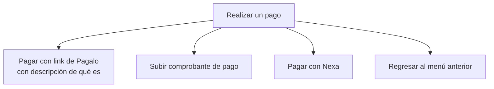
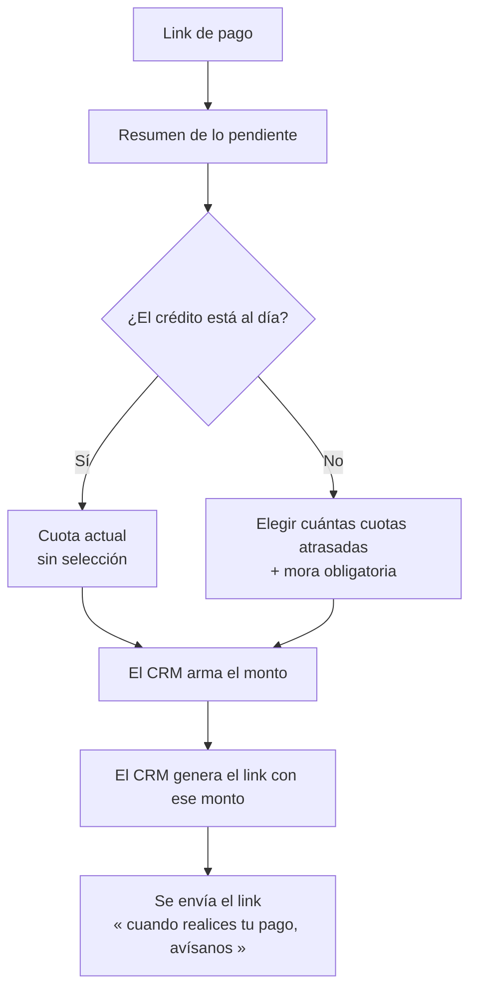
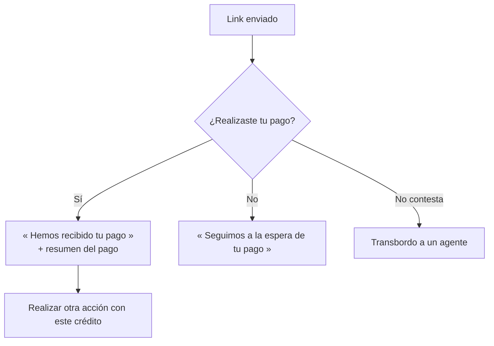

# Paso 3 · Realizar un pago

**Estado:** 🟡 En definición — notas de reunión (2026-08-13) + documento detallado
**Tickets:** [CC2-41 · CB-105](https://clubcashin.atlassian.net/browse/CC2-41) (link de pago),
[CC2-42 · CB-106](https://clubcashin.atlassian.net/browse/CC2-42) (transferencia),
[CC2-43 · CB-107](https://clubcashin.atlassian.net/browse/CC2-43) (comprobante)
**Prerrequisito:** [Paso 2](./02-menu-del-credito.md) — se entra con un crédito ya seleccionado

---

## 1. Menú de pago

> ¿Cómo te gustaría realizar tu pago?

**El menú es dinámico:** la opción de **subir comprobante** solo se muestra a algunos
clientes, según su perfil.

> ❓ **Pendiente:** qué define ese perfil. ¿Bucket de mora? ¿Historial de pagos? ¿Una marca
> manual que pone Cobros? Es una regla de negocio que hoy no existe en el sistema.

---

## 2. Pagar con link de Pagalo

### 2.1 Resumen previo

Antes de elegir, al cliente se le muestra el resumen de lo que tiene pendiente:

- Cuotas atrasadas
- Mora
- Cuota actual
- Convenio (si tiene) — 🔴 ver [D-15](./DECISIONES.md#d-15--convenio-y-promesa-de-pago-bloqueados)

### 2.2 Qué elige el cliente

**Regla base (reunión 2026-08-13):** el bot **solo muestra opciones de cuántas cuotas**. No
calcula, no arma montos, no conoce la mora. El monto y el link **los arma el CRM**.

| Situación del crédito | Qué se le ofrece |
| --- | --- |
| **Al día** | Solo la **cuota actual**. No hay selección: es la única opción. |
| **Con atraso** | Elige **cuántas cuotas atrasadas** quiere pagar. La **mora se suma siempre**, obligatoria y **sin opción de excluirla**. |
| **Con convenio vigente** | El documento detallado dice que se incluye **la cuota del convenio como tal**. Bloqueado hasta que gerencia apruebe el flujo de convenios. |

La selección se implementa con un **select de SimpleTech**. Con lo elegido se arma el monto,
y con ese monto **nosotros generamos el link de pago internamente**.

### 2.3 Cambio vs. el árbol de gerencia

El PDF de gerencia decía que el cliente selecciona **rubros**: cuotas atrasadas, mora, cuota
actual o convenio. **La mora ya no es un rubro elegible**: va siempre incluida cuando hay
atraso. El documento detallado lo dice igual: *"siempre le permitimos al cliente escoger las
cuotas que quiere pagar, pero siempre lo obligamos a pagar la mora"*.

### 2.4 Después de enviar el link

Se le pide al cliente que avise cuando haya pagado.

**Regla importante:** si el cliente **paga, avise o no**, se le manda igual el mensaje con el
recibo y cómo quedó su capital, su mora y su cuota —si quedó algo pendiente o si abonó a una
cuota siguiente. La notificación **no depende** de que el cliente conteste en el chat.

> ❓ **Pendiente:** cómo nos enteramos de que pagó. Si es por webhook de Pagalo, el "¿lo
> realizaste?" es solo cortesía; si no hay webhook, la confirmación del cliente es lo único
> que tenemos y hay que conciliar a mano.

---

## 3. Pagar con Nexa

Se le entrega:

- Info de **su cuenta personal**
- Info general
- **Mini tutorial** de cómo hacer la transferencia a su cuenta de Nexa
- Opción de regresar al menú anterior

**Al acreditarse el pago** se le manda el mensaje con el recibo y cómo quedó su capital, su
mora y su cuota (pendiente o abono a la siguiente).

> ❓ **Pendientes:** de dónde sale "su cuenta personal" de Nexa; qué pasa si el cliente no
> tiene cuenta Nexa; si la transferencia se detecta automáticamente o entra al mismo circuito
> de conciliación que la boleta.

---

## 4. Subir comprobante de pago

Flujo completo en [`04-validacion-de-boleta.md`](./04-validacion-de-boleta.md).

---

## 5. Reglas transversales de pago

| Regla | Definición |
| --- | --- |
| **Excedentes** | Aplica a **Nexa y boleta**. Excedente **mayor a Q25** → se aplica directo a la siguiente cuota. **Menor a Q25** → se registra como otros ingresos. |
| **Notificación de resultado** | Todo pago acreditado genera mensaje con recibo y detalle de capital, mora y cuota. Si se rechaza, también se le avisa. |
| **Escalamiento** | Falta de respuesta tras enviar el link de pago → agente humano. |

---

## 6. Pendientes de este paso

- **Orden de las cuotas.** Se asume de la más antigua a la más reciente (no puede pagar la 5
  dejando abierta la 3). Confirmar.
- **Alcance de la mora obligatoria.** Con 3 cuotas atrasadas y eligiendo pagar 1: ¿toda la
  mora acumulada o solo la de esa cuota?
- **¿La cuota actual entra en el combo?** Cliente con atraso que quiere además adelantar la
  cuota del mes en curso.
- **Vigencia del link.** La mora crece a diario: un link generado ayer queda corto hoy.
  Definir expiración y qué pasa al usar uno vencido.
- **Fuente única del monto.** El monto que ve el cliente y el que va en el link deben salir
  del mismo cálculo, una sola vez. En el módulo de cobros ya hay un problema conocido de
  doble fuente del monto de mora; no replicarlo acá.
- **Integración con Pagalo.** ¿API o generación manual? ¿Webhook de confirmación? ¿Quién
  aplica el pago en cartera y en qué momento?
- **Timeout del "no contestó".** Después de cuánto tiempo se transborda a un agente.
- **Perfil que habilita subir boleta** (§1).
