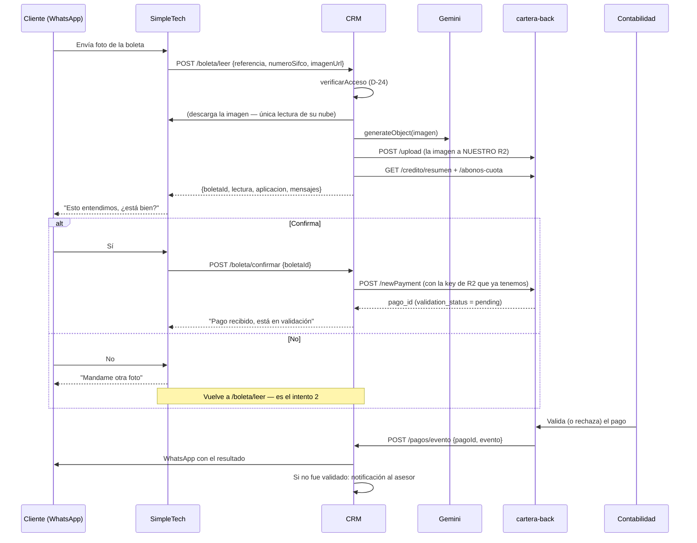

# Paso 4 · Pago con boleta

**Estado:** 🟢 **Contrato cerrado · sin implementar** (2026-08-19)
**Tickets:** [CC2-43 · CB-107](https://clubcashin.atlassian.net/browse/CC2-43) (cargar
comprobante), [CC2-44 · CB-108](https://clubcashin.atlassian.net/browse/CC2-44) (pendiente de
conciliación), [CC2-45 · CB-109](https://clubcashin.atlassian.net/browse/CC2-45)
(conciliación)
**Prerrequisito:** [Paso 1](./01-identificacion-y-acceso.md) (identidad) y
[Paso 2](./02-menu-del-credito.md) (crédito seleccionado)

> **Por qué es su propia sección.** Funcionalmente cuelga del menú del crédito —se llega
> desde ahí—, pero detrás hay lectura con IA, un borrador con estado, un insert en el sistema
> que mueve el dinero y un circuito de vuelta desde contabilidad. Es el paso con más lógica
> del bot, así que lleva su propio tag en Swagger (**Pago con boleta**), sus propias tablas y
> sus propios PR.

---

## 1. Qué hace

El cliente manda la foto de su boleta por WhatsApp. Nosotros la leemos con IA, le mostramos
lo que entendimos **para que confirme**, y solo si confirma registramos el pago en cartera —
por el mismo endpoint que usa el formulario de contabilidad, y en el mismo estado: pendiente
de validación. Cuando conta lo resuelve, cartera nos avisa y el CRM le escribe al cliente.



---

## 2. Los tres endpoints

| # | Endpoint | Quién llama | Para qué |
| --- | --- | --- | --- |
| 5 | `POST /api/bot/cobros/boleta/leer` | SimpleTech | Lee la boleta y devuelve los datos para confirmar. **No registra nada.** |
| 6 | `POST /api/bot/cobros/boleta/confirmar` | SimpleTech | Registra el pago en cartera. |
| — | `POST /api/bot/cobros/pagos/evento` | **cartera-back** | Avisa que conta resolvió el pago. **No va en el Swagger del bot**: no es de SimpleTech. |

Los dos primeros llevan la API key del bot ([D-18](./DECISIONES.md#d-18--autenticación-del-bot-api-key))
y la `referencia` del paso 1 ([D-24](./DECISIONES.md#d-24--el-menú-hereda-la-identidad-del-paso-1)).
El tercero lleva **otra** llave, propia de cartera — ver §6.

---

## 3. Servicio 5 · `POST /api/bot/cobros/boleta/leer`

### Request

```json
{
  "referencia": "9f8c3b2a-1d4e-4f6a-9b7c-2e5d8a1f0c33",
  "numeroSifco": "01010214108330",
  "imagenUrl": "https://cdn.simpletech.gt/media/abc123.jpg"
}
```

| Campo | Tipo | Obligatorio | Nota |
| --- | --- | --- | --- |
| `referencia` | uuid | Sí | La del paso 1, ya canjeada. |
| `numeroSifco` | string | Sí | El crédito elegido en el paso 2. |
| `imagenUrl` | url https | Sí | Dominio dentro de la allowlist ([D-29](./DECISIONES.md#d-29--la-imagen-se-descarga-con-allowlist)). |

**El número de intento no lo manda el bot.** Lo cuenta el CRM sobre los borradores de esa
sesión: es dato nuestro, y si lo mandara el bot se podría reiniciar para saltarse el tope
([D-27](./DECISIONES.md#d-27--tres-intentos-por-sesión-y-los-cuenta-el-crm)).

### Response 200

```json
{
  "success": true,
  "data": {
    "boletaId": "b3d1f0a4-77c2-4c19-9a56-0f2b8e4d1a90",
    "intento": 1,
    "intentosRestantes": 2,
    "expiraEn": "2026-08-19T21:15:00.000Z",
    "lectura": {
      "banco": { "id": 1, "nombre": "Banco Industrial", "leido": "BANCO INDUSTRIAL, S.A." },
      "monto": "6264.10",
      "fechaBoleta": "2026-08-18",
      "numeroAutorizacion": "123456789",
      "cuentaDestino": "***4587",
      "observaciones": null
    },
    "camposFaltantes": [],
    "confianza": "alta",
    "aplicacion": {
      "estimado": true,
      "cuota": { "numero": 3, "de": 60, "fechaVencimiento": "2026-08-18" },
      "saldoCuota": "6264.10",
      "mora": "59849.54",
      "orden": ["mora", "cuota_3"],
      "cubreMora": false,
      "cubreCuota": false,
      "excedente": "0.00"
    },
    "mensajes": {
      "titulo": "🧾 *Boleta recibida · Q6,264.10*",
      "resumen": "…",
      "completo": "…"
    }
  }
}
```

**Campos de la lectura.** Los cinco del formulario de cartera, más la cuenta destino que pide
el árbol de gerencia:

| Campo | Obligatorio para poder confirmar | Si no se lee |
| --- | --- | --- |
| `monto` | **Sí** | `422 BOLETA_ILEGIBLE`. Sin monto no hay pago. |
| `banco` | **Sí** | `banco: null` + `camposFaltantes: ["banco"]` + `bancosSugeridos` para que el cliente elija. |
| `fechaBoleta` | No | Se usa **hoy** y se avisa en `camposFaltantes`. |
| `numeroAutorizacion` | No | Va vacío. En cartera es opcional. |
| `cuentaDestino` | No | Solo informativa: se guarda y se le muestra a conta. Hoy **no se valida** — ver §13. |
| `observaciones` | No | Lo que el modelo haya podido leer de más (concepto, referencia). |

**`confianza`** resume la lectura para que el bot module el mensaje: `alta` (todo leído),
`media` (faltó algo opcional), `baja` (faltó el banco o la fecha). El bot no ramifica por
esto — es para el texto.

**`aplicacion` es una estimación y lo dice.** Cartera aplica el dinero en un orden fijo: la
mora primero y después las cuotas, de la más vieja a la más nueva. Con eso, el resumen del
crédito y los abonos parciales de la cuota actual alcanzan para decirle al cliente a dónde va
su dinero, pero **la aplicación real la hace cartera al validar** el pago. Por eso viaja
`estimado: true` y el mensaje dice "se aplicará", no "se aplicó".

### Errores

| HTTP | `codigo` | Cuándo |
| --- | --- | --- |
| 400 | `PARAMETROS_INVALIDOS` | Falta `referencia`, `numeroSifco` o `imagenUrl`. |
| 400 | `URL_NO_PERMITIDA` | La URL no es https o el dominio no está en la allowlist. |
| 401 | `REFERENCIA_INVALIDA` | No existe, no es de cobros, o nunca se canjeó. |
| 401 | `SESION_VENCIDA` | Pasaron más de 30 minutos desde el canje. |
| 404 | `CREDITO_NO_ENCONTRADO` | El crédito no es de esa persona (mismo error que si no existiera). |
| 404 | `CREDITO_SIN_DATOS` | El crédito existe en el CRM pero cartera no lo tiene. |
| 413 | `ARCHIVO_MUY_GRANDE` | Más de 8 MB. |
| 422 | `ARCHIVO_NO_SOPORTADO` | No es JPG, PNG, WEBP ni PDF. |
| 422 | `BOLETA_ILEGIBLE` | El modelo no sacó ni el monto. Foto borrosa, recortada, o no es una boleta. |
| 429 | `DEMASIADOS_INTENTOS` | Tercer intento agotado en esta sesión. |
| 502 | `IMAGEN_NO_DESCARGABLE` | La URL respondió error, tardó más de 15 s o cortó. |
| 503 | `LECTOR_NO_DISPONIBLE` | Gemini caído o timeout de 30 s. **Se puede reintentar**, no cuenta intento. |
| 500 | `ERROR_INTERNO` | Cualquier otra cosa. |

Todos con `data.mensaje` listo para el chat, igual que el resto del bot
([D-22](./DECISIONES.md#d-22--todo-lo-que-no-termina-en-dato-va-con-estado-http-de-error)).

---

## 4. Servicio 6 · `POST /api/bot/cobros/boleta/confirmar`

### Request

```json
{
  "referencia": "9f8c3b2a-1d4e-4f6a-9b7c-2e5d8a1f0c33",
  "numeroSifco": "01010214108330",
  "boletaId": "b3d1f0a4-77c2-4c19-9a56-0f2b8e4d1a90",
  "bancoId": 1
}
```

**Lo único que el bot puede mandar además del `boletaId` es `bancoId`**, y solo cuando la
lectura no lo reconoció o el cliente lo corrigió. El monto, la fecha y la autorización **no
se aceptan por el request**: salen del borrador que guardó el CRM. Es la diferencia entre que
el monto lo dicte la boleta y que lo dicte quien está del otro lado del chat
([D-26](./DECISIONES.md#d-26--el-monto-lo-dicta-la-boleta-no-el-cliente)).

Si el cliente dice que los datos están mal, el bot **no corrige**: le pide otra foto y vuelve
a `/boleta/leer`. Ese es el reintento.

### Response 200

```json
{
  "success": true,
  "data": {
    "pagoIds": [48213, 48214],
    "cuotasCubiertas": [3, 4],
    "estado": "en_validacion",
    "monto": "12528.20",
    "banco": "Banco Industrial",
    "fechaBoleta": "2026-08-18",
    "numeroAutorizacion": "123456789",
    "mensajes": { "titulo": "…", "resumen": "…", "completo": "…" }
  }
}
```

**`pagoIds` es una lista, no un id.** Una boleta que cubre dos cuotas crea dos pagos en
cartera (§5.2). El bot no necesita usarlos —son para el circuito de vuelta y para soporte—
pero devolver un solo id sería mentir sobre lo que quedó registrado.

### 4.1 Qué pasa si el bot reintenta el mismo `boletaId`

El caso feo no es que el cliente confirme dos veces: es que **cartera registre el pago y
nosotros no nos enteremos** —timeout, corte de red, el proceso se cae entre el `newPayment` y
el guardado—. Si un reintento viera el borrador todavía sin confirmar, volvería a llamar a
cartera y crearía un **segundo pago real**.

Y la protección de cartera no alcanza: su chequeo de duplicados **solo corre cuando vienen
`numeroAutorizacion` y `banco_id` a la vez**, y en este contrato la autorización es opcional
(hay boletas que no la traen). Sin autorización, no hay red.

Por eso el borrador tiene un **estado intermedio** y la confirmación es una máquina de tres
pasos:

```
leida  ──(se marca)──►  confirmando  ──(cartera respondió)──►  confirmada
                             │
                             └──(no respondió)──►  se queda en confirmando
```

1. **Antes** de llamar a cartera, el borrador pasa a `confirmando` con un UPDATE condicional
   (`WHERE estado = 'leida'`). Dos peticiones simultáneas: solo una gana.
2. Se llama a `newPayment`.
3. Con la respuesta, se guardan los `pago_id` y el borrador pasa a `confirmada`.

Un reintento sobre un borrador en `confirmando` **no vuelve a llamar a cartera**: responde
`409 CONFIRMACION_EN_CURSO`.

**Y para no dejarlo colgado**, un job de reconciliación revisa los borradores que llevan más
de 5 minutos en `confirmando` y le pregunta a cartera si esa boleta existe — la busca por la
`r2_key`, que es única y quedó en la tabla `boletas` de cartera:

- **no existe** → el borrador vuelve a `leida` y el cliente puede confirmar de nuevo;
- **existe** → se guardan los `pago_id` encontrados y el borrador pasa a
  **`confirmada_a_verificar`**, no a `confirmada`.

**Por qué "a verificar" y no "lista".** `insertPayment` **no es transaccional**: escribe las
filas de `pagos_credito` y de `boletas` una por una contra el `db` global, sin envolver el
loop. Si se cayó a mitad de repartir entre tres cuotas, quedaron una o dos filas commiteadas
y un 500 de vuelta. Encontrar filas con esa `r2_key` prueba que **algo** se escribió, no que
se escribió **todo**.

Por eso el job nunca vuelve a llamar a `newPayment` cuando encuentra filas —duplicaría lo ya
escrito— y tampoco le dice al cliente "pago recibido". Lo que hace es:

- dejar el borrador en `confirmada_a_verificar` con los ids que sí encontró;
- **notificar a contabilidad y al asesor** para que revisen si el monto quedó completo;
- al cliente, un mensaje neutro: *"estamos procesando tu pago, te avisamos"*.

Que `insertPayment` no sea atómico es un problema de cartera que ya existía y excede este
feature; acá solo se evita que el bot lo convierta en un pago a medias silencioso
([D-34](./DECISIONES.md#d-34--la-confirmación-se-protege-con-estado-no-con-idempotency-key)).

Eso necesita un endpoint de lectura en cartera (`GET /pagos-por-boleta?url=…`), que es
aditivo y no toca el camino de escritura. **No se mete una idempotency key en `newPayment`**:
ese endpoint mueve dinero y ya fue decisión no meterle idempotencia
([D-34](./DECISIONES.md#d-34--la-confirmación-se-protege-con-estado-no-con-idempotency-key)).

### Errores

| HTTP | `codigo` | Cuándo |
| --- | --- | --- |
| 400 | `PARAMETROS_INVALIDOS` | Falta `boletaId`. |
| 400 | `BANCO_REQUERIDO` | La lectura no reconoció el banco y no vino `bancoId`. |
| 400 | `BANCO_INVALIDO` | El `bancoId` no está en el catálogo activo. |
| 401 | `REFERENCIA_INVALIDA` / `SESION_VENCIDA` | Igual que arriba. |
| 404 | `BORRADOR_NO_ENCONTRADO` | El `boletaId` no existe o es de otra sesión. |
| 410 | `BORRADOR_VENCIDO` | Pasaron más de 15 minutos desde la lectura. Pedir la foto de nuevo. |
| 409 | `BOLETA_YA_CONFIRMADA` | Ese borrador ya se registró. Va con los `pagoIds` en `data` — **no se registra otro pago**. |
| 409 | `CONFIRMACION_EN_CURSO` | Hay una confirmación a medias de este mismo borrador (§4.1). Se responde sin volver a llamar a cartera. |
| 409 | `BOLETA_DUPLICADA` | Misma autorización + banco ya registrada. Ver §9. |
| 502 | `PAGO_NO_REGISTRADO` | Cartera respondió error al insertar. |
| 503 | `CARTERA_NO_DISPONIBLE` | Cartera no respondió. |
| 500 | `ERROR_INTERNO` | Otra cosa. |

---

## 5. Qué se le manda a cartera

El insert es `POST /newPayment` de cartera-back — **el mismo que usa el formulario de
contabilidad**, sin ruta especial para el bot. Mapeo campo por campo:

| Campo de `newPayment` | De dónde sale | Nota |
| --- | --- | --- |
| `credito_id` | `resumen.credito_id` | Del `/credito/resumen` del paso 2. |
| `usuario_id` | `creditos.usuario_id` — **falta exponerlo** | Es el **cliente dueño del crédito** en `cartera.usuarios`, no el asesor ni un usuario del CRM. Ver el recuadro de abajo. |
| `monto_boleta` | `lectura.monto` | Lo leído de la boleta. |
| `fecha_pago` | **hoy** (GT) | Igual que el formulario. |
| `fecha_boleta` | `lectura.fechaBoleta` | La de la boleta; si no se leyó, hoy. |
| `banco_id` | `lectura.banco.id` o el `bancoId` del request | |
| `numeroAutorizacion` | `lectura.numeroAutorizacion` | Puede ir vacío. |
| `origen_pago` | `"boleta"` | Es literalmente eso. |
| `cuotaApagar` | `resumen.cuota_actual.numero` | La más vieja sin pagar. **El bot no elige cuota.** |
| `url_boletas` | `[boleta.r2_key]` | La key de **nuestro** R2, guardada al leer. Ver §7. |
| `registerBy` | `"bot-cobros@clubcashin.com"` | Identifica el pago en el historial y es el filtro del circuito de vuelta. |
| `observaciones` | `"Boleta cargada por el cliente vía WhatsApp"` + lo que se haya leído | Para que conta sepa de dónde vino. |
| `otros` | `0` | |
| `abono_directo_capital` | `0` | El bot nunca abona a capital. |

**Lo que el bot no hace.** No decide excedentes, no reparte entre cuotas, no toca la mora:
todo eso ya lo hace `newPayment` —mora primero, luego cuotas de la más vieja a la más nueva—
exactamente igual que cuando conta registra el pago a mano.

### 5.1 Registrar no es inerte

Decir "queda pendiente hasta que conta lo valide" es **falso a medias**, y conviene tenerlo
claro antes de exponer esto a clientes:

| Al **registrar** (pending) | Espera a la **validación** |
| --- | --- |
| `procesarPagoMora` corre dentro de `newPayment` y **descuenta la mora en el acto** (`updateMora` con `DECREMENTO`) | El pago sigue en `validation_status = 'pending'` |
| Si la mora queda en 0, el crédito **pasa de `MOROSO` a `ACTIVO`** | Las cuotas del calendario **no** se cierran (`cuotas_credito.pagado` no se toca) |
| Se crean las filas de `pagos_credito` con la boleta adjunta | Los inversionistas **no** se procesan hasta `revalidatePayment` |

O sea: entre que el cliente sube la boleta y conta la mira, **su mora ya bajó**. Y el bot
mismo no se lo va a mostrar mal —`/credito/resumen` solo cuenta como pagada una cuota con
pago `validated`— pero el número de mora sí cambia.

**Esto no lo introduce el bot.** Pasa idéntico cuando conta registra a mano una boleta que
llegó por correo: es cómo funciona `registerPayment` desde siempre. Lo que cambia es la
frecuencia y que ya no hay un humano filtrando antes del insert.

**La consecuencia de diseño está en el rechazo:** tiene que ser la acción que **devuelve** la
mora. Ver §6 y [D-32](./DECISIONES.md#d-32--registrar-una-boleta-ya-mueve-la-mora-y-por-eso-el-rechazo-es-revertir).

### 5.2 Una boleta puede crear varios pagos

`newPayment` recorre las cuotas pendientes mientras le quede dinero, y **crea o actualiza una
fila de `pagos_credito` por cuota**. Un cliente con tres cuotas atrasadas que paga las tres
con una sola boleta genera **tres pagos**, cada uno con su `pago_id` y todos apuntando a la
misma imagen en la tabla `boletas`.

Además, **la respuesta de `newPayment` hoy no devuelve ningún `pago_id`** — devuelve un
resumen (`cuotas_pagadas_completas`, `cuotas_pagadas_parciales`, `monto_aplicado`).

Sin esos ids no hay circuito de vuelta: cuando conta valide, el evento traerá un `pago_id` que
el CRM no sabría de quién es. Por eso el PR B agrega a la respuesta de `newPayment` la lista de
ids creados:

```json
{ "success": true, "pagos": [48213, 48214, 48215], "detalle": { … } }
```

Es **aditivo** —el formulario de carteraFront ignora el campo— y no toca la lógica de
aplicación. Del lado del CRM, la relación boleta→pagos es 1:N y vive en su propia tabla
([D-33](./DECISIONES.md#d-33--una-boleta-son-varios-pagos-y-una-sola-notificación)).

> **`usuario_id` no es quién registra el pago.** Es el cliente del crédito: para el
> `01010214108330` vale `1049` → *Raul Alberto Zeledon Burgalin*, con su NIT. El asesor de ese
> crédito es otra columna (`asesor_id` → `asesores`, *Erik Rivas*), y no entra en el pago.
> Quien registra viaja en `registerBy`, que es texto libre — ahí va
> `bot-cobros@clubcashin.com`.
>
> O sea que **no hay nada que emparejar con el CRM**: el id viene con el crédito. Lo único que
> falta es que `/credito/resumen` lo devuelva, que es agregar una columna al `select` que ya
> existe.

**La regla de los Q25 ya está adentro.** El árbol de gerencia pide que un excedente mayor a
Q25 se aplique a la siguiente cuota y uno menor se registre como otros ingresos
([`03-metodos-de-pago.md`](./03-metodos-de-pago.md#5-reglas-transversales-de-pago)). Eso es
exactamente lo que hace `registerPayment.ts` hoy con cualquier pago: sigue repartiendo entre
cuotas mientras sobre más de Q25, y lo que queda por debajo lo suma a `otros`. **El bot no
reimplementa nada de esto** — si lo hiciera, habría dos fuentes de la misma regla y algún día
dirían cosas distintas.

---

## 6. Circuito de vuelta · cartera → CRM

### Endpoint (en el CRM)

`POST /api/bot/cobros/pagos/evento`, autenticado con `x-api-key: $CARTERA_WEBHOOK_API_KEY`
— **una llave distinta a la del bot**: quien puede consultar créditos no tiene por qué poder
disparar mensajes de WhatsApp.

```json
{
  "pagoId": 48213,
  "creditoId": 987,
  "numeroSifco": "01010214108330",
  "evento": "validado",
  "motivo": null,
  "usuario": "conta@clubcashin.com",
  "ocurridoEn": "2026-08-19T20:03:00.000Z"
}
```

| `evento` | Qué pasó en cartera | Qué hace el CRM |
| --- | --- | --- |
| `validado` | `GET /aplicar-pago` — **el botón "Validar Pago" de conta** | WhatsApp al **cliente**: pago acreditado. |
| `validado` | `POST /revalidatePayment` — "Revalidar", solo ADMIN | Lo mismo. |
| `revertido` | `POST /reversePayment` | **Este es el rechazo.** WhatsApp al cliente + notificación al asesor. |
| `regresado_a_pendiente` | `POST /revertPaymentToPending` | Depende de si al cliente ya se le dijo que estaba acreditado — ver abajo. |
| `marcado_falso` | `POST /false-payment` | Solo notificación al asesor, **marcada como alerta**: ver el recuadro. |

> **La validación normal es `/aplicar-pago`, no `/revalidatePayment`.** El botón "Validar
> Pago" de `paymentsTable.tsx` llama a `pagosService.aplicarPago(pagoId)`, que pega en
> `GET /aplicar-pago?pago_id=…` y de ahí a `aplicarPagoAlCredito`, que es quien mueve el pago
> de `pending` a `validated`. `/revalidatePayment` es otra acción ("Revalidar", reservada a
> ADMIN). Si el circuito colgara solo de `/revalidatePayment`, **el caso normal —conta valida
> la boleta y el cliente nunca se entera— se perdería entero.**

> **`regresado_a_pendiente` no siempre es silencio.** `revertPaymentToPending` sirve
> justamente para devolver a pendiente un pago **ya validado**. Si al cliente ya se le mandó
> el "tu pago fue acreditado" (`bot_cobros_boletas.notificado_cliente_at` con valor), callarse
> lo deja creyendo algo que dejó de ser cierto: se le vuelve a escribir —*"estamos revisando
> de nuevo tu pago"*— y el ciclo de notificación de esa boleta se **reabre**
> (`notificado_cliente_at` vuelve a `NULL`). Si nunca se le dijo nada, entonces sí: solo al
> asesor, porque para el cliente no cambió nada.

> **Rechazar una boleta es "Revertir Pago", no "marcar falso".** Es lo que hace conta hoy en
> carteraFront, y es el único camino que **devuelve la mora** que el registro descontó (§5.1):
> `reversePayment` llama a `updateMora` con `INCREMENTO`. Funciona igual sobre un pago
> `pending`, así que sirve para una boleta que nunca se validó.
>
> `false-payment` **no restaura la mora** — solo pone `pagado: false, paymentFalse: true`. En
> la UI ni siquiera está cableado a un botón del flujo de boletas de cliente. Si aun así llega
> un evento `marcado_falso`, el CRM no le escribe al cliente: levanta una alerta al asesor
> diciendo que ese crédito quedó con la mora descontada por una boleta que se descartó.
> Ver [D-32](./DECISIONES.md#d-32--registrar-una-boleta-ya-mueve-la-mora-y-por-eso-el-rechazo-es-revertir).

Respuesta siempre `200`, aunque no se haya notificado:

```json
{ "success": true, "data": { "notificado": true, "motivo": null } }
```

`motivo: "PAGO_NO_ES_DEL_BOT"` cuando el pago no salió del bot — que es el caso del 99% de
los pagos. **No es un error**: si respondiéramos 4xx, cartera lo trataría como fallo y
llenaría los logs de contabilidad de rojo.

### Del lado de cartera

Los controladores emiten el aviso **después de que la transacción hizo commit**, con el
patrón que ya existe en `services/crm.service.ts` (`notifyPayInvestors`): try/catch propio,
log y seguir. Un WhatsApp caído no puede tumbar la validación de un pago
([D-28](./DECISIONES.md#d-28--el-aviso-a-whatsapp-nunca-rompe-la-acción-de-conta)).

### El aviso se puede perder, y por eso hay un segundo camino

"Try/catch, log y seguir" tiene un costo: si el CRM está caído justo en ese segundo, **ese
evento no vuelve nunca**. Y no es un detalle cosmético — el aviso *es* el producto: un pago
validado del que el cliente jamás se entera es peor que no tener circuito.

En vez de montar un outbox con reintentos del lado de cartera —tabla nueva, job nuevo, en la
app que mueve el dinero—, el CRM **se encarga de no depender del aviso**:

| Camino | Qué es | Cuándo actúa |
| --- | --- | --- |
| **Rápido** | El webhook `/pagos/evento` | Siempre que salga bien: el cliente se entera en segundos. |
| **Red de seguridad** | Un job del CRM revisa las boletas confirmadas que tienen pagos sin resolver y le **pregunta a cartera** en qué `validation_status` están | Cada hora. Si alguno ya no está `pending`, se procesa como si el evento hubiera llegado. |

El job reusa el mismo endpoint de lectura del §4.1 (`GET /pagos-por-boleta`, que devuelve el
`validation_status` de cada fila). Nada se pierde: el webhook adelanta el aviso, el job
garantiza que ocurra ([D-35](./DECISIONES.md#d-35--el-webhook-adelanta-el-aviso-el-job-lo-garantiza)).

### A quién se le avisa

- **Cliente:** al teléfono del CRM (el mismo criterio del OTP), con plantilla aprobada de
  SimpleTech vía `sendWhatsappTemplate` — la infraestructura que ya usan los mensajes de
  cobros y el de bienvenida. Es obligatorio que sea plantilla: pueden haber pasado más de
  24 h desde el último mensaje del cliente.
- **Asesor:** notificación del CRM (`createNotification`), asignada al `responsable` del caso
  de cobros de ese crédito. Si el crédito no tiene caso o el caso no tiene responsable, la
  notificación va **al rol `cobros`** en vez de perderse.

### Idempotencia y agrupación

Un pago se puede revertir y volver a validar; conta puede repetir una acción. Cada aviso se
guarda en `bot_cobros_pago_eventos` con **unique `(pago_id, evento, ocurrido_en)`**: si el
mismo evento llega dos veces con el mismo timestamp, se responde `notificado: false` y no se
manda otro WhatsApp.

**Y una boleta puede tener varios pagos (§5.2), así que llegarán varios eventos.** Conta
valida las tres cuotas una por una: son tres eventos para una sola boleta. Mandarle tres
WhatsApp al cliente por un solo pago sería ridículo.

La regla es **un mensaje por boleta, cuando ya no falte ninguno**:

1. Llega un evento → se registra y se marca ese pago como resuelto.
2. Si **quedan pagos de la misma boleta sin resolver**, no se escribe nada todavía.
3. Cuando **todos** están resueltos, sale **un** mensaje que refleja el conjunto:
   - todos `validado` → *"tu pago fue acreditado"*;
   - alguno `revertido` o `marcado_falso` → *"necesitamos revisar tu pago"* + asesor.
4. Si a las **24 h** la boleta sigue con pagos resueltos y pagos sin resolver, se notifica
   **solo al asesor** (nunca al cliente): algo quedó a medias en la validación.

---

## 7. La imagen: de su nube a la nuestra

**La URL de SimpleTech se lee una sola vez, en `/boleta/leer`.** Se descarga, se valida, se
lee con IA y —si la lectura sirvió— **se sube a nuestro R2** por el `POST /upload` de cartera,
el mismo que usa el formulario de contabilidad. La key queda guardada en el borrador.

Para cuando el cliente confirma, la imagen **ya es nuestra**: `/boleta/confirmar` no vuelve a
tocar la nube de ellos.

```
/boleta/leer      descarga (su nube) → valida → IA → sube a R2 → guarda la key
/boleta/confirmar usa la key guardada → newPayment
```

**Por qué no se sube al confirmar.** Porque entre la lectura y la confirmación pasan minutos:
el cliente lee el resumen, lo piensa, contesta. Las URLs de medios de WhatsApp **caducan a
los pocos minutos**, así que subir al confirmar es apostar a que su enlace siga vivo justo
cuando el cliente dice que sí — y si no lo está, el pago se cae después de que el cliente
confirmó, que es el peor momento posible. Aparte, no queremos que la boleta que respalda un
pago viva en la nube de un tercero
([D-31](./DECISIONES.md#d-31--la-boleta-se-copia-a-nuestro-r2-al-leerla)).

**El orden importa: la IA va antes que la subida.** Si el modelo dice que la foto no es un
comprobante, no se sube nada. Así el bucket no se llena de selfies y fotos de la pantalla.

**Huérfanos.** Un cliente que hace tres intentos deja tres archivos y confirma uno: los otros
dos quedan sin pago que los referencie. Son fotos de celular, pesan poco, y el borrador
guarda la key para saber cuáles son. Si algún día molesta, cartera ya tiene
`deleteDocumentoFromR2()`; solo falta exponerla en una ruta.

---

## 8. La lectura con IA

**Motor: Gemini**, el mismo que ya lee los estados de cuenta bancarios en el CRM
(`routers/bank-analysis.ts`): `@ai-sdk/google` + `generateObject` con schema de Zod. No entra
dependencia nueva ni cuenta nueva — [D-25](./DECISIONES.md#d-25--la-boleta-la-lee-gemini-con-el-motor-que-ya-está-en-el-crm).

| Parámetro | Valor | Por qué |
| --- | --- | --- |
| Modelo | `gemini-3-flash-preview` | El mismo del análisis bancario. |
| Timeout | **30 s** | Una foto, no nueve PDF. El análisis bancario usa 120 s porque procesa estados de cuenta completos. |
| Reintentos internos | **0** | Si falla, el cliente manda otra foto ([D-27](./DECISIONES.md#d-27--tres-intentos-por-sesión-y-los-cuenta-el-crm)). Reintentar solo duplica el costo con la misma imagen mala. |
| Tamaño máximo | 8 MB | WhatsApp comprime; arriba de eso es un PDF pesado. |
| Formatos | JPG, PNG, WEBP, PDF | El PDF entra porque muchos bancos mandan el comprobante así. |

**Al modelo se le manda la imagen y nada más.** Ni el nombre del cliente, ni el monto
esperado, ni el crédito: si le decimos cuánto esperamos, lo va a "leer". El cruce contra el
crédito se hace después, con la respuesta ya en la mano.

### Schema de extracción

```ts
export const boletaPagoSchema = z.object({
  banco: z.string().optional().describe("Banco emisor tal como aparece impreso"),
  monto: z.string().optional().describe("Monto total en quetzales, solo dígitos y punto"),
  fechaBoleta: z.string().optional().describe("Fecha de la operación en formato YYYY-MM-DD"),
  numeroAutorizacion: z.string().optional().describe("No. de autorización, documento o referencia"),
  cuentaDestino: z.string().optional().describe("Cuenta que recibe, últimos 4 dígitos"),
  tipoOperacion: z.string().optional().describe("depósito, transferencia, cheque…"),
  observaciones: z.string().optional().describe("Concepto o descripción si aparece"),
  esBoletaDePago: z.boolean().describe("false si la imagen no es un comprobante bancario"),
  extraccionExitosa: z.boolean(),
  camposNoLeidos: z.array(z.string()),
});
```

`esBoletaDePago: false` → `422 BOLETA_ILEGIBLE`, con mensaje de que mande la foto del
comprobante. Sin eso, una selfie devuelve campos vacíos y el cliente no entiende qué pasó.

### Mapeo del banco

`cartera.bancos` tiene 24 filas para unos 15 bancos reales: `Banrural` está dos veces
(también como `Banco de Desarrollo Rural`), `BAM` tres, y hay un `test` con 92 pagos encima.
Usarlo tal cual sería mandar al cliente una lista con bancos repetidos y filas de prueba.

**La deduplicación ya existe y es la columna `id_banco_transferencia`**, un id universal que
el endpoint de cartera ya sabe filtrar:

```
GET /bancos?con_transferencia=true   →  15 filas, una por banco real
```

Esas 15 son el catálogo del bot. No hay duplicados, no hay `test`, y cada una trae su id
universal.

| Paso | Qué se hace |
| --- | --- |
| 1 | El nombre leído se busca contra las **15 con `id_banco_transferencia`**, por tabla de alias explícita. |
| 2 | Si no cae ahí, se busca entre las **9 que no tienen ese id** — ahí viven `Interbanco` (27) y `PAGALO` (28), que son bancos reales sin id universal todavía. Se excluyen `test` y `test2`. |
| 3 | Si tampoco, `banco: null` + `bancosSugeridos` con las 15 para que el cliente elija. |

**Nunca por parecido de texto.** Adivinar el banco es adivinar en qué cuenta va a buscar conta
el dinero; que el cliente lo elija cuesta un mensaje más y no se equivoca.

> **Ojo con G&T.** El id universal lo tiene la fila `19` (G&T Continental, 100 pagos), no la
> `3` (Banco G&T Continental, 659 pagos), que es la que más usa contabilidad. Los pagos del
> bot van a quedar en la 19 mientras los de conta siguen en la 3. No rompe nada —las dos son
> G&T— pero cualquier reporte que agrupe por `banco_id` los va a ver separados. Si molesta,
> se unifican las filas en cartera; es una decisión de conta, no del bot.

### Costo

Una llamada por intento, tope de 3 intentos por sesión, una imagen por llamada. Es el gasto
más chico que puede tener este flujo con IA. La cuenta de Gemini ya está aprobada y en uso en
el CRM para el análisis bancario; esto no agrega proveedor ni contrato nuevo.

---

## 9. Duplicados

Hay **dos** controles, y son distintos:

**1. El nuestro, antes de llamar a cartera.** Si esta misma sesión ya confirmó una boleta con
el mismo banco, monto y autorización en las últimas 24 h → `409 BOLETA_DUPLICADA` sin tocar
cartera. Es el caso común: el cliente manda la boleta dos veces porque no vio la respuesta.

**2. El de cartera, que tiene un falso positivo conocido — y un agujero.** `newPayment`
rechaza con 409 si existe cualquier pago con la misma `(numeroAutorizacion, banco_id)` **en
todo el sistema**, sin mirar el crédito. Y **solo corre si vienen los dos campos**: una boleta
sin número de autorización no pasa por ningún chequeo (por eso §4.1). Y las referencias de
BAC y G&T se repiten entre clientes distintos: en prod hay 79 bloqueos por esto, 27 de ellos
contra el crédito de otra persona.

Con el formulario eso lo resuelve un contador que ve el error y lo escala. Con el bot, el
cliente recibiría "esa boleta ya fue registrada" **siendo mentira**. Por eso, un 409 de
cartera se traduce así:

- Al cliente: *"Necesitamos revisar tu boleta antes de aplicarla. Tu asesor te va a contactar."*
- Al asesor: **notificación en el CRM**, con el crédito, el monto y la referencia.
- En el CRM: el borrador queda en estado `fallida` con el motivo, para poder contarlos.

**No se le dice al cliente que su boleta está duplicada** mientras el chequeo siga siendo
global. El arreglo de fondo —acotar la búsqueda al crédito— está propuesto y no aplicado; va
aparte de este feature.

---

## 10. Qué se guarda en el CRM

Dos tablas nuevas. La imagen **no** se guarda en el CRM: vive en **nuestro** R2, subida al
leerla (§7), igual que cualquier otra boleta del sistema. Del lado del CRM solo queda la key.

```sql
CREATE TABLE bot_cobros_boletas (
  id                  uuid PRIMARY KEY DEFAULT gen_random_uuid(),
  -- SET NULL, no CASCADE: ver el recuadro de abajo.
  otp_id              uuid REFERENCES otps(id) ON DELETE SET NULL,
  -- Identidad propia, para sobrevivir a la purga del OTP.
  lead_id             uuid REFERENCES leads(id) ON DELETE SET NULL,
  co_debtor_id        uuid REFERENCES co_debtors(id) ON DELETE SET NULL,
  numero_sifco        text NOT NULL,
  credito_id          integer,
  intento             integer NOT NULL,
  imagen_origen_url   text NOT NULL,          -- la de SimpleTech, solo para trazar
  r2_key              text,                   -- la nuestra; se llena al leer, no al confirmar
  lectura             jsonb NOT NULL,          -- lo que devolvió el modelo, crudo
  banco_id            integer,
  monto               numeric(12,2),
  fecha_boleta        date,
  numero_autorizacion text,
  cuenta_destino      text,
  confianza           text,
  estado              text NOT NULL,           -- leida | confirmando | confirmada |
                                               -- confirmada_a_verificar | descartada | fallida
  motivo_fallo        text,
  confirmando_desde   timestamptz,             -- para el job de reconciliación (§4.1)
  notificado_cliente_at timestamptz,           -- un mensaje por boleta, no por pago (§6)
  expira_en           timestamptz NOT NULL,
  created_at          timestamptz NOT NULL DEFAULT now(),
  updated_at          timestamptz NOT NULL DEFAULT now()
);
CREATE INDEX ON bot_cobros_boletas (otp_id);
CREATE INDEX ON bot_cobros_boletas (estado) WHERE estado = 'confirmando';

-- Una boleta puede haber creado varios pagos en cartera (§5.2).
CREATE TABLE bot_cobros_boleta_pagos (
  boleta_id  uuid NOT NULL REFERENCES bot_cobros_boletas(id) ON DELETE CASCADE,
  pago_id    integer NOT NULL,
  numero_cuota integer,
  resuelto_en timestamptz,                     -- cuando conta lo validó o revirtió
  PRIMARY KEY (boleta_id, pago_id)
);
CREATE UNIQUE INDEX ON bot_cobros_boleta_pagos (pago_id);

CREATE TABLE bot_cobros_pago_eventos (
  id                    uuid PRIMARY KEY DEFAULT gen_random_uuid(),
  boleta_id             uuid REFERENCES bot_cobros_boletas(id) ON DELETE SET NULL,
  pago_id               integer NOT NULL,
  evento                text NOT NULL,
  ocurrido_en           timestamptz NOT NULL,
  payload               jsonb,
  notificado_cliente_at timestamptz,
  notificado_asesor_at  timestamptz,
  error                 text,
  created_at            timestamptz NOT NULL DEFAULT now(),
  UNIQUE (pago_id, evento, ocurrido_en)
);
```

**`bot_cobros_boleta_pagos` es el puente.** El unique sobre `pago_id` es lo que permite que,
cuando cartera avise que el pago 48213 se validó, el CRM sepa **de qué boleta** era, de qué
cliente y a qué teléfono escribirle — y también cuántos pagos hermanos faltan por resolver
antes de mandar el mensaje (§6).

**La `r2_key` es el puente de emergencia.** Si una confirmación se cae a mitad, el job de
reconciliación (§4.1) busca en cartera por esa key: es única y quedó guardada del lado de
ellos en la tabla `boletas`.

> **La boleta confirmada no puede colgar del OTP.** Con `ON DELETE CASCADE`, purgar un OTP
> vencido —o borrar el lead, que cascadea hacia `otps`— se llevaría también la boleta ya
> confirmada. Y ahí se rompe todo lo demás: el evento de conta llegaría con un `pago_id` que
> ya no tiene fila, el CRM lo leería como `PAGO_NO_ES_DEL_BOT` y **el cliente nunca sabría que
> su pago se acreditó**, aunque el pago exista en cartera.
>
> Por eso `otp_id` es `ON DELETE SET NULL` y la boleta guarda su propia identidad (`lead_id` /
> `co_debtor_id`). Si al momento del evento no se puede resolver un teléfono —porque el lead
> también se borró—, se notifica **solo al asesor** en vez de perder el hecho.
>
> La purga de §10 aplica a los borradores **sin confirmar**. Una boleta confirmada vive
> mientras viva su pago; es la única prueba de por qué hay una boleta en cartera que nadie del
> equipo subió.

**Retención.** Los borradores **sin confirmar** se purgan a los **7 días** con el resto de la
limpieza de PII ([D-14](./DECISIONES.md#d-14--retención-de-pii-y-logs)) — y esa purga no puede
llegarles por cascada desde `otps` (recuadro de arriba). Los confirmados se
conservan mientras exista el pago: son la trazabilidad de por qué hay una boleta en cartera
que nadie del equipo subió. El archivo en R2 sigue la misma suerte que cualquier otra boleta
—no se borra— salvo los huérfanos de §7, que quedan identificados por su `r2_key`.

---

## 11. Mensajes al cliente

Cuatro momentos, cada uno con las **tres versiones** del paso 2 (`titulo`, `resumen`,
`completo`), en `lib/bot-cobros/mensajes-boleta.ts`:

| Momento | Qué dice |
| --- | --- |
| `boleta-leida` | Lo que entendimos + cómo se va a aplicar + "¿está correcto?" |
| `pago-en-validacion` | "Recibimos tu pago. Está en validación; te avisamos cuando se acredite." |
| `pago-validado` | "Tu pago de Q… fue acreditado", con cómo quedó su cuota y su mora. |
| `pago-rechazado` | "No pudimos acreditar tu pago", sin detalle técnico, con el asesor como salida. |

Los textos son **borrador de IT**; marketing los corrige después, tocando solo ese archivo.
Los del circuito de vuelta viajan además por plantilla aprobada de Meta, así que el texto
final depende de qué plantillas haya: hoy son `mensaje{1..4}parametro` y el mensaje se parte
en párrafos.

---

## 12. Seguridad

| Riesgo | Control |
| --- | --- |
| **SSRF** con `imagenUrl` | Solo `https`, dominio en allowlist (`BOT_COBROS_DOMINIOS_IMAGEN`), sin seguir redirecciones a IP privadas, timeout 15 s, tope de 8 MB. |
| Depender de la nube de un tercero | La imagen se copia a nuestro R2 al leerla; confirmar ya no toca a SimpleTech (D-31). |
| Pedir la boleta de otro crédito | `verificarAcceso` (D-24) en los dos endpoints, igual que el resto del menú. |
| Que el cliente dicte el monto | El monto sale del borrador del CRM, no del request (D-26). |
| Gasto descontrolado de IA | 3 intentos por sesión; el OTP ya tiene su propio rate limit aguas arriba. |
| Basura en R2 | Solo sube lo que el modelo reconoció como comprobante; una selfie o una foto ilegible no llega a R2 (§7). |
| Disparar WhatsApps desde afuera | El endpoint de eventos usa llave propia, distinta de la del bot. |
| Boleta ajena / manipulada | Fuera de alcance del bot: lo resuelve la validación de contabilidad, igual que hoy con las boletas que entran por correo. |

---

## 13. Reglas y validaciones antes de registrar

| Regla | Qué se hace |
| --- | --- |
| `monto <= 0` | `422 BOLETA_ILEGIBLE`. |
| `monto > Q1,000,000` | No se registra: al asesor. Es un error de lectura mucho más probable que un pago real. |
| `fechaBoleta` futura | Se usa **hoy** y se anota en observaciones. Una boleta no puede ser de mañana. |
| `fechaBoleta` de más de 90 días | Se registra, pero la observación se lo dice a conta. |
| Crédito `CANCELADO` / `INCOBRABLE` | No se acepta la boleta: al asesor. |
| Cuenta destino | Se guarda y se muestra; **no se valida**. La lista de cuentas de Cash In no vive en el monorepo — ver §15. |
| Sin cuota pendiente | `resumen.cuota_actual` en `null` → el crédito no tiene a qué aplicar. Al asesor. |

---

## 14. Plan de implementación

Tres PR a `COBROS-02`, en este orden:

| PR | Alcance | Se puede probar solo |
| --- | --- | --- |
| **A** | Tablas + `/boleta/leer` + descarga con allowlist + lectura con IA + **copia a R2** + mapeo de bancos + Swagger | Sí: devuelve datos y deja el archivo, no registra pago. |
| **B** | `/boleta/confirmar` con la máquina de estados (§4.1) + job de reconciliación. **En cartera:** `usuario_id` en `/credito/resumen`, la lista de `pagos` en la respuesta de `newPayment` y `GET /pagos-por-boleta` | Sí, contra la instancia de dev de cartera. |
| **C** | Endpoint de eventos + emisión desde `aplicar-pago`, `revalidatePayment`, `reversePayment`, `revertPaymentToPending` y `false-payment` + job de respaldo (§6) + agrupación por boleta + WhatsApp + notificación al asesor | Necesita coordinar deploy de las dos apps. |

**Los tres cambios en cartera del PR B son aditivos**: dos campos nuevos en respuestas que ya
existen y un endpoint de lectura. Ninguno toca el camino de escritura de un pago.

Cada PR lleva su parte del Swagger en el mismo commit
([D-23](./DECISIONES.md#d-23--la-documentación-de-la-api-es-swagger-y-es-obligatoria)) y suma
`bot-cobros-boleta.ts` a las `FUENTES` del candado (`openapi.test.ts`), o la prueba pasará
en verde sin estar documentando nada.

---

## 15. Pendientes

**Bloquean el arranque del bot, no el desarrollo:**

- **Qué cuentas de la empresa se le muestran** antes de pedirle la boleta. Es texto fijo que
  puede vivir en SimpleTech o salir de un endpoint; hay que decidirlo con Cobros.

**Se pueden trabajar después:**

- **Ingreso manual de datos** (doc de gerencia §3): que el cliente escriba monto y fecha en
  vez de mandar otra foto. Queda fuera de v1 a propósito (D-26). Si entra, es un `origen:
  "manual"` en `/confirmar` y una revisión obligatoria de conta.
- **Validar la cuenta destino** contra las cuentas de Cash In, para detectar boletas que
  pagaron a otra empresa antes de que un contador las abra.
- **¿Notificamos solo los pagos del bot?** v1 sí: solo esos. Extenderlo a todos los pagos
  (que cualquier cliente reciba WhatsApp cuando conta valide su boleta) es una decisión de
  Cobros, no técnica — el circuito ya quedaría montado.
- **SLA de validación.** "Te avisamos cuando se acredite" es una promesa sin plazo. Si conta
  tarda dos días, el bot debería poder decirlo.
- **Los 30 minutos de sesión.** [D-24](./DECISIONES.md#d-24--el-menú-hereda-la-identidad-del-paso-1)
  ya avisó que este es el flujo que los puede quedar cortos: leer, mirar, confirmar. Se
  arranca con 30 y se mide; si aparecen `SESION_VENCIDA` en el medio del flujo, toca sesiones
  de verdad.
