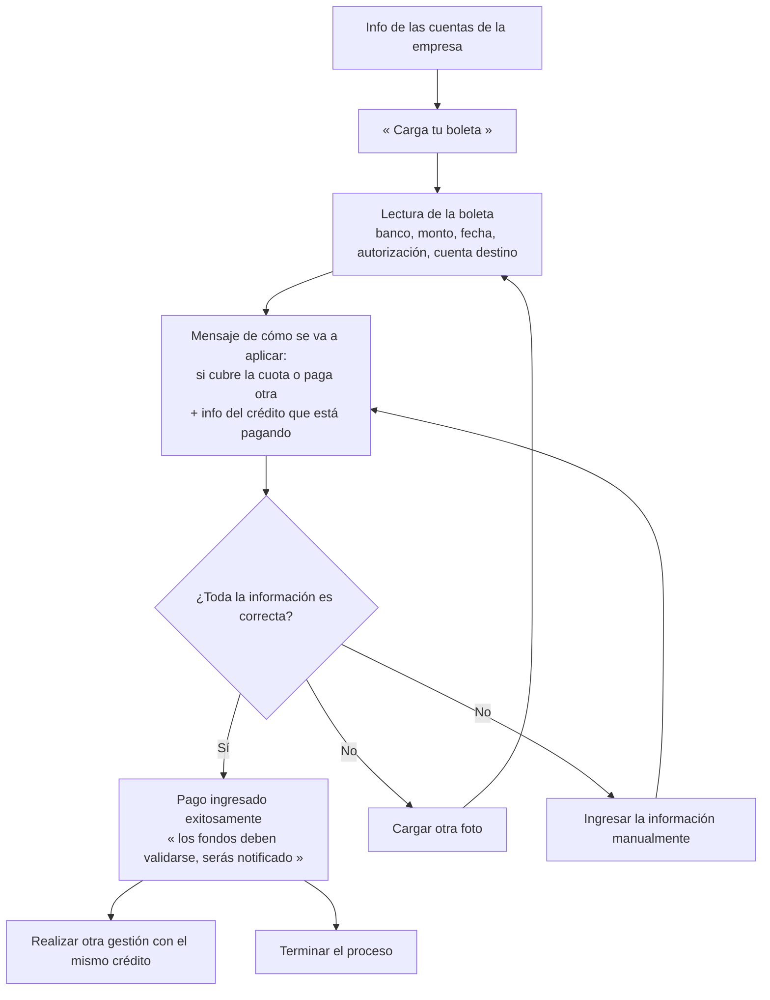

# Paso 4 · Subir comprobante y validación de boleta

**Estado:** 🟡 En definición — según documento detallado
**Tickets:** [CC2-43 · CB-107](https://clubcashin.atlassian.net/browse/CC2-43) (cargar
comprobante), [CC2-44 · CB-108](https://clubcashin.atlassian.net/browse/CC2-44) (pendiente de
conciliación), [CC2-45 · CB-109](https://clubcashin.atlassian.net/browse/CC2-45)
(conciliación)
**Prerrequisito:** [Paso 3](./03-metodos-de-pago.md) — opción visible solo para algunos perfiles

---

## 1. Flujo

Antes de pedir la boleta se le muestra la **información de las cuentas de la empresa**.

## 2. Datos que se extraen de la boleta

| Campo | Origen |
| --- | --- |
| Banco | Lectura automática |
| Monto | Lectura automática |
| Fecha de la boleta | Lectura automática |
| Número de autorización | Lectura automática |
| Cuenta destino | Lectura automática |

Además del listado de datos, se le muestra **cómo se va a aplicar el pago**: si cubre la
cuota, si paga otra, y la información del crédito que está pagando. Eso obliga a que el
cálculo de aplicación exista **antes** de confirmar, no después.

## 3. Ingreso manual

Cuando el cliente dice que los datos no están bien, puede cargar otra foto o escribirlos:

| Campo | Tipo |
| --- | --- |
| Banco | **Lista** de opciones (no texto libre) |
| Monto | Número |
| Fecha de la boleta | Fecha |
| Número de autorización | Texto — **opcional** |
| Boleta | Adjunto |

Después del ingreso manual se repite el mismo mensaje de cómo se va a aplicar y la
confirmación.

## 4. Resultado

- **Confirmado:** *"Pago ingresado exitosamente"*, con mensaje aclaratorio de que **los
  fondos deben ser validados** y que se le notificará. El cliente puede hacer otra gestión
  con el mismo crédito o terminar.
- **Pago aceptado (ya validado):** se manda comprobante por SMS o WhatsApp indicando que su
  pago fue acreditado y **cómo quedó su capital, su mora si aplica, y si quedó algo pendiente
  de su cuota o si abonó a una cuota siguiente**.
- **Pago rechazado:** también se le avisa.

## 5. Pendientes

- **Motor de lectura de la boleta (OCR).** Qué se usa, qué precisión se espera y qué pasa
  cuando no logra leer nada. Hoy no existe nada de esto en el monorepo.
- **Estado "pendiente de conciliación"** (CB-108): dónde vive: ¿en cartera como pago no
  aplicado, o en una cola propia del CRM? Debe verse tanto en la cola de conciliación como en
  el historial del crédito.
- **Quién valida los fondos** y en cuánto tiempo. Hay un SLA implícito en "serás notificado".
- **Conciliación automática** (CB-109): sin API bancaria, el documento del backlog propone
  carga de estado de cuenta. Definir.
- **Duplicados:** el cliente sube dos veces la misma boleta, o sube una boleta ya conciliada.
  Detectar por número de autorización + banco + monto + fecha.
- **Boleta que no corresponde** (de otro crédito, monto distinto al esperado, cuenta destino
  que no es nuestra): qué se le dice.
- **Almacenamiento y retención** de las imágenes (R2, como el resto de adjuntos) y por
  cuánto tiempo.
