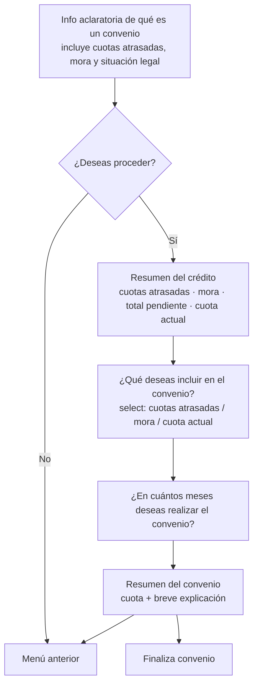
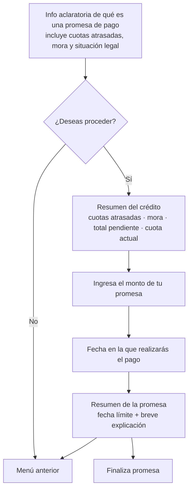

# Paso 5 · Convenio y promesa de pago

**Estado:** 🔴 **BLOQUEADO (2026-08-13)** — pendiente de aprobación de gerencia.
Ver [D-15](./DECISIONES.md#d-15--convenio-y-promesa-de-pago-bloqueados).

> **No se define, no se estima y no se implementa** hasta que haya aprobación. Lo de abajo
> queda documentado tal como está en las fuentes, para no perderlo y para poder retomarlo
> rápido cuando se desbloquee.

---

## 1. Convenio de pago

Al **aprobarse del lado de cobros**, o cuando el usuario completa el convenio, **se envía un
documento con el resumen del convenio**.

## 2. Promesa de pago

Al **aprobarse del lado de cobros**, o cuando el usuario la completa, **se envía un documento
con el resumen de la promesa**.

## 3. Qué habrá que resolver cuando se desbloquee

- **Quién aprueba y dónde.** "Se aprueba del lado de cobros" implica una bandeja de
  aprobación en el CRM que hoy no existe para convenios creados por el cliente.
- **Convenio creado por el cliente vs. por el asesor.** El módulo de cobros ya crea
  convenios; un convenio nacido en el bot tiene que caer en el mismo lugar, no en un circuito
  paralelo.
- **Qué cuotas cubre el convenio.** Hoy el convenio guarda el **monto**, no cuáles cuotas.
  Eso ya es un problema conocido del módulo y afecta directo a lo que el bot puede mostrar.
- **Un crédito en convenio queda fuera del funnel de cobros.** Hay que definir qué le muestra
  el bot a ese cliente y qué puede pagar (ver [Paso 3](./03-metodos-de-pago.md)).
- **Contenido legal** del documento de convenio y de promesa, y quién lo firma.
- **Límites:** plazo máximo en meses, monto mínimo, cuántas veces puede un cliente hacer un
  convenio o incumplir una promesa antes de que el bot deje de ofrecérselo.
