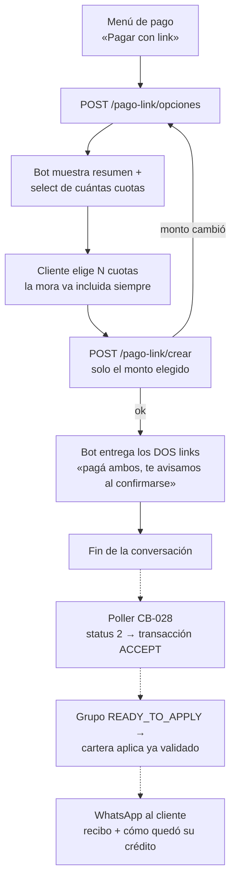

# Paso 3.1 · Pagar con link de Págalo

**Estado:** 🟢 **Contrato revisado con Daniel (2026-08-24)** — D-45…D-52 cerradas; los
ajustes al modelo de CB-028 ya están hechos (migraciones 0045 CRM / 0009 cartera, por
correr) y el checklist con Jose vive en [§9](#9-checklist-de-coordinación-con-jose-cb-028)
**Tickets:** [CC2-41 · CB-105](https://clubcashin.atlassian.net/browse/CC2-41) (bot) — se
apoya en **CB-028** (infraestructura Págalo del lado del asesor, la lleva Jose)
**Prerrequisito:** [Paso 2](./02-menu-del-credito.md) — se entra con crédito seleccionado y
sesión verificada, desde el menú de pago del [Paso 3](./03-metodos-de-pago.md)

---

## 1. La idea en una línea

El cliente elige **cuántas cuotas** paga (la mora va de cajón), el CRM arma el monto y le
responde **dos links de Págalo** — capital / todo lo demás; uno solo si un lado es Q0 — y
ahí **termina la conversación**. Del pago nos enteramos **nosotros** —un job que le
pregunta a Págalo—, y cuando los links del grupo están pagados y verificados, el pago entra
a cartera **ya validado**, con `origen_pago = 'pagalo'` y su voucher como boleta. Cartera
no se entera de nada hasta ese momento.

---

## 2. Lo que ya existe y NO se reinventa (CB-028)

Jose ya modeló la persistencia completa de Págalo para el flujo del asesor
(PR #1415, mergeado 2026-08-24). El bot **usa exactamente esa infraestructura**
([D-45](./DECISIONES.md#d-45--el-bot-reusa-la-infraestructura-págalo-de-cb-028)); lo único
nuevo del bot son **dos servicios de conversación** y el origen del grupo.

### 2.1 El modelo (CRM — `pagalo-payments.ts`, migración 0039)

```
pagalo_payment_groups  1 ── N pagalo_payment_links
         │
         └──────────── 1 ── N pagalo_payment_events   (auditoría append-only)
```

- **`pagalo_payment_groups`** — la intención de cobro: crédito, montos
  (`capital_total` + `facturable_total` = `total_amount`), snapshot inmutable de cuotas y
  rubros (`allocations_snapshot`), y la máquina de estados
  `DRAFT → LINKS_PENDING → PENDING_PAYMENT → PARTIALLY_PAID → READY_TO_APPLY → APPLYING →
  COMPLETED` (más `APPLICATION_FAILED / REVIEW_REQUIRED / CANCELLED`). La misma fila es el
  **outbox** hacia cartera (lease + reintentos con `FOR UPDATE SKIP LOCKED`).
- **`pagalo_payment_links`** — cada generación física de un link: tipo `CAPITAL` o
  `MORA_INTERES`, `external_identifier` (nuestro id, UNIQUE global), uuid y short-uuid de
  Págalo, la transacción observada (`transaction_status` debe ser `ACCEPT` para ser fuente
  de aplicación), el voucher, y **el lease del poller** (`next_poll_at`, `poll_claimed_at`,
  `poll_attempts`) — el job que escucha los links **ya está previsto en el modelo**.
- **`pagalo_payment_events`** — quién hizo qué y cuándo, con `actor_user_id` NULL para
  job/webhook/sistema.

### 2.2 El ledger en cartera (`pagalo_payment_imports`, migración cobros-02/0008)

Una fila por grupo (`crm_group_id` UNIQUE = idempotencia por retry), con la evidencia de
los **dos ACCEPT** y `payload_hash`. Relaciona N `pagos_credito` vía `pagalo_import_id`.
Cumple [D-38](./DECISIONES.md#d-38--cartera-solo-se-toca-con-endpoints-nuevos): tabla nueva,
columna nullable nueva, servicio nuevo — nada existente se modifica.

### 2.3 Qué le falta al modelo para el bot (revisado con Daniel 2026-08-24)

| Hueco | Detalle | Con quién |
| --- | --- | --- |
| **Quién crea el grupo** | Decisión de Daniel: el grupo del bot **se asocia al asesor que tiene asignado el crédito** (`creditos.asesor_id` de cartera) + **columna `origen`** (`ASESOR`/`BOT`) para que ficha, reportes y notificaciones distingan. Cómo se mapea ese asesor a un `user.id` del CRM (para `created_by`) se define en implementación | Jose |
| **Grupo sin gestión** | `contacto_cobro_id` es nullable (el bot no nace de una gestión del asesor) — ya lo soporta, solo confirmarlo | Jose |
| **Un solo link cuando un lado es Q0** | Decisión de Daniel: si la selección no lleva capital, **solo se genera el link facturable** — y viceversa. Requiere relajar el CHECK `capital_total > 0 AND facturable_total > 0` (y los invariantes de "ambos tipos" del grupo) para aceptar grupos de un solo link | Jose |

---

## 3. La API de Págalo (investigación 2026-08-24)

Fuente: colección Postman publicada en [docs.pagalo.co](https://docs.pagalo.co/). Aplica
**Págalo V2 · Pasarela de pago**. Lo relevante para nosotros son **3 endpoints + 1 de
respaldo**:

| Endpoint | Para qué lo usamos |
| --- | --- |
| `POST {urlApiGateway}/v1/payment/request` | **Crear el link de pago** |
| `POST {urlApiGateway}/v1/payment/request/uuid` | **Estado del link** (¿ya lo pagaron?) |
| `POST {urlApiGateway}/v1/payment/transaction/uuid` | **La transacción** detrás del link pagado — la evidencia `ACCEPT` |
| `POST {urlApiGateway}/v1/integration/transactions` | Listado paginado (Bearer vía `/v1/login`) — conciliación de respaldo, no es del flujo |

### 3.1 Autenticación y ambientes

- Los de pasarela van con header **`authorization: <credencial>`** — una credencial
  **estática por comercio y ambiente** que entrega Págalo, igual que `urlApiGateway`
  (la colección no publica las URLs base: llegan con las credenciales).
- **Ambiente de pruebas: ya lo tenemos** (entregado 2026-08-24): `urlApiGateway` =
  `https://api.pagalodev.com/`. La credencial de pruebas la tiene Daniel; **vive en el
  `.env` del server** (`PAGALO_API_URL` / `PAGALO_API_KEY` por ambiente), nunca en el repo
  ni en payloads guardados.
- ⚠️ **Para credenciales LIVE, Págalo exige revisar antes el sistema que integra** (está en
  la introducción de su doc). Hay que pedir esa revisión con tiempo — mismo tipo de bloqueo
  que la whitelist de IP del SMS.
- La credencial **jamás se persiste** en payloads guardados (regla ya escrita en el modelo
  de CB-028: `request_auth` es el código comercial de la transacción, no la credencial).

### 3.2 Crear el link — `POST /v1/payment/request`

Campos que nos importan (los demás van fijos):

| Campo | Valor nuestro | Nota |
| --- | --- | --- |
| `description` | `"Crédito {sifco} · Pago 1 de 2"` / `"Crédito {sifco} · Pago 2 de 2"` | Lo ve el cliente en el checkout. **Neutro a propósito** (decisión de Daniel): nada de "intereses" ni "mora" en la cara del cliente — asusta. Cuando el grupo es de un solo link: `"Crédito {sifco} · Pago"` |
| `total_amount` | El monto del link, 2 decimales | |
| `type_request` | `"SP"` | Link de pago único (la alternativa `QR` no aplica) |
| `currency` | `"GTQ"` | |
| `n_quotas` | `false` | Sin cuotas de tarjeta (visacuotas) |
| `expiration` | `false` | **Sin expiración por ahora** ([D-51](./DECISIONES.md#d-51--los-links-no-expiran-por-ahora)): si expira uno con el otro ya pagado, recuperarse es un enredo |
| `external_identifier` | Nuestro id interno del link | **La llave de recuperación**: con él se consulta la transacción aunque perdamos el uuid. UNIQUE global en nuestro modelo |
| `callback_accept` / `callback_reject` | URLs de retorno | Son **redirects del navegador** del cliente, sin firma — ver §3.4 |
| `client` | Prellenado con nombre y teléfono del lead **si tenemos su email**; si no, `{}` y el cliente llena sus datos en el checkout | Si se manda el objeto, Págalo exige `first_name/last_name/phone/email/country` |
| `products` | Un renglón por link con el mismo monto | |

La respuesta trae el uuid del request y la URL corta del link (la colección no publica el
ejemplo de respuesta del create; el modelo de CB-028 ya guarda `pagalo_request_uuid`,
`pagalo_short_uuid` y `payment_url` del response sanitizado).

### 3.3 Saber si está pagado — los dos pasos de la verificación

**Paso A — el link:** `POST /v1/payment/request/uuid` con `{ "uuid": "<request_uuid>" }`:

| `status` | Significado |
| --- | --- |
| `1` | Creado, sin usar |
| `2` | **Pagado** |
| `3` | Cancelado |
| `4` | Expirado |

**Paso B — la transacción:** con status `2`, `POST /v1/payment/transaction/uuid` filtrando
por **`id_external`** (nuestro `external_identifier` — la doc dice explícito que ese filtro
"aplica únicamente en creación de link de pago"). La respuesta trae
`status_transaction: "ACCEPT"`, `request_auth` (autorización), `request_id`, `total`,
`value_payment` (últimos 4 de la tarjeta) y el detalle.

**Un link no se da por pagado sin el paso B**: el CHECK de CB-028
(`is_application_source` exige `transaction_status = 'ACCEPT'` + uuid + monto + voucher)
está construido exactamente para eso.

### 3.4 No hay webhook firmado

La colección **no documenta webhooks servidor-a-servidor**. Los `callback_accept/reject`
son URLs a las que Págalo **redirige el navegador del cliente** al terminar el checkout:
llegan sin firma y desde el dispositivo del cliente, así que **jamás son fuente de verdad**
— cualquiera con la URL podría invocarlas. Sirven de **acelerador**: si nos llega el
callback, adelantamos el poll de ese link (`next_poll_at = now()`), y el job verifica
contra Págalo. Es el mismo patrón de
[D-35](./DECISIONES.md#d-35--el-webhook-adelanta-el-aviso-el-job-lo-garantiza): *el webhook
adelanta el aviso, el job lo garantiza*.

### 3.5 Otras notas de la investigación

- **Voucher:** Págalo aloja el comprobante (URL de su storage) — encaja con
  `voucher_source = 'PAGALO'` del modelo.
- **Anulación:** existe `POST /v1/payment/transaction/reverse`, pero solo el mismo día
  (antes de liquidación) — es para incidentes, no del flujo. **No hay endpoint documentado
  para cancelar un link** ya creado (el estado 3 = cancelado existe, así que desde el panel
  de Págalo seguramente se puede a mano; por API no está en la colección — **preguntarles**).
  Mientras tanto, un link que sobra se marca `REPLACED` en nuestro modelo, queda vivo en
  Págalo **y justo por eso NO sale del poller** (hallazgo de Codex): se sigue consultando
  —a cadencia más lenta— hasta observar su destino final: **pagado** (el partial UNIQUE de
  CB-028 manda el grupo a `REVIEW_REQUIRED` en vez de aplicar dos veces), **cancelado** a
  mano en el panel (→ `CANCELLED`, y ahí sí deja de consultarse) o **expirado** (→
  `EXPIRED`). El índice parcial del poll incluye `REPLACED` (migración 0046) para que ese
  barrido no cueste un full scan.
- El estado de "listado de transacciones" (`/v1/integration/transactions`, con Bearer del
  `/v1/login`) filtra por `status_transaction`, fechas y página — es la herramienta de
  **conciliación de respaldo** si un día dudamos del poller.

---

## 4. El flujo del bot



Las líneas punteadas **no son conversación**: pasan sin que el cliente escriba nada.

### 4.1 Servicio 1 — `POST /api/bot/cobros/pago-link/opciones`

Mismo control de acceso del paso 2
([D-24](./DECISIONES.md#d-24--el-menú-hereda-la-identidad-del-paso-1)): referencia viva,
código canjeado, ventana de 30 minutos, crédito de esa persona (`404
CREDITO_NO_ENCONTRADO` si no).

```jsonc
// request — la referencia es la MISMA del paso 1
{ "referencia": "3b530493-…", "numeroSifco": "01010214124000" }
```

```jsonc
// respuesta — crédito con 3 cuotas atrasadas
{
  "success": true,
  "data": {
    "resumen": {
      "alDia": false,
      "cuotasAtrasadas": 3,
      "cuotaMensual": "2464.63",
      "mora": "1250.00"
    },
    "opciones": [
      { "cuotas": 1, "etiqueta": "1 cuota + mora — Q3,714.63",  "montoTotal": "3714.63",
        "desglose": { "cuotas": "2464.63", "mora": "1250.00" } },
      { "cuotas": 2, "etiqueta": "2 cuotas + mora — Q6,179.26", "montoTotal": "6179.26",
        "desglose": { "cuotas": "4929.26", "mora": "1250.00" } },
      { "cuotas": 3, "etiqueta": "3 cuotas + mora — Q8,643.89", "montoTotal": "8643.89",
        "desglose": { "cuotas": "7393.89", "mora": "1250.00" } },
      { "cuotas": 4, "etiqueta": "3 cuotas + la próxima + mora — Q11,108.52", "montoTotal": "11108.52",
        "desglose": { "cuotas": "9858.52", "mora": "1250.00" } }
    ],
    // aplanado para el bot, como los créditos del paso 1 (`cantidadCreditos` + `etiquetaN`)
    "cantidadOpciones": 4,
    "opcion1Etiqueta": "1 cuota + mora — Q3,714.63",  "opcion1Monto": "3714.63",
    "opcion2Etiqueta": "2 cuotas + mora — Q6,179.26", "opcion2Monto": "6179.26",
    "opcion3Etiqueta": "3 cuotas + mora — Q8,643.89", "opcion3Monto": "8643.89",
    "opcion4Etiqueta": "3 cuotas + la próxima + mora — Q11,108.52", "opcion4Monto": "11108.52",
    "mensajes": { "titulo": "…", "resumen": "…", "completo": "…" }
  }
}
```

- **Al día** → una sola opción (`cuotas: 1`, la cuota actual, sin mora). El bot no muestra
  select: es la única.
- **Con atraso** → una opción por cada acumulado desde la más vieja (`1…N`), **más una**
  que agrega la próxima cuota por vencer (`N+1`): confirmado por Daniel — hoy 24 de agosto
  el cliente puede pagar también la del 30. **No se eligen cuotas sueltas**: pagar la 5
  dejando abierta la 3 no existe.
- **Máximo 4 opciones** (acordado con SimpleTech 2026-08-25): lo normal son 2 o 3 cuotas
  atrasadas, y con 4 el crédito ya está en recuperación del vehículo. Se ofrecen los
  primeros acumulados hasta llenar 4 (`1…min(N,4)`) y la opción "+ próxima" solo si cabe.
- **Las opciones vienen también aplanadas** (`cantidadOpciones`, `opcion1Etiqueta`,
  `opcion1Monto` … hasta 4), igual que `cantidadCreditos`/`etiquetaN` del paso 1: el motor
  de SimpleTech arma el select con variables literales, no recorriendo arreglos.
- **No hay pagos parciales en este flujo** (a diferencia de la boleta): se pagan cuotas
  **completas**, y justo por eso el reparto por rubro de cada link es determinista — se
  sabe exactamente qué abono va a dónde.
- **Las opciones se calculan sobre el SALDO de cada cuota, no su valor nominal** (duda de
  Daniel 2026-08-24): si una cuota ya traía un pago parcial —una boleta que no alcanzó, o
  el excedente > Q25 de un pago anterior abonado a ella— la opción ofrece **lo que le
  falta** (total de la cuota − lo aplicado). Cartera ya guarda ese saldo **por rubro** en
  la fila sembrada de `pagos_credito` (`capital_restante`, `interes_restante`,
  `iva_12_restante`, `seguro_restante`, `gps_restante`…), así que el reparto entre los dos
  links sale directo de ahí. La regla anterior no se rompe: el link no **deja** cuotas a
  medias — pero sí **termina de completar** una que ya venía a medias.
- **La mora nunca es opcional** y va **completa** en toda opción con atraso. Es además lo
  único implementable: la foto de `moras_credito` guarda **un monto por crédito**, no por
  cuota ([D-46](./DECISIONES.md#d-46--el-cliente-elige-cuántas-cuotas-el-crm-arma-el-monto)).
- Una cuota **con pago esperando validación** (una boleta en bandeja de conta) no se
  ofrece — mismo criterio que `cuotasAtrasadas` del paso 2.
- `mensajes` viene armado para el chat, como en el paso 2: SimpleTech no concatena nada.

**Errores propios** (además de los de identidad del paso 2, formato
[D-22](./DECISIONES.md#d-22--todo-lo-que-no-termina-en-dato-va-con-estado-http-de-error)):

| HTTP | `codigo` | Cuándo |
| --- | --- | --- |
| 409 | `MORA_POR_CONFIRMAR` | La foto de `moras_credito` no coincide con las cuotas atrasadas (misma guarda del paso 2). **Sin mora confiable no se genera link**: se manda al cliente con su asesor antes que cobrarle una cifra equivocada |
| 409 | `CREDITO_NO_PAGABLE_POR_LINK` | Estado del crédito fuera del flujo: `EN_CONVENIO` ([D-15](./DECISIONES.md#d-15--convenio-y-promesa-de-pago-bloqueados)), `INCOBRABLE`, `CANCELADO`, `PENDIENTE_CANCELACION`, `CAIDO` |
| 409 | `SIN_CUOTAS_QUE_PAGAR` | Nada vencido ni por vencer que ofrecer |
| 409 | `PAGO_EN_PROCESO` | Hay un grupo Págalo **de cualquier origen** en vuelo post-pago (`READY_TO_APPLY`/`APPLYING`/`APPLICATION_FAILED`/`REVIEW_REQUIRED`) para este crédito — o uno **del asesor** con links vivos: no se ofrecen opciones calculadas sobre una deuda que está por cambiar — mismo candado que en `/crear` (§4.2) |
| 409 | `PAGO_PARCIAL_EN_CURSO` | El grupo del bot está **`PARTIALLY_PAID`**: no se ofrecen opciones nuevas — el cliente elegiría una selección que `/crear` ignoraría (hallazgo de Codex: pediría 1 cuota y recibiría el componente de 3). El `data` del error trae **el link pendiente con su monto y los mensajes armados** («te falta el Pago 2 de 2 — Q X»), para que el bot lo reenvíe directo |

### 4.2 Servicio 2 — `POST /api/bot/cobros/pago-link/crear`

```jsonc
// request — SOLO el monto (acordado con SimpleTech 2026-08-25): no viaja `cuotas`
{
  "referencia": "3b530493-…",
  "numeroSifco": "01010214124000",
  "monto": "6179.26"   // el opcionNMonto de la opción que el cliente eligió
}
```

El CRM valida identidad, **recalcula con la misma función que armó las opciones**
([D-47](./DECISIONES.md#d-47--fuente-única-del-monto-y-montoesperado)) y busca `monto`
entre las opciones vigentes: como los montos son estrictamente crecientes (cada opción
agrega una cuota), **el monto identifica la opción** y no hace falta mandar `cuotas`. Si no
está entre ellas (cambió la mora, entró un pago) → `409 MONTO_DESACTUALIZADO` y el bot
vuelve a pedir opciones. Si coincide: crea el **grupo CB-028** (origen `BOT`,
asociado al asesor asignado del crédito) con su snapshot, llama a Págalo — **dos veces, o
una sola si la selección no lleva capital o es solo capital** — y responde:

```jsonc
// respuesta
{
  "success": true,
  "data": {
    "pago": {
      "referenciaPago": "9f21c4d0-…",      // id del grupo — para soporte, no lo teclea nadie
      "montoTotal": "6179.26",
      "expira": null                        // sin expiración por ahora (D-51)
    },
    "links": [
      { "tipo": "CAPITAL",      "monto": "3100.00", "url": "https://…", "titulo": "Pago 1 de 2" },
      { "tipo": "MORA_INTERES", "monto": "3079.26", "url": "https://…", "titulo": "Pago 2 de 2" }
    ],
    "mensajes": {
      "titulo": "…",
      "completo": "…"   // explica que son DOS links, que debe pagar ambos,
                        // en cualquier orden, y que le avisamos al confirmarse
    }
  }
}
```

**Errores propios:**

| HTTP | `codigo` | Cuándo |
| --- | --- | --- |
| 409 | `MONTO_DESACTUALIZADO` | `monto` no corresponde a ninguna opción vigente del recálculo. El bot repite `/opciones` |
| 200 | — (mismos links) | Grupo activo **sin pagos observados** y el recálculo da **el mismo desglose** (comparación contra el `allocations_snapshot` completo, no el total — dos deudas distintas pueden sumar lo mismo): se responden **los mismos links**. Con **desglose distinto**: se crea un **grupo NUEVO** con su propio snapshot, y el viejo se cancela con sus links `REPLACED` (siguen en el poll, [§3.5](#35-otras-notas-de-la-investigación)) — el snapshot de un grupo es **inmutable** (hallazgo de Codex): reemplazar links "adentro" del mismo grupo dejaría al `REPLACED` —aún cobrable afuera— sin la evidencia bajo la que se emitió, o a los links nuevos despachándose con un snapshot viejo |
| 200 | — (link pendiente) | Grupo **`PARTIALLY_PAID`** (ya se observó un pago): se responde **el link pendiente de ese mismo grupo**, siempre, **ignorando la selección enviada** — un grupo con dinero adentro **jamás se regenera** (reemplazarlo crearía de nuevo el componente ya pagado y mandaría el pago real a revisión); la deriva de mora la absorbe [D-52](./DECISIONES.md#d-52--si-la-mora-cambió-cuando-el-link-se-paga-mora-primero-y-se-avisa-el-faltante) al aplicar. En el flujo normal no se llega acá: `/opciones` ya intercepta este estado con `PAGO_PARCIAL_EN_CURSO` (§4.1) — esta rama cubre la conversación que quedó abierta con la pantalla de selección vieja |
| 409 | `PAGO_EN_PROCESO` | Un grupo Págalo del crédito — **de cualquier origen, bot o asesor** (comparten poller y ledger; hallazgo de Codex) — está **en vuelo post-pago** (`READY_TO_APPLY`, `APPLYING` o `APPLICATION_FAILED`): el dinero ya entró y cartera todavía no aplica, así que el recálculo vería la deuda **vieja** y armaría un doble cobro. Respuesta: «tu pago se está aplicando, te llega tu recibo» — **jamás** links nuevos en esa ventana. `REVIEW_REQUIRED` responde el mismo código con mensaje de hablar con su asesor. Y un grupo **del asesor** con links vivos o dinero adentro (aunque nadie haya pagado aún) también responde este código — «tenés un pago por link en curso con tu asesor» — porque el bot **no cancela ni duplica la intención de un asesor**; las reglas de reuso/reemplazo de arriba aplican solo a grupos de origen `BOT` |
| 502 | `PAGALO_NO_DISPONIBLE` | Págalo no respondió o falló creando el segundo link. **No queda ninguna intención a medias**: el grupo queda `CANCELLED` y el link que sí se creó se marca `REPLACED` (cancelarlo a mano en el panel). Mensaje al cliente: intentá más tarde o subí tu boleta |

**La carrera de dos `/crear` la arbitra la base** (hallazgo de Codex): todo lo de arriba
presupone "el grupo activo del crédito" en singular, pero dos requests concurrentes (retry
de la plataforma, mensaje duplicado) podían ver ambos «no hay grupo» y emitir **dos juegos
de links cobrables**. El índice único parcial `pagalo_payment_groups_credit_active_uq`
(migración **0047**) permite **un solo grupo por crédito fuera de
`COMPLETED`/`CANCELLED`**, de cualquier origen; el reemplazo (cancelar el viejo + crear el
nuevo) corre en **una transacción**, y el perdedor de una carrera falla el INSERT, relee y
responde los links del ganador.

### 4.3 La conversación termina al entregar los links

No hay paso de confirmación del cliente
([D-49](./DECISIONES.md#d-49--del-pago-nos-enteramos-nosotros-no-el-cliente)). La rama
"¿Realizaste tu pago?" del árbol de gerencia queda de **cortesía**: si el cliente escribe
"ya pagué", el bot puede responder genérico ("lo estamos verificando, te llega tu recibo").
Un `GET /pago-link/estado` para responder con el estado real (pagó uno, falta el otro) es
**opcional y queda fuera del MVP** — la notificación de §5 cubre la necesidad.

### 4.4 Historial y Swagger

- Los dos servicios **caen solos al historial** por el middleware comodín
  ([D-41](./DECISIONES.md#d-41--el-registro-es-un-middleware-y-jamás-rompe-la-respuesta)):
  acciones `pago_link_opciones` y `pago_link_crear`. Al implementar se les agregan
  **curadores** ([D-42](./DECISIONES.md#d-42--qué-guarda-cada-interacción-y-qué-nunca)):
  cuotas elegidas, montos y tipo de link — **jamás** URLs de pago ni datos de tarjeta.
- Son endpoints de SimpleTech → **Swagger obligatorio en el mismo commit**
  ([D-23](./DECISIONES.md#d-23--la-documentación-de-la-api-es-swagger-y-es-obligatoria)).
- **Implementación (2026-08-25):** lógica en `lib/bot-cobros/pago-link.ts` (opciones,
  candados de grupo, creación del grupo `origen=BOT` y emisión de links con el cliente
  Págalo de CB-028), handlers en `controllers/bot-cobros-pago-link.ts`, curadores
  `pago_link_opciones`/`pago_link_crear` en `historial.ts`. **Alcance de este slice: hasta
  entregar los links.** La detección del pago (poller CB-028), la aplicación en cartera y
  la notificación (§5) se integran aparte — primero como pago sin validar, luego validado
  + facturación (decisión de Daniel 2026-08-25). **2026-08-26:** el import de cartera ya
  registra + asigna cuenta + ajusta mora + **valida** en una transacción, y factura +
  manda el recibo post-commit ([D-50 v2](./DECISIONES.md#d-50--el-pago-por-link-nace-validado-en-la-misma-transacción)).

---

### 4.5 Servicio 9 — `POST /api/bot/cobros/pago-link/estado` (agregado 2026-08-27)

Pedido de SimpleTech: el bot quiere saber si **los links que generó en esta conversación** ya
están pagados. Lo respondemos con **nuestra base** (el poller ya verificó cada `ACCEPT` contra
Págalo y guardó el voucher): un link está pagado si es `PAID`/fuente de aplicación, o si el grupo
ya está en aplicación (`READY_TO_APPLY`, `APPLYING`, `APPLICATION_FAILED`, `COMPLETED`).

- **Entrada:** `referencia` y `numeroSifco`, como los otros dos servicios. "Esta conversación" =
  el grupo de origen `BOT` de ese crédito **creado después de que la persona canjeó su código**
  (la sesión de D-24). Sin ninguno → `409 SIN_LINKS`.
- **Salida:** `estado` = `PAGADOS` | `PARCIAL` | `SIN_PAGO`, plano como las opciones
  (`totalLinks`, `linksPagados`, `linksPendientes`, `link1Titulo/Estado/Monto/Url`, `link2…`;
  la URL solo viene si ese link sigue pendiente, para que el bot lo reenvíe) y
  `mensajes.completo` listo para mandar. Los links `REPLACED`/`CANCELLED` no cuentan.
- **Historial:** `pago_link_estado` guarda el veredicto y el conteo, nunca URLs.
- Implementación: `consultarEstadoPagoLink` + `resumirEstadoLinks` en `pago-link.ts`;
  `verificarSesion` se separó de `verificarAcceso` en `menu-credito.ts` para poder validar la
  sesión sin un crédito.

---

## 5. Después del chat: quién escucha y quién aplica

Todo esto es **infraestructura CB-028, compartida con el flujo del asesor** — se construye
una vez y le sirve a los dos orígenes. Reparto propuesto (confirmar con Jose):

| Pieza | Qué hace | Dueño |
| --- | --- | --- |
| **Poller de links** | Recorre por `next_poll_at` los links `ACTIVE` **y los `REPLACED` aún cobrables** (a cadencia más lenta — §3.5; sin expiración, un link viejo pagado tiene que observarse): status del link → si `2`, transacción por `id_external` → exige `ACCEPT` → guarda evidencia + voucher → link `PAID`. Con todos los links requeridos pagados: grupo `READY_TO_APPLY`; un `REPLACED` pagado manda el grupo a `REVIEW_REQUIRED` | Jose (CB-028) |
| **Callbacks** | `callback_accept/reject` apuntan a un endpoint nuestro que solo **adelanta** `next_poll_at` del link. Sin firma → jamás escriben estado (§3.4) | Jose (CB-028) |
| **Dispatcher a cartera** | Reclama grupos `READY_TO_APPLY`, arma el payload normalizado + hash, llama al **servicio nuevo** de cartera que inserta en `pagalo_payment_imports` y crea los `pagos_credito` | Jose (CB-028) |
| **Aplicación en cartera** | Idempotente por `crm_group_id`; **una sola transacción** ([D-50 v2](./DECISIONES.md#d-50--el-pago-por-link-nace-validado-en-la-misma-transacción)): registro (`origen_pago = 'pagalo'`, voucher como boleta en `cartera.boletas`), cuenta de empresa **PAGALO**, ajuste de mora ([D-52](./DECISIONES.md#d-52--si-deuda-cambia-págalo-se-comporta-como-boleta-manual)) y **validación** con la misma función del botón "Validar Pago" — no pasa por la bandeja de conta, a diferencia de la boleta ([D-39](./DECISIONES.md#d-39--el-rechazo-es-un-botón-explícito-no-se-infiere-del-reverso)). Post-commit, cartera factura (SAT) y manda el recibo. Falla dentro de la tx = rollback + reintento del CRM | Jose (CB-028) + Daniel |
| **Notificación al cliente** | **El recibo lo manda cartera** al validar (el mismo WhatsApp que recibe cualquier cliente cuando conta valida su pago), disparado post-commit por el import ([D-50 v2](./DECISIONES.md#d-50--el-pago-por-link-nace-validado-en-la-misma-transacción)). El bot **solo** manda el acuse al detectar cada `ACCEPT` — «recibimos tu Pago 1 de 2, te falta el 2» / «recibimos tu pago, lo estamos aplicando» — sin afirmar aplicación. Nada de recibo duplicado: un solo mensaje con saldos, y lo manda quien cambió los saldos | Cartera (recibo) · Bot (acuse) |

Lo que el flujo del bot le pide a ese circuito: que el grupo sepa su **origen** (bot o
asesor) y lleve **el asesor asignado del crédito**, para que la notificación, la ficha 360
y los reportes sepan de quién es cada link.

---

## 6. Reglas duras del paso

1. **El bot no calcula nada.** Ni montos, ni mora, ni desgloses: solo muestra lo que
   `/opciones` respondió y devuelve la selección.
2. **El monto tiene una sola fuente.** La función que arma opciones es la que arma el link;
   el `monto` que manda el bot (el `montoEsperado` de D-47) es el candado. En cobros ya nos
   pasó tener doble fuente del monto de mora — acá nace prohibido.
3. **Sin mora confiable no hay link** (`MORA_POR_CONFIRMAR` bloquea, no avisa).
4. **Ningún pago se aplica sin `ACCEPT` verificado contra Págalo** (el status `2` del link
   no basta; los callbacks jamás escriben).
5. **El grupo completo o nada.** Normalmente dos links; **uno solo cuando la selección no
   lleva capital o es solo capital**. Si Págalo falla a media creación, el grupo se
   cancela: nunca se le entrega al cliente media intención de pago.
6. **Un grupo con un pago adentro no se toca.** `PARTIALLY_PAID` solo puede completarse
   (o irse a revisión); y desde que el último link se paga hasta el `COMPLETED` de cartera
   (`READY_TO_APPLY`/`APPLYING`/`APPLICATION_FAILED`/`REVIEW_REQUIRED`) el crédito **no
   recibe links nuevos** (`PAGO_EN_PROCESO`) — **sin importar el origen del grupo**, bot o
   asesor: comparten poller y ledger, y el doble cobro es el mismo. Reemplazar links
   aplica únicamente a grupos **de origen `BOT` sin ningún pago observado** (la intención
   de un asesor no se cancela ni se duplica desde el bot) — y nunca "adentro" del grupo:
   **cambiar el desglose es crear un grupo nuevo**, porque el `allocations_snapshot` es
   inmutable y es la evidencia de lo que cada link cobró.
7. **Sin pagos parciales.** Se pagan cuotas completas — por eso el reparto por rubro es
   determinista y ni el cliente ni conta tienen que decidir a qué se aplica qué.
8. **La credencial de Págalo no toca disco**: ni en payloads guardados, ni en logs, ni en
   el historial.

---

## 7. Decisiones de este paso

| # | Tema | Estado |
| --- | --- | --- |
| [D-45](./DECISIONES.md#d-45--el-bot-reusa-la-infraestructura-págalo-de-cb-028) | El bot reusa la infraestructura Págalo de CB-028 | 🟢 |
| [D-46](./DECISIONES.md#d-46--el-cliente-elige-cuántas-cuotas-el-crm-arma-el-monto) | El cliente elige cuántas cuotas; el CRM arma el monto | 🟢 |
| [D-47](./DECISIONES.md#d-47--fuente-única-del-monto-y-montoesperado) | Fuente única del monto y `montoEsperado` | 🟢 |
| [D-48](./DECISIONES.md#d-48--capital-en-un-link-todo-lo-demás-en-el-otro) | Capital en un link, todo lo demás en el otro | 🟢 |
| [D-49](./DECISIONES.md#d-49--del-pago-nos-enteramos-nosotros-no-el-cliente) | Del pago nos enteramos nosotros, no el cliente | 🟢 |
| [D-50](./DECISIONES.md#d-50--el-pago-por-link-nace-validado) | El pago por link nace validado | 🟢 |
| [D-51](./DECISIONES.md#d-51--los-links-no-expiran-por-ahora) | Los links no expiran (por ahora) | 🟢 |
| [D-52](./DECISIONES.md#d-52--si-la-mora-cambió-cuando-el-link-se-paga-mora-primero-y-se-avisa-el-faltante) | Si la mora cambió al pagar: mora primero y se avisa el faltante | 🟢 |

---

## 8. Preguntas abiertas

Las de la primera versión que Daniel ya resolvió (2026-08-24) subieron al contrato:
reparto de rubros (capital solo / **todo lo demás** al otro, [D-48](./DECISIONES.md#d-48--capital-en-un-link-todo-lo-demás-en-el-otro)),
cuotas sin capital (un solo link), vigencia (sin expiración, [D-51](./DECISIONES.md#d-51--los-links-no-expiran-por-ahora)),
mora que cambió con el link vivo (mora primero + aviso del faltante, [D-52](./DECISIONES.md#d-52--si-la-mora-cambió-cuando-el-link-se-paga-mora-primero-y-se-avisa-el-faltante)),
cuota actual al combo (sí), notificación (nosotros, al validar con Págalo) y credenciales
de pruebas (recibidas). Quedan:

- **Cancelar un link por API.** Preguntar a Págalo si existe (§3.5). Mientras tanto la
  regeneración marca `REPLACED` internamente y la cancelación real es manual en su panel —
  con links que no expiran, esto es lo único que evita que un link viejo quede cobrable
  para siempre.
- **Mapeo del asesor a `created_by`.** El grupo ya guarda `cartera_asesor_id` (migración
  0045); definir en implementación qué `user.id` del CRM va en `created_by` cuando crea el
  bot — mapeo asesor→user o usuario de sistema.
- **No duplicar el recibo.** Nosotros notificamos al validar con Págalo; cartera ya manda
  recibos por WhatsApp al crear pagos — al implementar, apagar/omitir el de cartera para
  `origen_pago = 'pagalo'` o no mandar el nuestro, pero uno solo.
- **Revisión LIVE de Págalo:** agendar la revisión que exigen para entregar credenciales
  de producción (§3.1).
- ~~**Excedentes.**~~ Resuelto (hallazgo de Codex): en el camino feliz no existen —monto
  exacto, cuotas por su saldo (§4.1)— pero un link **viejo puede quedar grande** si otro
  pago o una condonación achican la deuda antes de usarlo. La aplicación **revalida contra
  los saldos vigentes** al observar el pago, y un link sobrado manda el grupo a
  `REVIEW_REQUIRED`: el sobrante jamás se acomoda solo, ni con la regla de Q25 — detalle
  en el espejo de [D-52](./DECISIONES.md#d-52--si-la-mora-cambió-cuando-el-link-se-paga-mora-primero-y-se-avisa-el-faltante).

---

## 9. Checklist de coordinación con Jose (CB-028)

Todo lo que este contrato necesita de (o comparte con) el flujo del asesor, en un solo
lugar. Compilado 2026-08-24.

### a) Cambios al modelo — ✅ YA HECHOS por nosotros (2026-08-24), para que Jose revise

La 0039 del CRM ya estaba aplicada en dev y la 0008 de cartera en el sandbox
`cartera_cobros2`, así que los ajustes van en **migraciones nuevas** (por correr):
**`0045_pagalo_grupo_un_link_origen.sql`** (CRM) y **`cobros-02/0009_pagalo_un_solo_link.sql`**
(cartera), con sus schemas Drizzle actualizados.

| # | Qué se hizo | Dónde |
| --- | --- | --- |
| 1 | **Grupos de un solo link** ([D-48](./DECISIONES.md#d-48--capital-en-un-link-todo-lo-demás-en-el-otro)): `amounts_chk` pasa a `>= 0` con `total > 0` (junto a `total_matches`, al menos un lado existe). El invariante de servicio cambia: `READY_TO_APPLY` = *los links requeridos del grupo* pagados, no siempre dos | CRM (`pagalo-payments.ts` + 0045) |
| 2 | Lo mismo en el **ledger**: evidencia por lado nullable + `amounts_chk >= 0` + **CHECK de coherencia por lado** (monto > 0 ⇒ evidencia completa; monto = 0 ⇒ lado vacío — explícito porque un CHECK con NULL "pasa", la misma lección de sus fixes). Los `*_different_chk` quedan igual: con un lado NULL pasan solos | cartera (`schema.ts` + `cobros-02/0009`) |
| 3 | **Columna `origen`** (`ASESOR`/`BOT`, default `ASESOR`) en `pagalo_payment_groups` + CHECK | CRM (0045) |
| 4 | **`cartera_asesor_id`** en el grupo: el asesor asignado del crédito al crear (ID opaco, sin FK — mismo criterio que `cartera_credito_id`). **Queda para implementación**: qué `user.id` va en `created_by` cuando crea el bot | CRM (0045) |
| 5 | Confirmar que el grupo **sin `contacto_cobro_id`** (el bot no nace de una gestión) es un caso soportado — único punto de modelo que sigue siendo pregunta | Jose |

### b) El servicio compartido (fuente única)

| # | Qué |
| --- | --- |
| 6 | **Un solo servicio** arma grupo + allocations + llamadas a Págalo, y lo usan asesor y bot. ¿Ya lo tiene empezado? ¿Con qué interfaz? El bot solo le agrega la capa `/pago-link/*` |
| 7 | **El desglose por cuota desde cartera** que use su flujo: el bot necesita el mismo, incluyendo los `*_restante` para cuotas con pago parcial (§4.1) |
| 8 | **Convención del `external_identifier`** (es UNIQUE global y es la llave de recuperación ante Págalo) |
| 9 | **Descripciones de los links**: las neutras de [D-48](./DECISIONES.md#d-48--capital-en-un-link-todo-lo-demás-en-el-otro) ("Pago 1 de 2 / 2 de 2") también en el flujo del asesor — el cliente final es el mismo |

### c) El circuito post-pago

| # | Qué |
| --- | --- |
| 10 | **Poller**: confirmar que él lo construye (su schema ya trae el lease), que verifica `ACCEPT` con `/payment/transaction/uuid` —nunca solo el status del link— y que barre también los `REPLACED` aún cobrables (§3.5; índice ampliado en la migración 0046) |
| 11 | **Callbacks**: endpoint que solo adelanta `next_poll_at` — jamás escribe estado ([D-49](./DECISIONES.md#d-49--del-pago-nos-enteramos-nosotros-no-el-cliente)) |
| 12 | **Aplicación en cartera**: transaccional (su propia nota: no reintentar `newPayment` a ciegas), `origen_pago = 'pagalo'`, voucher a `cartera.boletas`, sin re-activar la regla de excedentes Q25 por redondeos, usando los `*_restante` si la cuota venía a medias, **revalidando contra los saldos vigentes** (un link viejo sobrado —la deuda se achicó— manda el grupo a `REVIEW_REQUIRED`, espejo de D-52), y **la mora vigente se consume primero — solo con el dinero del link `MORA_INTERES`**, jamás con el del link `CAPITAL` ([D-52](./DECISIONES.md#d-52--si-la-mora-cambió-cuando-el-link-se-paga-mora-primero-y-se-avisa-el-faltante)) |
| 13 | **Notificación WhatsApp**: nosotros mandamos el recibo al validar con Págalo ([D-50](./DECISIONES.md#d-50--el-pago-por-link-nace-validado)) — coordinar con los recibos que cartera ya manda para que al cliente le llegue **uno** |
| 14 | **Regeneración**: viejos → `REPLACED` + cancelación manual en el panel mientras no haya API ([D-51](./DECISIONES.md#d-51--los-links-no-expiran-por-ahora)). ¿Él ya le preguntó a Págalo si existe cancelar por API? |

### d) Operativo

| # | Qué |
| --- | --- |
| 15 | **Env compartido**: `PAGALO_API_URL`/`PAGALO_API_KEY` por ambiente en el server del CRM — mismas credenciales para asesor y bot; quién las configura en dev/prod |
| 16 | **Correr las migraciones nuevas**: `0045` del CRM (dev tiene la 0039 aplicada) y `cobros-02/0009` en el sandbox `cartera_cobros2` (donde la 0008 ya corrió, adaptando el schema) — y ambas de nuevo en el ambiente objetivo cuando salga COBROS-02 |
| 17 | **La revisión LIVE de Págalo** (§3.1): agendar y definir quién la atiende |
