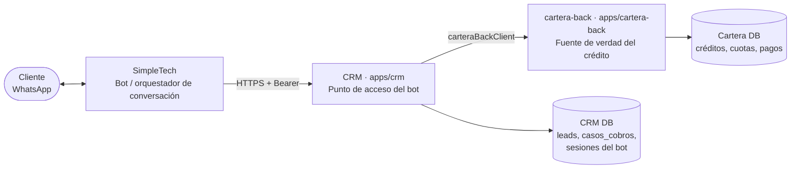
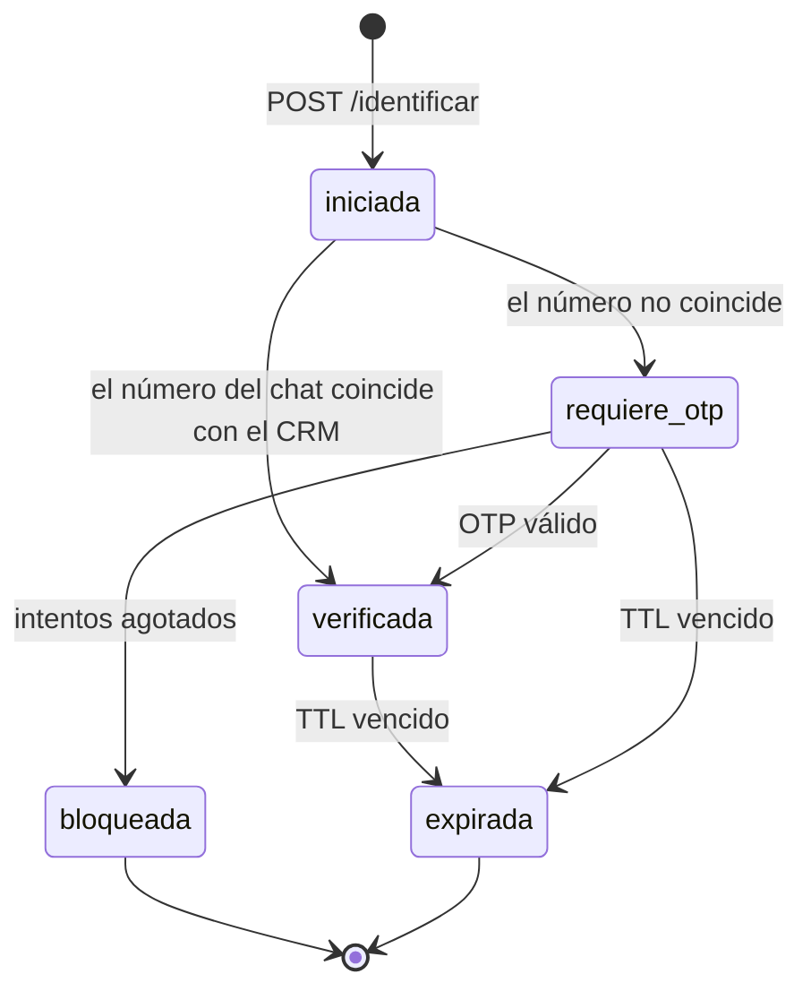

# Arquitectura de integración — bot de cobros

**Estado:** Propuesta · **No implementado**
**Alcance:** aplica a **todos** los pasos del feature, no solo al Paso 1.

---

## 1. Piezas y responsabilidades



| Pieza | Es dueña de | No le corresponde |
| --- | --- | --- |
| **SimpleTech** | La conversación: menús, textos, botones, en qué nodo va el cliente, adjuntos. | Reglas de negocio, saldos, decidir si alguien está verificado. |
| **CRM** | Identidad del cliente (lead, DPI, NIT, teléfonos, vehículo/placa), sesión del bot, autorización, auditoría, y **agregación** de datos hacia el bot. | Calcular saldos, mora o aplicar pagos. |
| **cartera-back** | Crédito, cuotas, mora, pagos, convenios, recibos. | Saber quién es el cliente en WhatsApp o si está verificado. |

### Principio: un solo punto de acceso

**SimpleTech habla únicamente con el CRM.** Nunca directo con cartera-back.

Motivos:

1. La identidad del cliente (teléfonos, DPI, NIT, placa) vive en el CRM; cartera-back no
   tiene teléfonos (`usuarios` de cartera no guarda `telefono`).
2. Un solo lugar donde poner autenticación, rate limiting, auditoría y enmascarado de PII.
3. cartera-back ya está expuesto a la operación interna con JWT de usuarios; abrirlo a un
   tercero multiplica la superficie de riesgo sobre el sistema que mueve el dinero.
4. Si mañana cambia el proveedor del bot, se cambia un consumidor, no dos integraciones.

**Consecuencia:** cuando un paso necesite datos que hoy no existen en cartera-back
(ej. un resumen compacto del crédito para el menú), se agrega el endpoint **en
cartera-back** y el CRM lo consume vía `carteraBackClient`. El CRM no consulta la base de
cartera por su cuenta.

**Dónde empieza cartera.** El [Paso 1](./01-identificacion-y-acceso.md) se resuelve
**enteramente dentro del CRM**: identificación, OTP y listado de créditos salen de `leads`,
`co_debtors`, `opportunities` y `vehicles`. La primera llamada a cartera-back ocurre cuando
el cliente **selecciona** un crédito y hay que mostrarle saldos ([Paso 2](./02-menu-del-credito.md)).

---

## 2. Superficie de API para el bot

### Prefijo y versión

```
/api/bot/v1/cobros/...
```

- `bot` lo separa de `/api/portal/*` (portal web) y de `/info/*` (bot de **ventas**).
- `v1` explícito: SimpleTech es un consumidor externo con su propio ciclo de despliegue.
  Un cambio incompatible se publica como `v2` y `v1` se mantiene hasta que migren.

> Hoy el bot de ventas consume `/info/*` **sin autenticación** (`/info/renap`,
> `/info/send-otp`, `/info/lead-progress`…). Eso no se replica acá: los endpoints de
> cobros exponen datos de crédito y van autenticados desde el día uno.

### Autenticación

Bearer token dedicado, mismo patrón que `validatePortalToken`
(`apps/crm/apps/server/src/controllers/portal-lead.ts`), con secreto **propio**:

```
Authorization: Bearer <BOT_COBROS_TOKEN>
```

- Variable nueva: `BOT_COBROS_TOKEN`. **No** reutilizar `BETTER_SECRET_PORTAL_WEB`: si se
  filtra uno, se rota uno solo.
- Rotación: el middleware acepta una lista (`BOT_COBROS_TOKEN`, `BOT_COBROS_TOKEN_PREV`)
  para poder rotar sin coordinar un despliegue simultáneo con SimpleTech.
- El token identifica al **integrador**, no al cliente final. La identidad del cliente la
  da la **sesión** (§3).

### Formato de respuesta

Todas las respuestas, incluidas las de error:

```jsonc
{
  "success": true,
  "data": { /* payload */ }
}
```

```jsonc
{
  "success": false,
  "error": {
    "codigo": "SESION_EXPIRADA",       // estable, para que el bot rutee
    "mensaje": "Tu sesión expiró.",    // texto en español, mostrable al cliente
    "detalle": "…"                      // opcional, solo para logs, nunca se muestra
  }
}
```

Regla: **el bot rutea por `codigo`, nunca por el texto**. Los textos se pueden ajustar sin
romper el flujo; los códigos no cambian dentro de una versión.

Catálogo inicial de códigos (crece con cada paso):

| Código | HTTP | Significado |
| --- | --- | --- |
| `NO_AUTORIZADO` | 401 | Token del integrador inválido o ausente. |
| `PARAMETROS_INVALIDOS` | 400 | Falta un campo o tiene formato inválido. |
| `NO_ENCONTRADO` | 200 † | No se encontró cliente/crédito con esos datos. |
| `SESION_INVALIDA` | 401 | `sesionId` desconocido. |
| `SESION_EXPIRADA` | 401 | Venció el TTL. |
| `SESION_NO_VERIFICADA` | 403 | Falta completar el segundo factor. |
| `DEMASIADOS_INTENTOS` | 429 | Rate limit o bloqueo por intentos fallidos. |
| `REQUIERE_AGENTE` | 200 | El caso debe escalarse a un humano. |
| `SERVICIO_NO_DISPONIBLE` | 503 | cartera-back caído o con circuito abierto. |

† Ver [D-05](./DECISIONES.md): "no encontrado" viaja como respuesta exitosa con estado, no
como 404, para que el bot no trate un dato equivocado del cliente como una falla técnica.

---

## 3. Sesión del bot

> ⚠️ **No aplica a la primera versión.** El 2026-08-13 se decidió que los servicios del
> [Paso 1](./01-identificacion-y-acceso.md) son **sin estado**: el bot reenvía `search` +
> `telefono` en cada llamada y el control de acceso es la validación del OTP
> ([D-04](./DECISIONES.md#d-04--dónde-vive-el-estado-de-identidad),
> [D-16](./DECISIONES.md#d-16--el-otp-viaja-en-la-respuesta)). Lo de abajo queda como diseño
> de referencia para cuando aparezcan flujos de varios pasos (pagos, boletas), donde sí hará
> falta.

El estado de la conversación vive en SimpleTech. El estado de **identidad** viviría en el
CRM, en una sesión con token opaco.



Reglas:

- **Ningún endpoint que devuelva datos del crédito acepta una sesión que no esté
  `verificada`.** Ni saldos, ni cuántos créditos tiene, ni el nombre completo.
- El `sesionId` es **opaco** (sin significado, no derivable del DPI) y de un solo uso por
  conversación.
- TTL propuesto: **15 minutos**, renovable con cada llamada; la verificación caduca aunque
  la sesión siga viva (ver [D-06](./DECISIONES.md)).
- La sesión guarda el **canal y el número del chat**, para que un `sesionId` robado no
  sirva desde otro número.
- Persistir en el CRM (tabla propuesta en el Paso 1), no en memoria: el servidor se
  reinicia en cada despliegue y las conversaciones no se pueden caer con él.

---

## 4. Datos: quién tiene qué

| Dato | Dónde vive | Cómo se obtiene |
| --- | --- | --- |
| DPI | CRM · `leads.dpi` | Usar el helper `eqDpi` (`lib/dpi-lookup.ts`): hay DPI guardados con y sin formato. |
| NIT | CRM · `leads.nit` | Búsqueda directa. Ojo: puede venir con guion. |
| Placa | CRM · `vehicles.license_plate` | `vehicles` → `opportunities.vehicle_id` → `opportunities.numero_sifco`. |
| Teléfonos del cliente | CRM · `leads.phone`, `casos_cobros.telefono_principal`, `casos_cobros.telefono_alternativo` | `referencias_lead.telefono` es de **otra persona**: no cuenta como teléfono del titular. |
| Teléfonos de codeudores | CRM · `co_debtors` | El documento detallado los acepta como número válido del crédito. Pendiente de confirmar ([D-11](./DECISIONES.md#d-11--quien-escribe-no-es-el-titular)). |
| Créditos del cliente | Puente `opportunities.numero_sifco` → cartera `creditos.numero_credito_sifco` | El CRM resuelve los números SIFCO y cartera devuelve el detalle. |
| Capital, cuotas, mora, próxima fecha | cartera-back | `GET /credito?numero_credito_sifco=…`, `GET /getAllCredits` vía `carteraBackClient`. |
| Vehículo (marca, modelo, año, placa) | CRM · `vehicles` | Ya se expone algo así en `/api/portal/lead/sifco`. |

**Regla de oro, ya establecida en el equipo:** información del **cliente** siempre sale del
CRM; información del **crédito** siempre sale de cartera. El bot no debe inventarse una
tercera fuente.

---

## 5. Errores hacia cartera-back

`carteraBackClient` ya trae circuit breaker, reintentos y timeout configurables
(`CARTERA_BACK_*`). Para el bot:

- **No reintentar operaciones de escritura** (pagos, convenios) sobre timeout: hay
  precedente de facturas duplicadas en SAT por reintento sobre timeout. Escritura =
  un intento + idempotencia.
- Toda operación de escritura de pasos futuros lleva **clave de idempotencia** provista
  por el bot (`Idempotency-Key`), para que un reintento de SimpleTech no cobre dos veces.
- Si el circuito está abierto → `SERVICIO_NO_DISPONIBLE` y el bot ofrece agente humano.
  Nunca un mensaje técnico al cliente.

---

## 6. Observabilidad y auditoría

- Cada llamada se registra con `sesionId` como identificador de correlación.
- Intentos de identificación (exitosos y fallidos), envíos y validaciones de OTP, y
  bloqueos se auditan: es un control antifraude, no solo un log.
- **PII fuera de los logs**: DPI/NIT se registran **hasheados**; teléfonos, enmascarados.
- CB-110 ([CC2-46](https://clubcashin.atlassian.net/browse/CC2-46)) pide ver estas
  interacciones dentro del CRM. La tabla de eventos del bot debe diseñarse pensando en
  que esa pantalla la va a leer, no como un log suelto.
- Métricas mínimas por paso: identificaciones OK/fallidas, % que cae en OTP, % que
  completa OTP, tiempo hasta selección de crédito, escalamientos a agente.

---

## 7. Ambientes

| Ambiente | CRM | cartera-back | Bot |
| --- | --- | --- | --- |
| Desarrollo | local / dev | dev (`s2`) | Número de pruebas de SimpleTech |
| Producción | prod | prod (`s3`) | Número de cobranza (CB-100, [CC2-22](https://clubcashin.atlassian.net/browse/CC2-22)) |

- **Prerrequisito:** el número de WhatsApp de cobranza debe estar separado del de ventas
  antes de salir a producción; si no, un mismo hilo mezcla leads de ventas con clientes
  con crédito.
- SimpleTech necesita apuntar a un CRM de **dev** con datos utilizables para probar sin
  tocar clientes reales ([D-10](./DECISIONES.md)).
