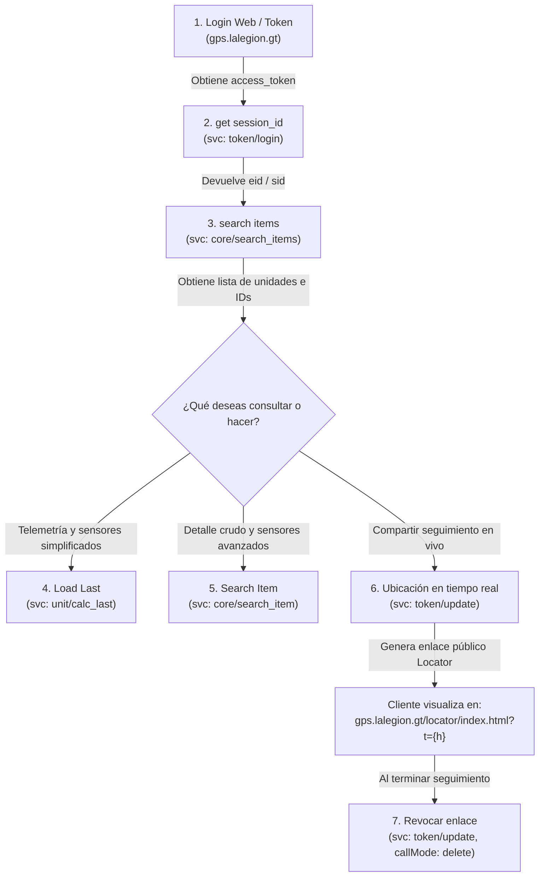

# Documentación y Resumen: API LEGION / Wialon

Documentación técnica y resumen de la colección de Postman **LEGION/Wialon API** (`gps.lalegion.gt`).

---

## 📌 1. Arquitectura y Funcionamiento General

La API se comunica con el motor de telemática **Wialon**. A diferencia de las APIs REST convencionales, Wialon opera mediante un **RPC sobre HTTP** con un único endpoint base:

- **Endpoint base:** `https://hst-api.wialon.com/wialon/ajax.html`
- **Método HTTP:** `POST`
- **Content-Type:** `application/x-www-form-urlencoded`

### Parámetros comunes en cada petición
| Parámetro | Tipo | Descripción |
| :--- | :--- | :--- |
| `svc` | String | Nombre del servicio o función en Wialon (ej. `core/search_items`, `unit/calc_last`). |
| `params` | String (JSON) | Objeto JSON codificado como cadena con los argumentos específicos del servicio. |
| `sid` | String | Identificador de sesión activa (**Session ID / `eid`**). Obligatorio para todas las consultas tras autenticarse. |

---

## 🔄 2. Flujo de Integración Típico (Workflow)



---

## 📋 3. Detalle de Endpoints

---

### 1. `Login`
* **Servicio (`svc`):** `core/login`
* **Estado:** ⚠️ *Deprecado / Solo de referencia.*
* **Propósito:** Autenticación clásica mediante usuario y contraseña directos en el cuerpo.
* **Nota oficial:** Este método ya no se debe utilizar para nuevos desarrollos. En su lugar, el token se genera iniciando sesión desde el portal web: `https://gps.lalegion.gt/login.html?access_type=-1&duration=0`.

#### Petición
```bash
POST https://hst-api.wialon.com/wialon/ajax.html
Content-Type: application/x-www-form-urlencoded

svc=core/login
&params={"user":"AntonioMartinez","password":"TU_PASSWORD"}
```

---

### 2. `get session_id`
* **Servicio (`svc`):** `token/login`
* **Propósito:** Iniciar sesión programática mediante un `access_token` generado previamente para obtener el identificador de sesión activa (**`eid`** / **`sid`**).
* **Uso del SID:** El campo **`eid`** que devuelve este servicio se debe utilizar como valor del parámetro **`sid`** en todas las peticiones posteriores.

#### Petición
```bash
POST https://hst-api.wialon.com/wialon/ajax.html
Content-Type: application/x-www-form-urlencoded

svc=token/login
&params={"token":"9aff9d99415abf437673fe432c4b417684A0DD3B89B08D37D00C508926DDAAA962BFD5DE"}
```

#### Respuesta clave
```json
{
  "host": "190.111.0.68",
  "eid": "0282bd4ab38f5d92c27866e62db7c6cd",
  "gis_sid": "3915e860b98cd831",
  "au": "Andre IT",
  "tm": 1738619190,
  "wsdk_version": "1.799",
  "base_url": "https://hst-api.wialon.com",
  "user": {
    "nm": "Andre IT",
    "id": 28989723
  }
}
```
> El valor `"0282bd4ab38f5d92c27866e62db7c6cd"` de **`eid`** es tu **`sid`**.

---

### 3. `search items`
* **Servicio (`svc`):** `core/search_items`
* **Propósito:** Buscar y listar las unidades (vehículos/activos) a las que tiene acceso el usuario autenticado.
* **Parámetros (`params`):**
  * `spec.itemsType`: `"avl_unit"` (unidades telemáticas).
  * `spec.propName`: `"sys_name"` (buscar por nombre de sistema).
  * `spec.propValueMask`: Máscara de búsqueda. `"*"` trae todas las unidades. Si deseas filtrar por nombre, coloca el nombre o comodín (ej: `*Camión*`).
  * `spec.sortType`: Campo de ordenamiento (ej. `"sys_name"`).
  * `flags`: Máscara de bits que define qué propiedades de las unidades se incluirán en la respuesta (ej. `8388609`).
  * `from` / `to`: Rango de paginación (`0` a `0` indica el primer bloque o todos según flags).

#### Petición
```bash
POST https://hst-api.wialon.com/wialon/ajax.html
Content-Type: application/x-www-form-urlencoded

svc=core/search_items
&sid=0282bd4ab38f5d92c27866e62db7c6cd
&params={
  "spec": {
    "itemsType": "avl_unit",
    "propName": "sys_name",
    "propValueMask": "*",
    "sortType": "sys_name"
  },
  "force": 1,
  "flags": 8388609,
  "from": 0,
  "to": 0
}
```

#### Respuesta clave
```json
{
  "searchSpec": {
    "itemsType": "avl_unit",
    "propName": "sys_name",
    "propValueMask": "*"
  },
  "totalItemsCount": 58,
  "indexFrom": 0,
  "indexTo": 0,
  "items": [
    {
      "nm": "Bidgar Yatz - C-629BNC",
      "cls": 2,
      "id": 28554757,
      "mu": 0,
      "uacl": 30567147044863
    }
  ]
}
```

---

### 4. `Ubicación en tiempo real`
* **Servicio (`svc`):** `token/update`
* **Propósito:** Crear un token temporal para la aplicación pública **Wialon Locator**. Permite a un cliente o tercero seguir una unidad en el mapa en vivo sin necesitar usuario ni contraseña.
* **Parámetros (`params`):**
  * `callMode`: `"create"`.
  * `app`: `"locator"`.
  * `dur`: Duración del enlace en segundos (ej. `86400` = 24 horas).
  * `fl`: Banderas de permisos del localizador (ej. `131072`).
  * `items`: Array con los IDs numéricos de las unidades a compartir (ej. `[28554757]`).
  * `p`: Parámetros adicionales en formato JSON escapado (ej. mostrar geocercas, nombres o trazas).

#### Petición
```bash
POST https://hst-api.wialon.com/wialon/ajax.html
Content-Type: application/x-www-form-urlencoded

svc=token/update
&sid=02006ff22599213e37512b2530acc64e
&params={
  "callMode": "create",
  "app": "locator",
  "at": 0,
  "dur": 86400,
  "fl": 131072,
  "p": "{\"note\":\"Localizador de Unidad\",\"zones\":1,\"tracks\":1}",
  "items": [28554757]
}
```

#### Respuesta clave y construcción de URL
```json
{
  "h": "9aff9d99415abf437673fe432c4b4176CC106C78FC34FBA83C12800CE4D2555B20A882D0",
  "app": "locator",
  "dur": 86400,
  "items": [28554757]
}
```
> Con el valor retornado en **`h`**, construyes el link para el cliente:
> **`https://gps.lalegion.gt/locator/index.html?t=9aff9d99415abf437673fe432c4b4176CC106C78FC34FBA83C12800CE4D2555B20A882D0`**

---

### 5. `Revocar enlace de Locator (token/update)`
* **Servicio (`svc`):** `token/update`
* **Propósito:** Revocar y eliminar un token antes de su vencimiento (útil para cortar el acceso a un enlace de Locator al finalizar un viaje o cobro).
* **Parámetros (`params`):**
  * `callMode`: `"delete"`
  * `h`: El hash (`h`) del token que se desea destruir.

#### Petición
```bash
POST https://hst-api.wialon.com/wialon/ajax.html
Content-Type: application/x-www-form-urlencoded

svc=token/update
&sid=027418840f594c040467d2a73b3a2c97
&params={"callMode":"delete","h":"9aff9d99415abf437673fe432c4b4176C27DC7F22F5BFD5435B4615411025196F21B1948"}
```

---

### 6. `Search Item`
* **Servicio (`svc`):** `core/search_item`
* **Propósito:** Consultar la información detallada y mensajes crudos de una unidad en específico mediante su ID (`flags: 1025`).
* **Lógica documentada para estado Encendido / Apagado:**
  1. Identificar el sensor principal en la propiedad `prp.monitoring_sensor_id`.
  2. Buscar ese ID dentro de la lista de sensores (`sens`) para saber qué parámetro de telemetría utiliza (por ejemplo: `io_1`).
  3. Leer el valor del parámetro en el último mensaje recibido: `lmsg.p.io_1`.
  4. Comparar contra la configuración `ci`:
     * Si `ci` usa 0 y 1: `0 = Apagado`, `1 = Encendido`.
     * Si `ci` usa umbrales (-Infinity a 0.5): menor a 0.5 es `Apagado`, mayor o igual a 0.5 es `Encendido`.

#### Petición
```bash
POST https://hst-api.wialon.com/wialon/ajax.html
Content-Type: application/x-www-form-urlencoded

svc=core/search_item
&sid=02e98d26fda9f1e9c6e2e16926a8aa07
&params={"id":28233911,"flags":1025}
```

#### Respuesta clave
```json
{
  "item": {
    "nm": "A-04",
    "cls": 2,
    "id": 28233911,
    "pos": {
      "t": 1773704628,
      "y": 14.610365,
      "x": -90.5158933,
      "s": 0
    },
    "lmsg": {
      "t": 1773704628,
      "p": {
        "io_1": 0,
        "pwr_ext": 12.909,
        "gsm": 5
      }
    }
  },
  "flags": 1025
}
```

---

### 7. `Load Last`
* **Servicio (`svc`):** `unit/calc_last`
* **Propósito:** Obtener de manera directa, procesada y legible el estado final consolidado de una o múltiples unidades en una sola petición.
* **Ventaja:** No requiere calcular manualmente los sensores contra `lmsg.p` como en `core/search_item`, ya que Wialon entrega los valores calculados y con formato humano.
* **Parámetros (`params`):**
  * `itemIds`: Array con los IDs numéricos de las unidades a consultar.

#### Petición
```bash
POST https://hst-api.wialon.com/wialon/ajax.html
Content-Type: application/x-www-form-urlencoded

svc=unit/calc_last
&sid=0210c7e6f1df0de072e750e7c4eff84f
&params={
  "itemIds": [20060450]
}
```

#### Respuesta clave
```json
[
  {
    "i": 20060450,
    "mileage": {
      "value": 267490.145,
      "format": { "value": "267490.15 km" }
    },
    "engine_hours": {
      "value": 3465.82,
      "format": { "value": "3465.82 h" }
    },
    "pos": {
      "y": 14.0816366,
      "x": -91.4502916,
      "c": 116,
      "s": { "value": 0, "format": { "value": "0.00 km/h" } }
    },
    "sensors": {
      "1": {
        "value": 0,
        "format": { "value": "Apagado" }
      },
      "2": {
        "value": 0,
        "format": { "value": "Apagado (Apagado)" }
      }
    }
  }
]
```

---

### 8. `calc - last message`
* **Estado:** 📝 *Borrador / Sin configurar.*
* **Propósito:** Endpoint de reserva o plantilla en la colección Postman sin cuerpo ni parámetros definidos.

---

## 📊 4. Tabla Comparativa Rápida

| Nombre Postman | Servicio Wialon (`svc`) | Autenticación requerida | Función principal |
| :--- | :--- | :--- | :--- |
| **Login** | `core/login` | Credenciales de usuario | *(Deprecado)* Login clásico por usuario/clave. |
| **get session_id** | `token/login` | `token` de acceso | Iniciar sesión y obtener `eid` (`sid`). |
| **search items** | `core/search_items` | `sid` | Listar unidades asociadas a la cuenta. |
| **Ubicación en tiempo real** | `token/update` | `sid` | Generar enlace público temporal de Locator. |
| **Revocar Locator** | `token/update` (`callMode: delete`) | `sid` | Revocar o eliminar un token de Locator. |
| **Search Item** | `core/search_item` | `sid` | Detalle avanzado de unidad y mensajes crudos (`lmsg`). |
| **Load Last** | `unit/calc_last` | `sid` | Kilometraje, horas, velocidad y sensores formateados. |
| **calc - last message** | *(vacío)* | - | *(Placeholder sin configurar en la colección).* |
